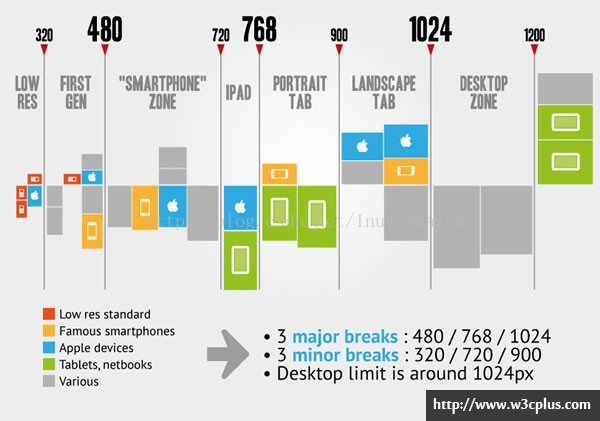

### 准备工作1：设置Meta标签

首先我们在使用Media的时候需要先设置下面这段代码，来兼容移动设备的展示效果：

1. <meta name="viewport" content="width=device-width, initial-scale=1.0, maximum-scale=1.0, user-scalable=no">

这段代码的几个参数解释：

- width = device-width：宽度等于当前设备的宽度
- height = device-height：高度等于当前设备的高度
- initial-scale：初始的缩放比例（默认设置为1.0）  
- minimum-scale：允许用户缩放到的最小比例（默认设置为1.0）  
- maximum-scale：允许用户缩放到的最大比例（默认设置为1.0）  
- user-scalable：用户是否可以手动缩放（默认设置为no，因为我们不希望用户放大缩小页面） 

 

### 准备工作2：加载兼容文件JS

因为IE8既不支持HTML5也不支持CSS3 Media，所以我们需要加载两个JS文件，来保证我们的代码实现兼容效果：

```html
1. <!--[if lt IE 9]>
2.  <script src="https://oss.maxcdn.com/libs/html5shiv/3.7.0/html5shiv.js"></script>
3.  <script src="https://oss.maxcdn.com/libs/respond.js/1.3.0/respond.min.js"></script>
4. <![endif]-->
```

### 准备工作3：设置IE渲染方式默认为最高(这部分可以选择添加也可以不添加)

现在有很多人的IE浏览器都升级到IE9以上了，所以这个时候就有又很多诡异的事情发生了，例如现在是IE9的浏览器，但是浏览器的文档模式却是IE8:

为了防止这种情况，我们需要下面这段代码来让IE的文档模式永远都是最新的：

1. <meta http-equiv="X-UA-Compatible" content="IE=edge">

 （如果想使用固定的IE版本，可写成：<meta http-equiv="X-UA-Compatible" content="IE=EmulateIE9">）

不过我最近又发现了一个更给力的写法：

1. <meta http-equiv="X-UA-Compatible" content="IE=Edge，chrome=1">

怎么这段代码后面加了一个chrome=1，这个[Google Chrome Frame（谷歌内嵌浏览器框架GCF）](http://zh.wikipedia.org/wiki/Google_Chrome_Frame)，如果有的用户电脑里面装了这个chrome的插件，就可以让电脑里面的IE不管是哪个版本的都可以使用Webkit引擎及V8引擎进行排版及运算，无比给力，不过如果用户没装这个插件，那这段代码就会让IE以最高的文档模式展现效果。这段代码我还是建议你们用上，不过不用也是可以的。

### 进入CSS3 Media写法

```css
@media screen and (max-width: 960px){
    body{
        background: #000;
    }
}
```

移动设备是不是纵向放置的显示屏，可以这样写：

```html
<link rel="stylesheet" type="text/css" media="screen and (orientation:portrait)" href="style.css">
```


### Media所有参数汇总

以上就是我们最常需要用到的媒体查询器的三个特性，大于，等于，小于的写法。媒体查询器的全部功能肯定不止这三个功能，下面是我总结的它的一些参数用法解释：

- width:浏览器可视宽度。
- height:浏览器可视高度。
- device-width:设备屏幕的宽度。
- device-height:设备屏幕的高度。
- orientation:检测设备目前处于横向还是纵向状态。
- aspect-ratio:检测浏览器可视宽度和高度的比例。(例如：aspect-ratio:16/9)
- device-aspect-ratio:检测设备的宽度和高度的比例。
- color:检测颜色的位数。（例如：min-color:32就会检测设备是否拥有32位颜色）
- color-index:检查设备颜色索引表中的颜色，他的值不能是负数。
- monochrome:检测单色楨缓冲区域中的每个像素的位数。（这个太高级，估计咱很少会用的到）
- resolution:检测屏幕或打印机的分辨率。(例如：min-resolution:300dpi或min-resolution:118dpcm)。
- grid：检测输出的设备是网格的还是位图设备。

1280分辨率以上（大于1200px）

```
@media screen and (min-width:1200px){
    #page{ width: 1100px; }#content,.div1{width: 730px;}#secondary{width:310px}
}
```

 

1100分辨率（大于960px，小于1199px）

```
@media screen and (min-width: 960px) and (max-width: 1199px) {
    #page{ width: 960px; }#content,.div1{width: 650px;}#secondary{width:250px}select{max-width:200px}
}
```

 

880分辨率（大于768px，小于959px）

```
@media screen and (min-width: 768px) and (max-width: 959px) {
    #page{ width: 900px; }#content,.div1{width: 620px;}#secondary{width:220px}select{max-width:180px}
}
```

 

720分辨率（大于480px，小于767px）

```
@media only screen and (min-width: 480px) and (max-width: 767px){
    #page{ width: 450px; }#content,.div1{width: 420px;position: relative; }#secondary{display:none}#access{width: 450px; }#access a {padding-right:5px}#access a img{display:none}#rss{display:none}#branding #s{display:none}
}
```

 

440分辨率以下（小于479px）

```
@media only screen and (max-width: 479px) {
    #page{ width: 300px; }#content,.div1{width: 300px;}#secondary{display:none}#access{width: 330px;} #access a {padding-right:10px;padding-left:10px}#access a img{display:none}#rss{display:none}#branding #s{display:none}#access ul ul a{width:100px}
}
```

```css
/* 竖屏 */  
@media screen and (orientation: portrait) and (max-width: 720px) { 对应样式 }  
  
/* 横屏 */  
@media screen and (orientation: landscape) { 对应样式 }  
```

```css
//CSS代码

@media (min-width: 1024px){undefined
  body{font-size: 18px}
} /*>=1024的设备*/
@media (min-width: 1100px) {undefined
  body{font-size: 20px}
} /*>=1024的设备*/
@media (min-width: 1280px) {undefined
  body{font-size: 22px;}
} 
@media (min-width: 1366px) {undefined
  body{font-size: 24px;}
}  
@media (min-width: 1440px) {undefined
  body{font-size: 25px !important;}
} 
@media (min-width: 1680px) {undefined
  body{font-size: 28px;}
} 
@media (min-width: 1920px) {undefined
  body{font-size: 33px;}
} 
```



