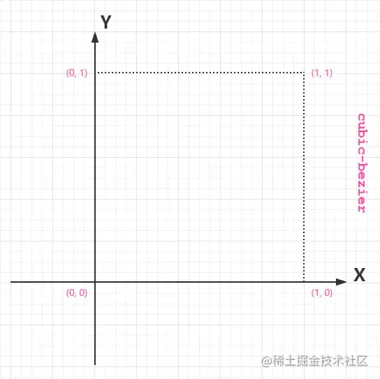

# cubic-bezier

cubic-bezier是 animation-timing-function 和 transition-timing-function 中一个重要的内容。

> 例子：transition:all 1s cubic-bezier(.21,.2,.65,.1)

cubic-bezier 又称三次贝塞尔，主要是为 animation 生成速度曲线的函数，规定是 cubic-bezier(, , , )。 我们可以从下图中简要理解一下 cubic-bezier：

 

从上图我们需要知道的是 cubic-bezier 的取值范围:

P0：默认值 (0, 0) P1：动态取值 (x1, y1) P2：动态取值 (x2, y2) P3：默认值 (1, 1)

我们需要关注的是 P1 和 P2 两点的取值，而其中 X 轴的取值范围是 0 到 1，当取值超出范围时 cubic-bezier 将失效；Y 轴的取值没有规定，当然也毋须过大。

[贝塞尔曲线(cubic-bezier)在线生成地址](http://yisibl.github.io/cubic-bezier/#.17,.67,.83,.67)

