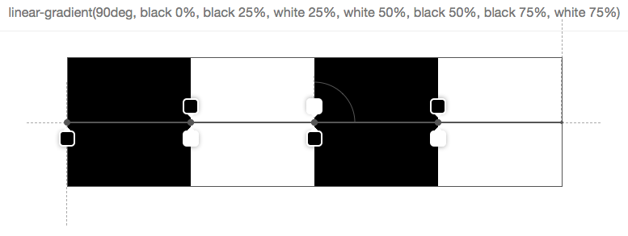

```xml
<!DOCTYPE html>
<html lang="en">
<head>
    <meta charset="UTF-8">
    <title>Title</title>
    <style>
        .box{
            width:100%;
            height:2px;
            background: -webkit-linear-gradient(left, #fff -4%,#2473fb 50%,#fff 100%);
        }
    </style>
</head>
<body>
<div class="box"></div>
</body>
</html>
```

# linear-gradient

> CSS linear-gradient() 函数创建一个表示颜色线性渐变的 <image> 。

元素只要用了linear-gradient，它等同于一张图片。

即:

background：linear-gradient(...params) ~= background：url(...image)

所以它只能用在图片可以用的地方。如：background、background-image。

不要把它当作颜色用在color等样式中。

## 方式

```css
background: linear-gradient(angle[角度], color-stop[起始颜色],color-stop[终点颜色]);
```

angle描述渐变的方向，单位是deg，它的有效角度值是0-360deg。默认180deg。

常用渐变角度分别为:

- 从下到上:0deg
- 从上到下:180deg
- 从左到右:90deg
- 从右到左:270deg

 

angle的值其实就是以**向顶部中央**方向为起点**顺时针**旋转的角度。

0deg时可以看作是上图穿过矩形中心的黑色虚线。

**渐变线:**

> 渐变线由包含渐变图形的容器的中心点和一个角度来定义的。渐变线上的颜色值是由不同的点来定义，包括起始点，终点，以及两者之间的可选的中间点（中间点可以有多个）。

图中示例了一个45deg经过矩形中心的渐变线，它的起点就是垂直于渐变线的红点，终点是起点对应的反射点，也就是图上的绿点。

这两点的颜色分别对应着css代码中定义的始末色值，其间则是沿着渐变线不断变化的色值。

### 1 0deg 蓝色起点 红色终点

```
background: linear-gradient(0deg, blue, red);
```


### 2 45deg 蓝色起点 红色终点

```
background: linear-gradient(45deg, blue, red);
复制代码
```


作者：vpt
链接：https://juejin.cn/post/6844903520097812494
来源：掘金
著作权归作者所有。商业转载请联系作者获得授权，非商业转载请注明出处。

 

## 渐变节点

渐变节点语法:`<color> [<percentage> | <length>]?`，每一个渐变点都可以控制其开始的位置，如果你不设置那么会按照起止进行等分过渡。可以参考我的demo截图。

 


```
h2{
    text-align:center;
    line-height:50px;
    background:linear-gradient( transparent 49%,#000 49%,#000 51% ,transparent 51%);
    span{
      padding:0 10px;
      background:#fff;
    }
  }
复制代码
```

## 最终效果图


作者：RobinsonZhang
链接：https://juejin.cn/post/6844903575361961991
来源：掘金
著作权归作者所有。商业转载请联系作者获得授权，非商业转载请注明出处。

 

 

 