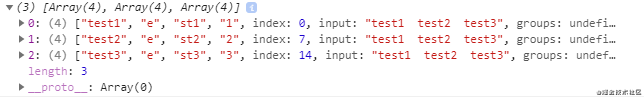

## ES6新特性

### Set

**`Set`** 对象允许你存储任何类型的唯一值，无论是[原始值](https://developer.mozilla.org/zh-CN/docs/Glossary/Primitive)或者是对象引用。

`NaN`和`undefined`都可以被存储在Set 中， `NaN`之间被视为相同的值（NaN被认为是相同的，尽管 NaN !== NaN）。

#### 方法

[`Set.prototype.add(*value*)`](https://developer.mozilla.org/zh-CN/docs/Web/JavaScript/Reference/Global_Objects/Set/add)

在`Set`对象尾部添加一个元素。返回该`Set`对象。

[`Set.prototype.clear()`](https://developer.mozilla.org/zh-CN/docs/Web/JavaScript/Reference/Global_Objects/Set/clear)

移除`Set`对象内的所有元素。

[`Set.prototype.delete(*value*)`](https://developer.mozilla.org/zh-CN/docs/Web/JavaScript/Reference/Global_Objects/Set/delete)

移除`Set`中与这个值相等的元素，返回`Set.prototype.has(value)`在这个操作前会返回的值（即如果该元素存在，返回`true`，否则返回`false`）。`Set.prototype.has(value)`在此后会返回`false`。

[`Set.prototype.entries()`](https://developer.mozilla.org/zh-CN/docs/Web/JavaScript/Reference/Global_Objects/Set/entries)

返回一个新的迭代器对象，该对象包含`Set`对象中的按插入顺序排列的所有元素的值的`[value, value]`数组。为了使这个方法和`Map`对象保持相似， 每个值的键和值相等。

[`Set.prototype.forEach(*callbackFn*[, *thisArg*\])`](https://developer.mozilla.org/zh-CN/docs/Web/JavaScript/Reference/Global_Objects/Set/forEach)

按照插入顺序，为Set对象中的每一个值调用一次callBackFn。如果提供了`thisArg`参数，回调中的`this`会是这个参数。

[`Set.prototype.has(*value*)`](https://developer.mozilla.org/zh-CN/docs/Web/JavaScript/Reference/Global_Objects/Set/has)

返回一个布尔值，表示该值在`Set`中存在与否。

[`Set.prototype.keys()` (en-US)](https://developer.mozilla.org/en-US/docs/Web/JavaScript/Reference/Global_Objects/Set/values)

与**`values()`**方法相同，返回一个新的迭代器对象，该对象包含`Set`对象中的按插入顺序排列的所有元素的值。

[`Set.prototype.values()`](https://developer.mozilla.org/zh-CN/docs/Web/JavaScript/Reference/Global_Objects/Set/values)

返回一个新的迭代器对象，该对象包含`Set`对象中的按插入顺序排列的所有元素的值。

#### [迭代Set](https://developer.mozilla.org/zh-CN/docs/Web/JavaScript/Reference/Global_Objects/Set#迭代set)

```
for (let item of mySet) console.log(item);
```

#### [数组去重](https://developer.mozilla.org/zh-CN/docs/Web/JavaScript/Reference/Global_Objects/Set#数组去重)

```
// Use to remove duplicate elements from the array
const numbers = [2,3,4,4,2,3,3,4,4,5,5,6,6,7,5,32,3,4,5]
console.log([...new Set(numbers)])
// [2, 3, 4, 5, 6, 7, 32]
```

#### 字符串大小写敏感

## ES7（2016）

### 指数操作符

```bash
2**10; // 1024
```

## ES8（2017）

### Object.values()

**Object.values()**方法返回一个给定对象自身的所有可枚举属性值的**数组**，值的顺序与使用[`for...in`](https://developer.mozilla.org/zh-CN/docs/Web/JavaScript/Reference/Statements/for...in)循环的顺序相同 ( 区别在于 for-in 循环枚举原型链中的属性 )。

```
var obj = { 0: 'a', 1: 'b', 2: 'c' };
console.log(Object.values(obj)); // ['a', 'b', 'c']

var an_obj = { 100: 'a', 2: 'b', 7: 'c' };
console.log(Object.values(an_obj)); // ['b', 'c', 'a']

var my_obj = Object.create({}, { getFoo: { value: function() { return this.foo; } } });
my_obj.foo = 'bar';
console.log(Object.values(my_obj)); // ['bar']

console.log(Object.values('foo')); // ['f', 'o', 'o']
```

### Object.entries()

`Object.entries()`方法返回一个给定对象自身可枚举属性的键值对数组，其排列与使用 `for...in` 循环遍历该对象时返回的顺序一致（区别在于 for-in 循环也枚举原型链中的属性）。

```javascript
const obj = { 0: 'a', 1: 'b', 2: 'c' };
console.log(Object.entries(obj)); // [ ['0', 'a'], ['1', 'b'], ['2', 'c'] ]

const myObj = Object.create({}, { getFoo: { value() { return this.foo; } } });
myObj.foo = 'bar';
console.log(Object.entries(myObj)); // [ ['foo', 'bar'] ]

// non-object argument will be coerced to an object
console.log(Object.entries('foo')); // [ ['0', 'f'], ['1', 'o'], ['2', 'o'] ]
```

**将`Object`转换为`Map`**

`new Map()` 构造函数接受一个可迭代的`entries`。借助`Object.entries`方法你可以很容易的将`Object`转换为`Map`:

```lasso
var obj = { foo: "bar", baz: 42 }; 
var map = new Map(Object.entries(obj));
console.log(map); // Map { foo: "bar", baz: 42 }
```

### String.prototype.padStart()

**`padStart()`** 方法用另一个字符串填充当前字符串(如果需要的话，会重复多次)，以便产生的字符串达到给定的长度。从当前字符串的左侧开始填充。

```
str.padStart(targetLength [, padString])
```

`padString` 可选

填充字符串。此参数的默认值为 " "（U+0020）。

```js
'abc'.padStart(10);         // "       abc"
'abc'.padStart(10, "foo");  // "foofoofabc"
'abc'.padStart(6,"123465"); // "123abc"
'abc'.padStart(8, "0");     // "00000abc"
'abc'.padStart(1);          // "abc"
```

### String.prototype.padEnd()

**`padEnd()`** 方法会用一个字符串填充当前字符串（如果需要的话则重复填充），返回填充后达到指定长度的字符串。从当前字符串的末尾（右侧）开始填充。

```
str.padEnd(targetLength [, padString])
```

```
'abc'.padEnd(10);          // "abc       "
'abc'.padEnd(10, "foo");   // "abcfoofoof"
'abc'.padEnd(6, "123456"); // "abc123"
'abc'.padEnd(1);           // "abc"
```

### Object.getOwnPropertyDescriptors()

用来获取一个对象的所有自身属性的描述符。

```
Object.getOwnPropertyDescriptors(obj)
```

### SharedArrayBuffer对象

> SharedArrayBuffer 对象用来表示一个通用的，固定长度的原始二进制数据缓冲区，

### Atomics对象

> Atomics 对象提供了一组静态方法用来对 SharedArrayBuffer 对象进行原子操作。

## ES9（2018）

### Promise.finally()

**finally()**方法返回一个[`Promise`](https://developer.mozilla.org/zh-CN/docs/Web/JavaScript/Reference/Global_Objects/Promise)。

在promise结束时，无论结果是fulfilled或者是rejected，都会执行指定的回调函数。

```bash
Promise.resolve().then().catch(e => e).finally();
```

# 剩余运算符(rest)

**Rest 参数必须放到参数列表的末尾**

```
function myFunction(x, y, z) { }
var args = [0, 1, 2];
myFunction(...args);
```

**与argument的区别**

 `arguments` 的特殊的类数组对象，该对象按参数索引包含所有参数。

```js
function showName() {
  alert( arguments.length );
  alert( arguments[0] );
  alert( arguments[1] );

  // 它是可遍历的
  // for(let arg of arguments) alert(arg);
}

// 依次显示：2，Julius，Caesar
showName("Julius", "Caesar");

// 依次显示：1，Ilya，undefined（没有第二个参数）
showName("Ilya");
```

- `arguments` 是一个类数组，也是可迭代对象，但它终究不是数组。它不支持数组方法，因此我们不能调用 `arguments.map(...)` 等方法。

- 它始终包含所有参数，我们不能像使用 rest 参数那样只截取入参的一部分。

- **箭头函数是没有** `"arguments"`

##  扩展运算符(spread)

[ES6中扩展运算符(spread)和剩余运算符(rest)详解](https://www.jianshu.com/p/3928e0571874)

```jsx
/******************扩展运算符(spread)********************/

     //demo 1  传递数据代替多个字符串的形式
     function  test(a,b,c){
         console.log(a);
         console.log(b);
         console.log(c);
     }

     var arr = [1, 2, 3];
     test(...arr);
    

     //demo2 将一个数组插入到另一个数据中
     var arr1 = [1, 2, 3,4];
     var arr2 = [...arr1, 4, 5, 6];
     console.log(arr2);


     //demo3  字符串转数据
     var str='loycoder';
     var arr3= [...str];
     console.log(arr3);
```


```jsx
 /******************剩余运算符(rest)********************/

  //demo4  当函数参数个数不确定时，用 rest运算符
    function rest01(...arr) {
        for (let item of arr) {
            console.log(item);
        }
    }
    rest01(1, 3, 5);

    //demo5 当函数参数个数不确定时的第二种情况
    function rest02(item, ...arr) {
        console.log(item);
        console.log(arr);
    }
    rest02(1, 2, 34);

    //demo6 rest运算符配合 解构使用：
    var [a,...temp]=[1, 2, 4];
    console.log(a);
    console.log(temp);
```

最后总结：

###### 扩展运算符用三个点号表示，功能是把数组或类数组对象展开成一系列用逗号隔开的值

###### rest运算符也是三个点号，不过其功能与扩展运算符恰好相反，把逗号隔开的值序列组合成一个数组

------

###### 当三个点(...)在等号左边，或者放在形参上。为 rest 运算符

###### 当三个在等号右边，或者放在实参上，是 spread运算符

或者说：

###### 放在被赋值一方是rest  运算符。放在赋值一方式 spread运算符。

# flat()

扁平化

```
[1, 2, [3, 4]].flat()
// [1, 2, 3, 4]
```

flat()默认只会“拉平”一层，如果想要“拉平”多层的嵌套数组，可以将flat()方法的参数写成一个整数，表示想要拉平的层数，默认为1。

```
[1, 2, [3, [4, 5]]].flat()
// [1, 2, 3, [4, 5]]
[1, 2, [3, [4, 5]]].flat(2)
// [1, 2, 3, 4, 5]
1234
```

上面代码中，flat()的参数为2，表示要拉平两层的嵌套数组。

如果不管有多少层嵌套，都要转成一维数组，可以用Infinity关键字作为参数。

```
[1, [2, [3]]].flat(Infinity)
// [1, 2, 3]
12
```

如果原数组有空位，flat()方法会跳过空位。

```
[1, 2, , 4, 5].flat()
// [1, 2, 4, 5]
```

## flatMap()

flatMap()方法对原数组的每个成员执行一个函数，相当于执行Array.prototype.map(),然后对返回值组成的数组执行flat()方法。该方法返回一个新数组，不改变原数组。

```
// 相当于 [[2, 4], [3, 6], [4, 8]].flat()
[2, 3, 4].flatMap((x) => [x, x * 2])
// [2, 4, 3, 6, 4, 8]
```

flatMap()只能展开一层数组。

## String.trimStart()和String.trimEnd()

去除字符串首尾空白字符

### 3. String.prototype.matchAll

> matchAll（）为所有匹配的匹配对象返回一个迭代器

```bash
const raw_arr = 'test1  test2  test3'.matchAll((/t(e)(st(\d?))/g));
const arr = [...raw_arr];
```



### 4. Symbol.prototype.description

> 只读属性，回 Symbol 对象的可选描述的字符串。

```bash
Symbol('description').description; // 'description'
```

### 5. Object.fromEntries()

> 返回一个给定对象自身可枚举属性的键值对数组

```bash
// 通过 Object.fromEntries， 可以将 Map 转化为 Object:
const map = new Map([ ['foo', 'bar'], ['baz', 42] ]);
console.log(Object.fromEntries(map)); // { foo: "bar", baz: 42 }
```

### Nullish coalescing Operator(空值处理)

表达式在 ?? 的左侧 运算符求值为undefined或null，返回其右侧。

```bash
let user = {
    u1: 0,
    u2: false,
    u3: null,
    u4: undefined
    u5: '',
}
let u2 = user.u2 ?? '用户2'  // false
let u3 = user.u3 ?? '用户3'  // 用户3
let u4 = user.u4 ?? '用户4'  // 用户4
let u5 = user.u5 ?? '用户5'  // ''
```

###  Optional chaining（可选链）

?.用户检测不确定的中间节点

```bash
let user = {}
let u1 = user.childer.name // TypeError: Cannot read property 'name' of undefined
let u1 = user.childer?.name // undefined
```

### globalThis

- 浏览器：window
- worker：self
- node：global

### replaceAll

> 返回一个全新的字符串，所有符合匹配规则的字符都将被替换掉

```bash
const str = 'hello world';
str.replaceAll('l', ''); // "heo word"
```

### Promise.any

> Promise.any() 接收一个Promise可迭代对象，只要其中的一个 promise 成功，就返回那个已经成功的 promise 。如果可迭代对象中没有一个 promise 成功（即所有的 promises 都失败/拒绝），就返回一个失败的 promise

### 逻辑运算符和赋值表达式

> 逻辑运算符和赋值表达式，新特性结合了逻辑运算符（&&，||，??）和赋值表达式而JavaScript已存在的 复合赋值运算符有：

## ??=可用来补充/初始化缺失的属性

```javascript
const pages = [
  {
  	title:'主会场',
    path:'/'
  },
  {
    path:'/other'
  },
  ...
]
  
for (const page of pages){
	page.title ??= '默认标题'
}
console.table(pages)
//(index)  title       		path
//0        "主会场"   	  "/"
//1        "默认标题"  	 "/other"
```

### 小结：

- &&=：当LHS值存在时，将RHS变量赋值给LHS
- ||=：当LHS值不存在时，将RHS变量赋值给LHS
- ??= ：当LHS值为null或者undefined时，将RHS变量赋值给LHS


作者：前端Sneaker
链接：https://juejin.cn/post/6890652568507121677
来源：掘金
著作权归作者所有。商业转载请联系作者获得授权，非商业转载请注明出处。

### 数字分隔符

> 数字分隔符，可以在数字之间创建可视化分隔符，通过_下划线来分割数字，使数字更具可读性

```bash
const money = 1_000_000_000;
//等价于
const money = 1000000000;

1_000_000_000 === 1000000000; // true
```

#### import

可以按需获取的动态 import

```
const util = './util.js'
import(util).then((module) => {
    module.fun1();
    module.fun2();
});

(async () => {
  const util = './util.js';
  const module = await import(util)
  const fun1 = module.fun1(1);
  const fun2 = module.fun1(2);
})();
```


