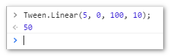

# 前端实现预览ppt，word，xls，pdf文件JavaScript 动画剖析

[JavaScript 动画剖析](https://blog.yiguochen.com/javascript-animate.html#comments)

### 解析CSS属性值

```css
div{ left:100px; }
```

上面的位置值就包含了数值“100”，要想实现该元素从100px的位置到600px的位置，只要不断的修改该元素的位置值，达到一定的速度就实现了动画，据国外的统计，每25毫秒切换一次画面，就可以实现“动”的效果。

CSS属性值都是字符串，为了方便进行计算，需先将字符串转换成数值，并且很多属性值都包含了单位，所以最好解析成下面这种格式：

```javascript
'100px' ==> { val : 100, unit : 'px' }
```

100px是元素开始动画的位置，600px是元素结束动画时的位置，同样的方法解析结束的位置值：

```javascript
'600px' ==> { val : 600, unit : 'px' }
```

### 动画的运行原理

结束值和开始值之差500px就是动画的总距离，通常动画的时间都是固定的，假定动画时间为1000毫秒，那么速度=总距离/总时间为0.5px/毫秒。

总距离S = 总时间T * 速度V ==> V = S/T

当前距离s = S/T * 已耗时t ==> s = S * (t/T)

即：当前距离 = 总距离 * (已耗时/总时间)

有了上面的公式就可以计算出在固定了总距离和总时间的动画中，某个时间点的元素应该出现的精确位置了。仅仅有这些还不够，元素的一系列连贯性的变化才能形成动画，这里就有必要引入帧这个比较通用的概念。

从动画开始运行到动画结束，总距离和总时间都是固定的，根据上面提到的每25毫秒切换一次画面，那么可以计算出每秒的传输帧数为40帧/秒，也就是40fps。这个动画的总时间为1000毫秒，恰好是运行40帧完成动画。

那么javascript如何表示一帧呢？javascript跟时间有关系的肯定是定时器setTimeout和setInterval，动画需要重复运行，所以这里使用setInterval，每25毫秒执行一次就是一帧，用代码表示就是：

```javascript
window.setInterval( tick, 25 );
```

每秒钟帧数 (fps) 愈多，所显示的动作就会愈流畅。通常，要避免动作不流畅的最低fps是30。事实上，在浏览器中，30fps还是会显得不太流畅，各大javascript框架都有默认的fps数，一般为50-80之间，各框架的fps和interval的设置在[这里](http://forum.jquery.com/topic/increasing-animation-frame-interval-and-exposing-it)有简短的介绍。jQuery的默认的interval是13毫秒，fps在75左右，在各框架中算是很高的了。是不是fps越高越好？浏览器能使用的系统资源是有限的，fps越高也就越耗性能，也有可能出现丢帧的现象，在肉眼觉得可以接受的动画流畅的范围内，应适当的设置interval，所以我的动画框架的interval设置成了16毫秒，fps在60左右。

### running

有了上面这些信息，就可以开始动画了，在定时器开始运行的那一刹那，要获取动画开始的时间，然后每一帧动画都要获取一次当前时间。动画开始时的属性值为sv，结束时的属性值是tv，结束时的单位是tu，当前时间减去开始的时间即为已耗时，已耗时/总时间的时间比为t，那么最终的运算公式为：

```javascript
( sv + (tv - sv) * t ).toFixed(7) + tu;
```

这里的toFixed的参数也是有讲究的，CSS属性值大多数都允许小数点的数值，所以精度越高，动画的效果看起来就会显得越流畅，toFixed(0)和toFixed(7)的效果会有明显的差异。

当已耗时大于或等于总时间，就该结束动画了，结束动画就是清除定时器，因为动画的运行的结果不太可能刚好等于结束属性值，所以结束动画时应该将CSS属性值还原，既是最后的关键帧。

### tween

tween翻译成中文是缓动，要想动画有特殊的效果，比如加速或者减速效果，就需要引入tween函数。

javascript的tween函数的由于计算方法不同，基本可以分成flash流派和prototype流派，动画的效果都差不多。flash流派的缓动函数通常都有4个参数，分别是：

- t: timestamp，指缓动效果开始执行到当前帧开始执行时经过的时间段，单位ms
- b: beginning position，起始位置
- c: change，要移动的距离，就是终点位置减去起始位置
- d: duration ，缓和效果持续的时间

flash流派的匀速运动的函数是这样的：

```javascript
var linear = function( t,b,c,d ){ 
	return c*t/d + b; 
};
```

prototype流派的计算公式更简单，封装得更好，只有一个参数–时间比，就是我上面说到的已耗时/总时间，匀速运动的函数是这样的：

```javascript
var linear = function( t ){
    return t;
};
```

显然只需传一个参数的计算方法更简洁，我的动画框架就采用了这类tween函数，早期的jQuery以及现在的YUI3采用的是flash流派，现在的1.7版也改成了prototype流派。有了tween，那么上面的运算公式可以改成这样：

```javascript
( sv + (tv - sv) * linear(t) ).toFixed(7) + tu;
```

比方说我们要从位置`0`的地方运动到`100`，时间是`10`秒钟，此时，`b`, `c`, `d`三个参数就已经确认了，`b`初始值就是`0`，变化值`c`就是`100-0`就是`100`，最终的时间就是`10`，此时，只要给一个小于最终时间`10`的值，`Tween.Linear`就会返回当前时间应该的坐标，例如，假设此时动画进行到第5秒，也就是`t`为5，则得到（截图自Chrome控制台）：


### 如何实际使用Tween.js中的缓动算法？

```javascript
// requestAnimationFrame的兼容处理
if (!window.requestAnimationFrame) {
    requestAnimationFrame = function(fn) {
        setTimeout(fn, 17);
    };	
}
```

显示一个动画效果，例如，还是拿上面的线性效果举例，则代码可以变成：

```javascript
var t = 0, b = 0, c = 100, d = 10;
var step = function () {
    // value就是当前的位置值
    // 例如我们可以设置DOM.style.left = value + 'px'实现定位
    var value = Tween.Linear(t, b, c, d);
    t++;
    if (t <= d) {
         // 继续运动
         requestAnimationFrame(step);
    } else {
        // 动画结束
    }
};
```

[如何使用Tween.js各类原生动画运动缓动算法](https://www.zhangxinxu.com/wordpress/2016/12/how-use-tween-js-animation-easing/)

### requestAnimationFrame兼容性

```javascript
window.requestAnimFrame = (function(){
  return  window.requestAnimationFrame       ||
          window.webkitRequestAnimationFrame ||
          window.mozRequestAnimationFrame    ||
          function( callback ){
            window.setTimeout(callback, 1000 / 60);
          };
})();
```

但是呢，并不是所有设备的绘制时间间隔是`1000/60 ms`, 以及上面并木有cancel相关方法，所以，就有下面这份更全面的兼容方法：

```javascript
(function() {
    var lastTime = 0;
    var vendors = ['webkit', 'moz'];
    for(var x = 0; x < vendors.length && !window.requestAnimationFrame; ++x) {
        window.requestAnimationFrame = window[vendors[x] + 'RequestAnimationFrame'];
        window.cancelAnimationFrame = window[vendors[x] + 'CancelAnimationFrame'] ||    // Webkit中此取消方法的名字变了
                                      window[vendors[x] + 'CancelRequestAnimationFrame'];
    }

    if (!window.requestAnimationFrame) {
        window.requestAnimationFrame = function(callback, element) {
            var currTime = new Date().getTime();
            var timeToCall = Math.max(0, 16.7 - (currTime - lastTime));
            var id = window.setTimeout(function() {
                callback(currTime + timeToCall);
            }, timeToCall);
            lastTime = currTime + timeToCall;
            return id;
        };
    }
    if (!window.cancelAnimationFrame) {
        window.cancelAnimationFrame = function(id) {
            clearTimeout(id);
        };
    }
}());
```

根据[这篇翻译文章](http://blog.segmentfault.com/humphry/1190000000386368)一些测试说法，FireFox/Chrome浏览器对`setInterval`, `setTimeout`做了优化，页面处于闲置状态的时候，如果定时间隔小于`1`秒钟(`1000ms`)，则停止了定时器。与`requestAnimationFrame`有类似行为。但如果时间间隔大于或等于`1000ms`，定时器依然执行，即使页面最小化或非激活状态。

参见下表：

|         | setInterval | requestAnimationFrame |
| :-----: | :---------: | :-------------------: |
|   IE    |   无影响    |         暂停          |
| Safari  |   无影响    |         暂停          |
| Firefox |    >=1s     |        1s - 3s        |
| Chrome  |    >=1s     |         暂停          |
|  Opera  |   无影响    |         暂停          |

