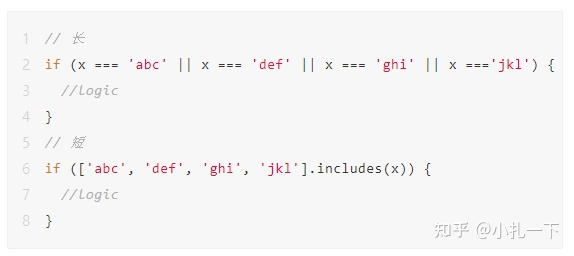

 

# [JavaScript 判断优雅写法](https://juejin.cn/post/6974972162637578254)

### 仅两种可能

```js
// if else
if(name === 'detanx') { ... }
else { ... }
```

#### 三元

- 其实当存在单语句、赋值等情况时，我们还可以选择三元运算语句。

```js
// 三元
let isMaster = false;
isMaster = name === 'detanx' ? true : false;
```

- 上述使用三元语句改写后，代码数量减少了，相对更优雅一些，可读性相对于 `if else` 也差不多。
- **在使用三元语句时，不建议再嵌套三元运算。** 例如：

```js
let masterStatus = 0; // 0 super, 1 master, 2 normal
let master = 'detanx';
masterStatus = master === 'detanx' ? 0 : (master === '17' ? 1 : 2);
```

#### `||` 、`&&`

- 除了三元以外，对某些特定情况，我们还可以使用 `||`、`&&` 运算符。例如请求数据结果：

```js
// ||
let responseData = [];
request(res => {
    if(res.code === 200) {
        responseData = res.data || []; // res.data 是否存在，和后端约定 null/Array
    }
})

responseData && responseData.map(item => { // 判断 responseData
    // item ...
})
```

#### `??`

- 当且仅当运算符左侧为 `null` 或 `undefined` 时，选择右侧的值。

```
let name = '';
const isNullOrUndefined = null;
name = isNullOrUndefined ?? 'default';
```

#### 多种可能

- 当提到多种可能时，大家首先想到的可能是 `if...else if...else` 或者 `switch...case`。例如判断不同的事件：

1. 多种可能对应同一种情况

```js
if(status === 0 || status === 1 || status === 2 || status === 3) {
    console.log('按钮可以点击');
}
// =>

if([0, 1, 2, 3].includes(status)) {
    console.log('按钮可以点击');
}
```

1. 多种可能对应不同情况

- 对应不同的事件，需要有不同的行为和执行逻辑。

```js
let content = [];
if(event === 'click') {
    content = ['jump', clickFunction];
} else if (event === 'blur') {
    content = ['jungle', blurFunction];
} else if (event === 'scroll') {
    content = ['scroll', scrollFunction];
} else if (event === 'size') {
    content = ['change', sizeFunction];
} else if (event === 'focus') {
    content = ['jungle', focusFunction];
} else {
    content = ['other', otherFunction];
}
```

- 使用对象数据结构改写上述代码。

```js
let content = [];
const eventObject = {
    'click': ['jump', clickFunction],
    'blur': ['jungle', blurFunction],
    'scroll': ['scroll', scrollFunction],
    'size': ['change', sizeFunction],
    'focus': ['jungle', focusFunction],
}
content = eventObject[event] || ['other', otherFunction];
```

- 根据我们业务的实际情况，我们也可以灵活的替换其他数据结构，在业务中有很多需要根据某一个值去显示不同的文案等。例如通过判断状态值（`status`）显示当前课程的状态。

```js
// status 0 已删除 1 未开始 2 上课中 3 已下课 4 已评估
let text = '';
```

- `if...else`

```js
if(status === 0) {
    text = '已删除'
} else if (status === 1) {
    text = '未开始'
} else if (status === 2) {
    text = '上课中'
} else if (status === 3) {
    text = '已下课'
} else if (status === 4) {
    text = '已评估'
} else {
    text = '--'
}
```

- `switch...case`

```js
switch(status) {
    case 0:
        text = '已删除';
        break;
    case 1:
        text = '未开始';
        break;
    case 2:
        text = '上课中';
        break;
    case 3:
        text = '已下课';
        break;
    case 4:
        text = '已评估';
        break;
    default:
        text = '--';
        break;
}
```

- 有上面两种写法，可读性是不错，就是写的很冗余，有没有更简洁的写法呢？往下看：

```js
const statusTextArray = ['已删除', '未开始', '上课中', '已下课', '已评估'];
text = statusTextArray[status] || '--';
```

- 两行代码就搞定了，是不是简洁了非常之多（**非连续数值的情况下，我们只需要将对应下标置为 `null` 或 `undefined` 即可，如果数值过大，不建议使用上面的写法**），这就是我们灵活运用了数组的特性和我们数据的特性。有人肯定会说了，你这个只适用数值的情况，不是数值或数值过大的情况又怎么办呢？别急，接着往下看：

```js
// status 非数值或数值过大
const statusTextObject = {
    100: '已删除',
    101: '未开始',
    102: '上课中',
    103: '已下课',
    104: '已评估'
}
text = statusTextObject[status] || '--';

// 非数值我们将对象的 key 替换为对应status的值即可。
```

1. 多值对应多种情况

- 在日常开发过程中，我们可能需要通过不止判断一个值去做显示或其他逻辑操作，可能需要判断 `2` 个甚至 `2` 个以上的值，那是否就只能写 `if...else` 了呢？

```js
// limit 权限，status 状态
if (limit === 'super') {
    if(status === 0) { // do ... } 
    else if (status === 1) { // do ... }
    else if (status === 2) { // do ... }
    else if (status === 3) { // do ... }
    else if (status === 4) { // do ... }
} else if (limit === 'normal') {
    if(status === 0) { // do ... } 
    else if (status === 1) { // do ... }
    else if (status === 2) { // do ... }
    else if (status === 3) { // do ... }
    else if (status === 4) { // do ... }
} else {
    // do ...
}
```

- 当情况过多时，嵌套越来越深，代码离优雅就越远，可读性也越差。

```js
// 改写
const limitStatusObject = {
    'super-0': () => { // do ... },
    'super-1': () => { // do ... },
    // ...
    'normal-0': () => { // do ... },
    'normal-1': () => { // do ... },
    // ...
}

// 还可以将每个对应的逻辑单独抽出来
const limitStatusObject = {
    'super-0': super0Function,
    'super-1': super1Function,
    // ...
    'normal-0': normal0Function,
    'normal-1': normal1Function,
    // ...
}

limitStatusObject[`${limit}-${status}`].call(this);
```

- 出了使用 `Object` 之外，我们还可以使用 `ES6` 中的 `Map` 数据结构，将对应值的键值组合成对象。

```js
const limitStatusMap = new Map([
  [{limit: 'super',status: 0},()=>{ // do ... }],
  [{limit: 'super',status: 1},()=>{ // do ... }],
  // ...
  [{limit: 'normal',status: 0},()=>{ // do ... }],
  [{limit: 'normal',status: 1},()=>{ // do ... }],
  // ...
]);
const list = [...limitStatusMap].filter(([key,value]) => (key.limit === limit && key.status === status));
list.forEach(([key,value]) => value.call(this));
```

- 当同一权限下，有几种状态值操作都是相同的，那我们又该怎么写呢？

```js
const functionA = () => { // do ... }
const functionB = ()=> { // do ... }
const limitStatusMap = new Map([
    [/^limit_[1-4]$/,functionA],
    [/^limit_5$/,functionB],
    //...
])

const list = [...actions].filter(([key,value]) => (key.test(`${limit}_${status}`)))
list.forEach(([key,value]) => value.call(this))
```

- 可以通过使用正则表达式去匹配相同操作的状态值。

### 深处嵌套对象

- 开发过程中，避免不了会遇到深层对象的取值，既然是深层对象，那我们肯定需要一层一层去判断是否存在对应的key才能继续获取下一层，不然的话，如果某一次数据的某一层不为对象或对应的值不存在时，又没有做异常处理，那我们的程序就会崩溃。显示环境出现这种问题，肯定是大事故了，那你可能就要被炒鱿鱼🦑了。那我们怎么怎么避免这种问题，并写出优雅的代码呢？

1. 正常写法

```js
const user = {
    base: {
        family: {
            parent: {
                mather: {
                    name: '...'
                },
                father: {
                    name: '...'
                }
            }
        }
    }
}
let fatherName = '';
if(user && user.base && user.base.family && user.base.family.parent && user.base.family.parent.father) {
    fatherName = user.base.family.parent.father.name || '-';
}
```

- 如上所示，当对象层级过深，我们需要每级都判断，那我们还可以怎么写呢？

```js
// 使用 ES6 新特性 ?.
let fatherName = '';
fatherName = user?.base?.family?.parent?.father?.name;
```


作者：小小小十七
链接：https://juejin.cn/post/6974972162637578254
来源：稀土掘金
著作权归作者所有。商业转载请联系作者获得授权，非商业转载请注明出处。
