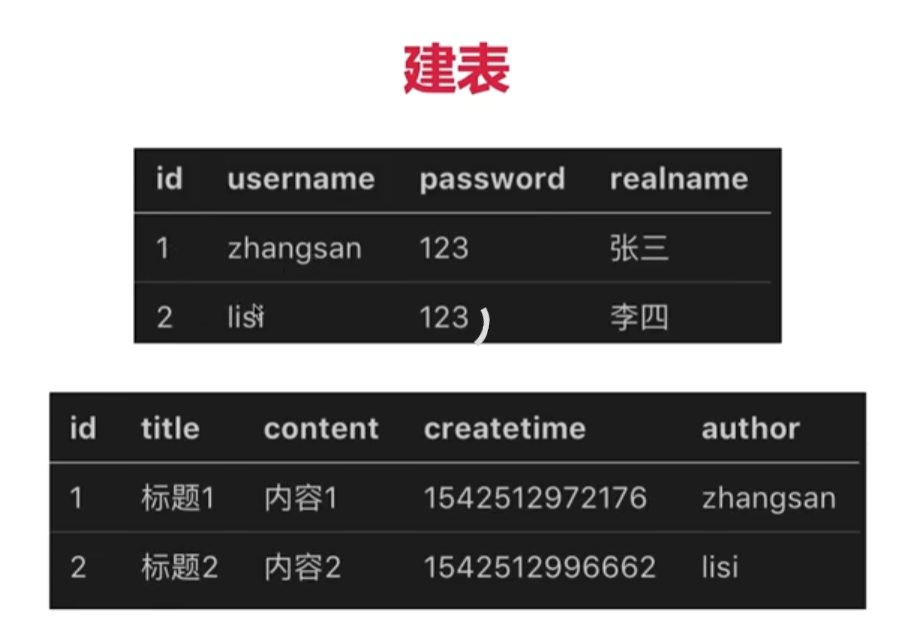
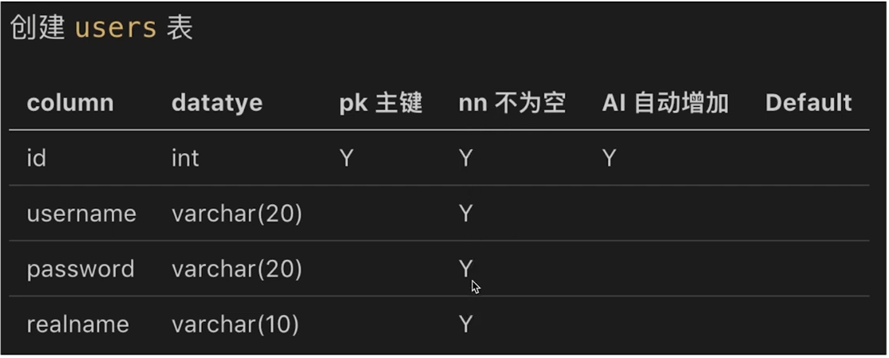
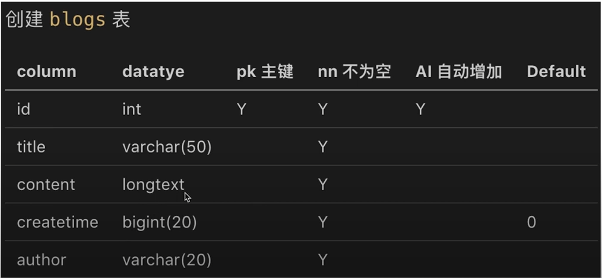

  



```
//int只能存储13位数值，太小不够用。只能用bigint
//longtext 最多存储4个g大小，长类型。
```


 

```sql
select username,`password` from users; //查询条件
select *from users where username='zhangsan' and `password`='123';//条件查询
update users set realname='lisi' where username='李四';
delete from users where username='lisi';
select * from users where status <>'0'; //不等于0
```

> 对于数据库的默认字段，如果需要作为表字段查询条件，需要加上``来查询。

>like 模糊查询

注意：

 

```sql
SET SQL_SAFE_UPDATES = 0;
```

 

> 注意：mysql的8左右的版本，他的varchar的字符长度统一了，不再是varchar(10)代表字母10个，汉字5个，现在**varchar(10)代表字母和汉字都是10个**。

