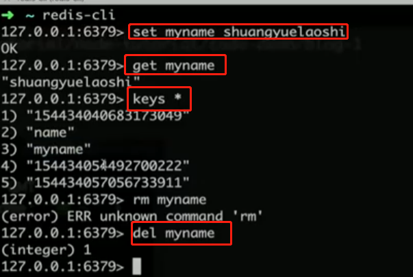
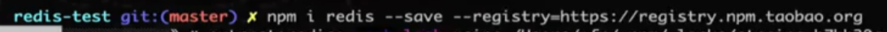
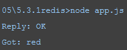
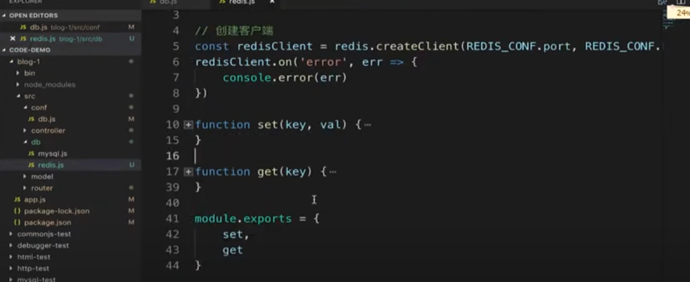
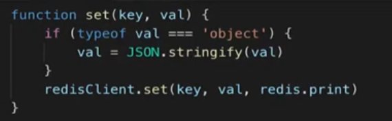
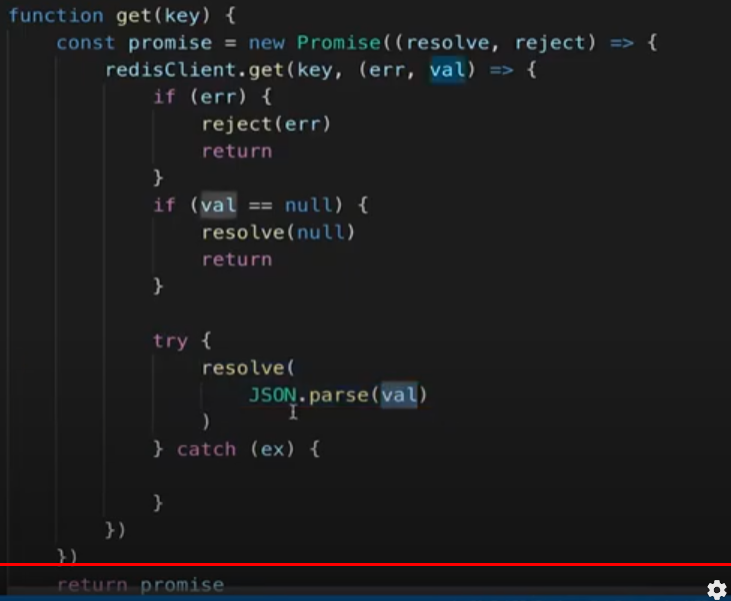

# redis安装

redis操作

```
//启动
redis-server
//redis终端
redis-cli 
```


 

安装



 demo

```js
var redis = require('redis')

var client = redis.createClient(6379, '127.0.0.1')//端口，ip
client.on('error', function (err) {
  console.log('Error ' + err);
});

// 1 键值对
client.set('color', 'red', redis.print);//redis.print打印值
client.get('color', function(err, value) {
  if (err) throw err;
  console.log('Got: ' + value)
    //退出
  client.quit();
})
```

 



  

  