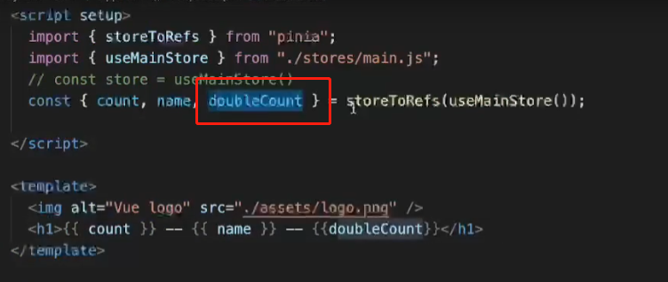

 

 

 

## 安装

 

 

 

 

 

## 声明和使用

 

 

## Getters

 

 

 

### 给getters传递参数

 

### 访问其他store中的getters


 

## Actions

### 同步任务


### 异步任务


## ts

```ts
import { generateFakeData, Item } from "@/models/item.model";
import { defineStore } from "pinia";

export type RootState = {
  items: Item[];
};

export const useMainStore = defineStore({
  id: "mainStore",
  state: () =>
    ({
      items: [],
    } as RootState),

  actions: {
    createNewItem(item: Item) {
      if (!item) return;

      this.items.push(item);
    },

    updateItem(id: string, payload: Item) {
      if (!id || !payload) return;

      const index = this.findIndexById(id);

      if (index !== -1) {
        this.items[index] = generateFakeData();
      }
    },

    deleteItem(id: string) {
      const index = this.findIndexById(id);

      if (index === -1) return;

      this.items.splice(index, 1);
    },

    findIndexById(id: string) {
      return this.items.findIndex((item) => item.id === id);
    },
  },
});
```

```ts
import { defineStore } from 'pinia'

interface AppState {
  name: string;
}

export const useUserStore = defineStore({
  id: 'app',
  state: (): AppState =>({
    name: 'Eduardo'
  }),
  getters: {},
  actions: {}
})
```

## 取消mutation，使用三种方式更改state

```typescript
<script lang="ts" setup>
import { useStore } from '@/store/modules/app';
import { ref } from 'vue';

const store = useStore();

function raise() {
  // 方式一：直接修改 -> 'direct'
  store.salary += 10000;

  // 方式二：patch对象 -> 'patch object'，填入打算更改的state字段即可
  store.$patch({
    salary: store.salary + 10000,
  });

  // 方式三：patch函数 -> 'patch function'，可键入语句，执行复杂逻辑
  store.$patch((state) => {
    state.salary += 10000;
  });
}
</script>
```

## store使用reactive包裹，自带响应性

无需二次包裹reactive、computed，即可在模板中直接使用，同时具有响应性

```
<template>
  <div>{{ store.name }}, 文章阅读量：{{ store.article }}</div>
  <hr />
  <button @click="jump">点击跳转阅读新文章</button>
</template>
```

## 四、跨模块调用直观方便

直接引入其他store的hook函数，调用即可

```javascript
import { useSomeOtherStore } from './auth-store'

export const useAppStore = defineStore('app', {
  state: () => ({
    // ...
  }),
  actions: {
    async someAction() {
      const someOtherStore = useSomeOtherStore()
      // ...
    },
  },
})
```

## 五、组件外调用

用户创建的类似useStore这样的Hook函数默认会自动注入在单页应用入口处创建并传递给app实例的Pinia实例(有点拗口...)，在组件内使用时，Pinia实例肯定已经传递给app实例了，这时候直接调用hook函数使用就完事了。但在组件外使用时，很可能出现在调用hook函数时，Pinia实例还未传递给app实例，这时候就需要用户手动将Pinia实例传入hook函数，并暴露出来以供调用。具体可参见官方文档的对应章节 -> **[Using a store outside of a component](https://pinia.esm.dev/core-concepts/outside-component-usage.html)**

```typescript
// main.ts
import { createApp } from 'vue';
import App from './App.vue';
import { pinia } from '@/store'

const app = createApp(App)
// 将pinia实例传递给app实例，在此之后使用useStore钩子，会自动注入pinia实例，否则需要在useStore中手动注入
app.use(pinia)

app.mount('#app')
```


```typescript
// store/index.ts
import { createPinia } from 'pinia'

const pinia = createPinia()
export { pinia }
```


```typescript
// store/modules/app.ts
import { defineStore } from 'pinia'
import { pinia } from '@/store'

interface AppState {
  name: string;
}

export const useUserStore = defineStore({
  id: 'app',
  state: (): AppState =>({
    name: 'Eduardo'
  }),
  getters: {},
  actions: {}
})

// 这里的pinia即为通过createPinia()生成并在入口处传递给app实例的pinia实例，在此手动注入，并暴露
export function useAppStoreHook() {
  return useAppStore(store)
}
```