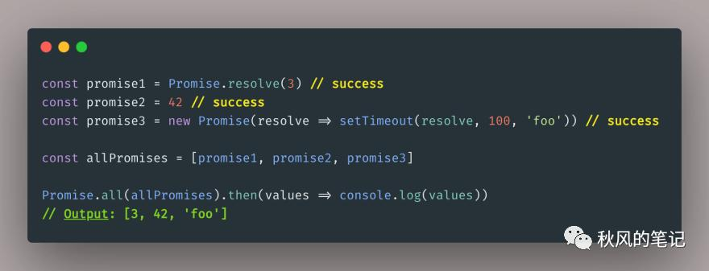
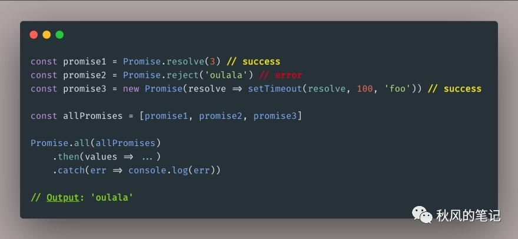
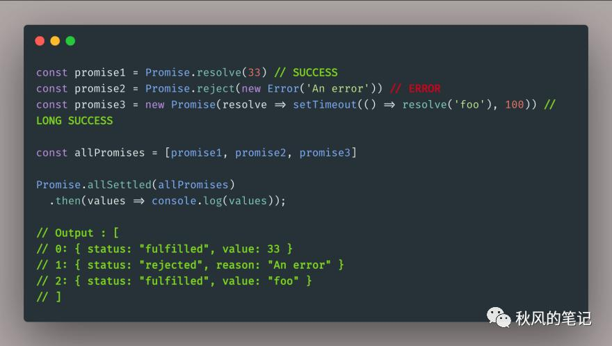

## 听说你还不知道Promise的allSettled()和all()的区别？

https://www.pianshen.com/article/51711808852/

- [ES6 Promise 的最佳实践](https://mp.weixin.qq.com/s?__biz=Mzg5NDAyNjc2MQ%3D%3D&chksm=c024917af753186cc2ca76e67d926dca30e0a280c612f06529ec42f6d97c4160a27b88158805&idx=1&mid=2247484444&scene=21&sn=b4715ef9272774b69f98716b98e5f9bf#wechat_redirect)
- [如何优雅地处理Async/Await的异常？](https://mp.weixin.qq.com/s?__biz=Mzg5NDAyNjc2MQ%3D%3D&chksm=c0249124f75318328db1fcfd4ba85e2344a359fd345bbe962cff2af394a7231744edd40811e9&idx=1&mid=2247484482&scene=21&sn=29436a0bcf5d5fcdb1a707bde0e8fd4d#wechat_redirect)
- [ES2017 异步函数的最佳实践（`async` /`await`）](https://mp.weixin.qq.com/s?__biz=Mzg5NDAyNjc2MQ%3D%3D&chksm=c0249153f753184588820322530cd3de53e0dc059746e0c8ac314199e3e70cf90817d2c25634&idx=1&mid=2247484469&scene=21&sn=9de487ecbfc03106e88b842105092e0a#wechat_redirect)
- [面试官: 如何在浏览器中控制最大请求并发数？](https://mp.weixin.qq.com/s?__biz=Mzg5NDAyNjc2MQ%3D%3D&chksm=c02491fdf75318eb1ed1fce14b2fc7fd9240fcf73569f7d27cd19be13ccd0e0c7c81266a9e63&idx=1&mid=2247484571&scene=21&sn=bf0befc2fb4578dedea4e49dcdb525b1#wechat_redirect)

两个 Promise 方式及他们差异：

- Promise.allSettled(可迭代)
- Promise.all(可迭代)

他们两个都传入可 `迭代对象`，并返回一个已完成的 Promises 的`数组`。

## Promise.all()

`Promise.all()`方法将一组可迭代的 Promises 作为输入，并返回一个 Promise ，该 Promise resolve 的结果为刚才那组 输入 promises 的返回结果。

`如果其中一个 promise 失败了`，则 `Promise.all` 整体将会失败。例如，我们传递2个 promise, 一个完成的 promise 和 一个 失败的promise，那么 `Promise.all` 将立即失败。

## Promise.allSettled()

当所有的 promises 都已经结束无论是完成状态或者是失败状态，它都会返回一个 promise，这个 promise 将会包含一个关于描述每个 promise 状态结果的对象数组。

对于每个结果对象，都有一个`状态`字符串：

- `fulfilled(完成)` ✅
- `rejected(失败)` ❌

返回值（或原因）表现每个 promise 的完成（或失败）。

## 区别

- `Promise.all` 将在 Promises 数组中的其中一个 Promises 失败后立即失败。
- `Promise.allSettled`将永远不会失败，一旦数组中的所有 Promises 被完成或失败，它就会完成。