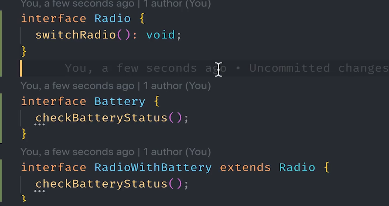
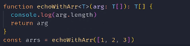

> ReactJS的官方网站为:[https://reactjs.org](https://reactjs.org/)

### typescript

类型为any，他的子类也是any类型，并且编译器不会提示类型，也不会报错

### 联合类型

```
let num :number｜string
```

### Array

```tsx
 let arr:number[]=[1,2]
```

类数组

代表 arguments就是类数组，她有length，也可以用[0]取值，但是不能使用数组的方法

### 元组

```tsx
let user:[string,number]=['molly',20]
```

### interface

```tsx
interface IPerson {
	readonly id:number;
	name:string;
	age?:number
}
//readonly 用于属性
//const 用于变量
```

### 函数

可选参数只能放在最后面，也可以提前赋值。

 

类型推断

### 类class

 

重写父类方法

##### 类的修饰符

- public 共有属性，任何人都可以访问
- private 私有属性，谁都访问不了
- protected 只能被子类访问
- readonly 

这些都是类的实例上的属性方法

定义类的静态属性 static

 v 

### 类和接口

interface抽象对象的属性和方法，

  

### 枚举

emun

 

### 泛型

 

##### 约束泛型

 

 

 

 

 

### 类型别名

 

