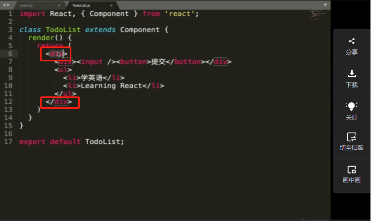
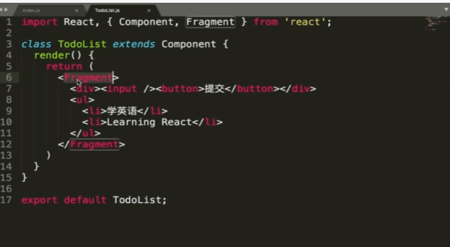

# 开发环境搭建

### manifest.json

pwa的配置文件

```json
{
  "short_name": "React App",
  "name": "Create React App Sample",
  "icons": [
    {
      "src": "favicon.ico",
      "sizes": "64x64 32x32 24x24 16x16",
      "type": "image/x-icon"
    },
    {
      "src": "logo192.png",
      "type": "image/png",
      "sizes": "192x192"
    },
    {
      "src": "logo512.png",
      "type": "image/png",
      "sizes": "512x512"
    }
  ],
  "start_url": ".",
  "display": "standalone",
  "theme_color": "#000000",
  "background_color": "#ffffff"
}
```

**如果使用jsx语法必须引入react**

## 基础jsx语法

> **自定义组件必须以大写字母开头。**h5的标签可以为小写字母开头。

在单组件中，jsx必须返回一个标签包裹的代码，例如

 

如果不想在生成页面有这个包裹的div标签，可以用Fragment这占位符来实现

 

