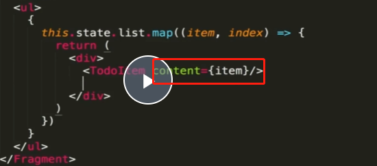
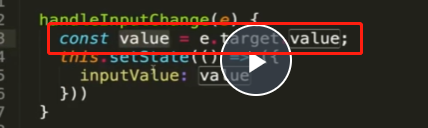

### class

> constructor(props){//最先被执行
>
> ​	super(props)//继承父类的构造函数
>
> ​	this.state={}//组件状态
>
> } 

 

 

 

 

### immutable

state不允许做任何改变。

## JSX语法细节补充

**注释书写**

```jsx
//第一种
{
	//这是注释并且不能放一行
}

//第二种
{/*这是注释*/}
```

**便签样式类名为className**

 

**不转义标签**

 

**点击聚焦**

 

## 拆分组件和组件之间传值

#### 父组件向子组件传递数据

 

 

##### 子组件向父组件传递数据

 

 

最新

 

因为react是异步渲染，这样写会报错，需要改成

  

preState是修改前的状态

 

### 

