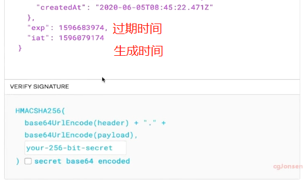

## 登陆

输入邮箱密码，在请求body中传向后端 

​		v

后端创建持久性会话

 		v

传回一个唯一标识符

 

## vuex payload

payload：有效载荷，即记录有效信息的部分。

>通常在传输数据时，为了使数据传输更可靠，要把原始数据分批传输，并且在每一批数据的头和尾都加上一定的辅助信息，比如这一批数据量的大小，校验位等，这样就相当于给已经分批原始数据加一些外套，这些外套起到标示作用，使得原始数据不易丢失。一批数据加上它的“外套”，就形成了传输通道中基本的传输单元，叫做数据帧或者数据包（有的地方数据帧和数据包不是同一概念比如网络传输）。
>这些数据帧中的记录信息的原始数据就是有效载荷数据，即payload data。而消息体就是外套。即标记着原始数据的大小等的辅助信息。

**使用**

vuex 配置：

```js
mutations: {
        //payload 对象写法
        increase(state, payload) {
            state.count += payload.amount;
        },
        //increase(state, n=1) {
        //            state.count += n;
        //        },
        decrease(state, n = 1) {
            state.count -= n;
        },
        switch_dialog(state) { // 这里的state对应着上面这个state
            state.show = state.show ? false : true
            // 你还可以在这里执行其他的操作改变state
        }
    },
```

```js
methods: {
            handleIncrease() {
                //this.$store.commit('increase', 5);
                //payload 对象写法
                this.$store.commit({
                    type: 'increase',
                    amount: 10
                })
            }
        }
```

## 登陆流程

### 基于cookie和seesion

 

 身份验证是有状态的，验证记录和会话必须同时保存在服务器端和客户端。

服务器端需要跟踪记录session并且存到数据库或者内存中。

前端在cookie中保存sessionId作为用户的唯一标识符

**缺点**

扩展性差，多台服务器登陆要求数据共享，解决方案有俩种，1，session数据持久化，保存到数据库或者服务器上，优点：架构清晰；缺点：工程量大。2，tokenbase。

### 基于token

 

 放到cookie中不能跨域，官方建议放到authorization中

#### token

 

 

 

token分为三部分：

- HEADER

  什么类型，用的什么加密算法 < = > json对象

- payload

  实际数据 < = > json对象

- signature

  是前俩个数据的签名，防止被篡改，需要指定的密钥。一般只有服务器知道密钥。

 

### 处理多个action操作

**方法1**

在第一个dispatc中的then中操作第二个dispatch

 

**方法2**

 

 

## 函数调用全局组件

组件A的函数

 

