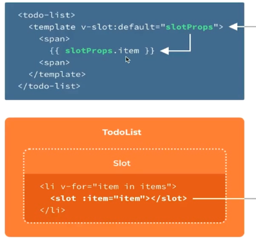
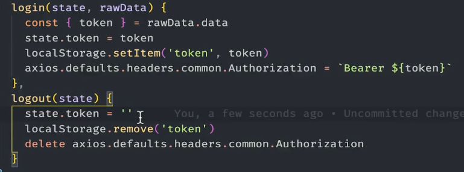

基本结构

 

## 文件上传的原理

表单

上传方式有俩种

- 表单提交方式 submit methods

  action是接收地址，method是传递方式，点击submit会上传文件

  二进制文件格式设置 **enctype="multipart/form-data"**

- JavaScript异步请求的模式

 

 

## 如何拿到dom节点

### 上传方法

 

## vue3 slot

 

 

  

