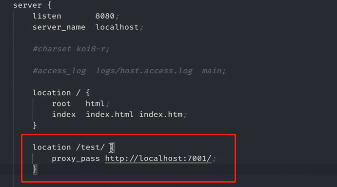

 

 

##  部署

自动部署网址[vercel](https://vercel.com/)

反向代理[nginx](https://www.nginx.com/)

 

### Gitee Pages

新建仓库，名字必须与介绍名一样。

 

将新建仓库clone到本地。

将build代码上传到仓库地址。

 

 

## nginx

- 安装

 

- 查看nginx信息

 

- 启动

 

之后可以在localhost:8080查看启动效果

 

- 关闭nginx

 

 

- nginx默认的配置文件在目录

 

配置文件是nginx.conf

打开命令 code nginx.conf

文件中http->server，就是设置映射的地方。

 

location 服务器路径为/时要处理的文件，root代表的是根目录，访问的文件是index.html，或者是index.htm

**这个意思是，根目录的时候访问root目录下的index文件。**

nginx的根目录是 /user/local/var/www

 

### 代理

 

 

### scp远程拷贝

 
