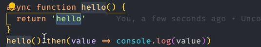
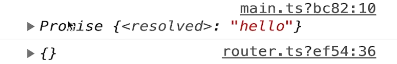
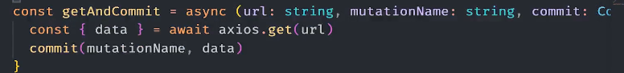
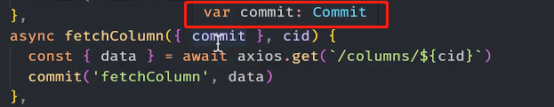
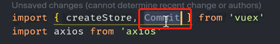

**Mutations必须是同步请求**

actions可以实现异步操作。

 actions接受一个与store具有相同方法和属性的context对象，

所以在actions中可以用context来提交mutations 

 

在组件中调用actions方法，可以用dispatch方法调用。

**注意：**在mutation中添加异步请求，容易破坏vuex的可追溯性。

### async和awiat

用async修饰函数，返回值会被包裹成**promise对象**

 

 

 await只能在async函数中使用，使得只有在await后面的语句有结果后才能继续执行下面的语句。

**await后面必须跟一个promise对象。**

### 优化重复代码

 

### 小技巧

在vscode中鼠标移到变量上可以看到变量的ts定义，然后再从对应的包中引入类型定义。

 

 

### 延时函数

 

##  teleport

