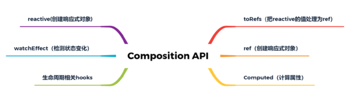

## Vue3 Composition API是什么？

[Vue3 Composition API介绍及实现原理分析](https://segmentfault.com/a/1190000039029078)

> 一组基于功能的附加API，可以灵活的组合组件的逻辑。

在基于Vue2开发项目时，通过methods、watch、data等组件属性实现页面逻辑的方式称之为Option API。

option API模式缺点：

​	不仅导致组件业务分散、产生胶水代码，而且编写的代码也需要Vue编译器将JS代码转换为真正的执行代码。

Composition API通过将组件属性作为JS函数暴露出来以解决上述问题，通过Composition API实现的业务代码无需编译器中间处理，同时TypeScript的类型检查机制可以更好的保障代码的健壮。

