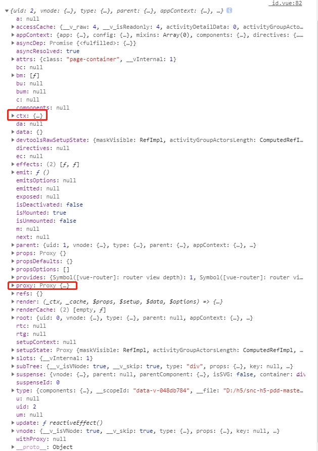

##  全新的 setup 函数

> 使用 Vue 3.x 的生命周期的情况下，整个组件相关的业务代码，都可以丢到 `setup` 里编写。
>
> 因为在 `setup` 之后，其他的生命周期才会被启用。

基本语法：

```ts
import { defineComponent } from 'vue'

export default defineComponent({
  setup (props, context) {
    // 业务代码写这里...
    
    return {
      // 需要给template用的数据、函数放这里return出去...
    }
  }
})
```

**第一个参数 `props` ：**

它是响应式的（只要你不解构它，或者使用 [toRef / toRefs](https://vue3.chengpeiquan.com/component.html#响应式-api-之-toref-与-torefs-new) 进行响应式解构），当传入新的 prop 时，它将被更新。

**第二个参数 `context` ：**

`context` 只是一个普通的对象，它暴露三个组件的 property：

| 属性  | 类型         | 作用                             |
| :---- | :----------- | :------------------------------- |
| attrs | 非响应式对象 | props 未定义的属性都将变成 attrs |
| slots | 非响应式对象 | 插槽                             |
| emit  | 方法         | 触发事件                         |

因为 `context` 只是一个普通对象，所以你可以直接使用 ES6 解构。

平时使用可以通过直接传入 `{ emit }` ，即可用 `emit('xxx')` 来代替使用 `context.emit('xxx')`，另外两个功能也是如此。

但是 `attrs` 和 `slots` 请保持 `attrs.xxx`、`slots.xxx` 来使用他们数据，不要解构这两个属性，因为他们虽然不是响应式对象，但会随组件本身的更新而更新。

### defineComponent

`defineComponent` 可以用于 `TypeScript` 的类型推导，帮你简化掉很多编写过程中的类型定义。

比如，你原本需要这样才可以使用 `setup`：

```ts
import { Slots } from 'vue'

// 声明props和return的数据类型
interface Data {
  [key: string]: unknown
}

// 声明context的类型
interface SetupContext {
  attrs: Data
  slots: Slots
  emit: (event: string, ...args: unknown[]) => void
}

// 使用的时候入参要加上声明，return也要加上声明
export default {
  setup(props: Data, context: SetupContext): Data {
    // ...

    return {
      // ...
    }
  }
}
```

是不是很繁琐？（肯定是啊！不用否定……

使用了 `defineComponent` 之后，你就可以省略这些类型定义：

```ts
import { defineComponent } from 'vue'

export default defineComponent({
  setup (props, context) {
    // ...
    
    return {
      // ...
    }
  }
})
```

而且不只适用于 `setup`，只要是 Vue 本身的 API ，`defineComponent` 都可以自动帮你推导。

### vue3生命周期

| 2.x 生命周期  |  3.x 生命周期   |                执行时间说明                |
| :-----------: | :-------------: | :----------------------------------------: |
| beforeCreate  |      setup      |               组件创建前执行               |
|    created    |      setup      |               组件创建后执行               |
|  beforeMount  |  onBeforeMount  |          组件挂载到节点上之前执行          |
|    mounted    |    onMounted    |             组件挂载完成后执行             |
| beforeUpdate  | onBeforeUpdate  |              组件更新之前执行              |
|    updated    |    onUpdated    |            组件更新完成之后执行            |
| beforeDestroy | onBeforeUnmount |              组件卸载之前执行              |
|   destroyed   |   onUnmounted   |             组件卸载完成后执行             |
| errorCaptured | onErrorCaptured | 当捕获一个来自子孙组件的异常时激活钩子函数 |

被包含在 `<keep-alive>` 中的组件，会多出两个生命周期钩子函数：

| 2.x 生命周期 | 3.x 生命周期  |         执行时间说明         |
| :----------: | :-----------: | :--------------------------: |
|  activated   |  onActivated  |         被激活时执行         |
| deactivated  | onDeactivated | 切换组件后，原组件消失前执行 |

## 组件的基本写法

| 适用版本 |    基本写法     | 视图写法 | 生命周期版本 | 官方是否推荐 |
| :------: | :-------------: | :------: | :----------: | :----------: |
|   3.x    | class component | template |     2.x      |      ×       |
|   3.x    | defineComponent | template |     2.x      |      ×       |
|   3.x    | defineComponent | template |     3.x      |      √       |
|   3.x    | class component |   tsx    |     2.x      |      ×       |
|   3.x    | defineComponent |   tsx    |     2.x      |      ×       |
|   3.x    | defineComponent |   tsx    |     3.x      |      √       |

>WARNING
>
>在 3.x ，只要你的数据要在 `template` 中使用，就必须在 `setup` 里return出来。
>
>当然，只在函数中调用到，而不需要渲染到模板里的，则无需 return 。

## 响应式 API 之 ref

`ref` 是最常用的一个响应式 API，它可以用来定义所有类型的数据，包括 Node 节点。

没错，在 2.x 常用的 `this.$refs.xxx` 来取代 `document.querySelector('.xxx')` 获取 Node 节点的方式，也是用这个 API 来取代。

## 获取DOM元素和组件实例

- 第一步：还是跟往常一样，在 html 中写入 ref 的名称

 

- 第二步：在 setup 中直接声明该变量————我是 TypeScript 所以还有引入类型

 

第三步：别忘了 retrun 该数据

 

第四步：然后就可以直接使用它了，通过 .value 访问到数据

 

### 获取当前组件的实例getCurrentInstance

```vue
<template>
  <div>
    {{id}}
  </div>
</template>

<script>
import { getCurrentInstance, ref } from 'vue';
export default {
  setup(){
    const { ctx } = getCurrentInstance()
    // 1. 这样也是为了去掉this
    // 2. 方便类型推导
    console.log(ctx.$router); // push等方法
    console.log(ctx.$router.currentRoute.value); // 路由实例
    // 这个其实没有必要变成ref因为这个值没必要动态
    // 但是他太长了, 这个真的不能忍
    const id = ref(ctx.$router.currentRoute.value.query.id)

    // 4: 页面拦截器
    ctx.$router.beforeEach((to, from,next)=>{
      console.log('路由的生命周期')
      next()
    })
    return {
      id
    }
  }
}

</script>
```

#### 注意：

用getCurrentInstance获取的组件实例的属性如下：

 

### ctx

- 开发环境的`ctx`，可以看到`$router`、`$store`、声明的变量和方法等
- 生产环境的`ctx`，`$router`、`$store`没有了，其他属性也都没有了，不能通过`ctx.$router`、`ctx.$store`访问router和store，因此ctx可以说对我们没有用，应该避免在代码中使用`ctx`

### **proxy**

**使用proxy替代ctx**

```js
<script>
import { defineComponent, getCurrentInstance } from 'vue'
 
export default defineComponent({
  name: '',
  setup(){
    const { proxy } = getCurrentInstance() // 使用proxy代替ctx，因为ctx只在开发环境有效
    console.log(proxy.$root.$route, proxy.$root.$router) // 路由信息
    console.log(proxy.$systemName) // 全局挂载对象
    return {
      
    }
  }
})
</script>
```

## 版本

> ```text
> 这里列出的并不全, 但是够用了
> 1. alpha 内测版本
> 2. beta  公测版本
> 3. Gamma 正式发布的候选版本
> 4. Final 正式版
> 5. plus  增强版
> 6. full  完全版 
> 7. Trial 试用版（一般有时间或者功能限制）
> ```

###  reactive

```js
import { reactive, toRefs } from "vue";
export default {
  setup() {
    // 注意事项: reactive的对象不可以结构返回或导入, 会导致失去响应式
    const obj = reactive({
      name: "金毛",
      age: 4
    });
    function addObj() {
      obj.age++;
    }
    return {
      ...obj, // 这样写不好, 里面会失去响应式
      obj, // 这样写那么外面就要都基于obj来调取, 类型{{obj.age}}
      ...toRefs(obj) // 必须是reactive生成的对象, 普通对象不可以, 他把每一项都拿出来包了一下, 我们可以这样用了 {{age}}, 放心咱们多深的obj也可以响应
    }
  }
 }
```

### vuex

```js
<script>
import { useStore } from "vuex";
import { computed } from "vue";
export default {
  setup() {
    const store = useStore();
    // 1: 单个引入
    const name = computed(() => store.state.name);
    // 2: 引入整个state
    const state = computed(() => store.state);
    console.log("vuex的实例", state.value); // 别忘了.value

    // 3: 方法其实就直接从本体上取下来了
    const updateName = newName => store.commit("updateName", newName);

    // 4: action一个意思
    const deferName = () => store.dispatch("deferName");

    // 5: getter 没变化
    const fullName = computed(() => store.getters.fullName);
    return {
      name,
      fullName,
      deferName,
      updateName,
    };
  }
};
</script>
```

### watch

```js
<script>
import { watch, ref } from "vue";
export default {
  setup() {
    const n1 = ref(1);
    const n2 = ref(1);
    const n3 = ref(1);
    // 1: 监听一个
    // 第一个参数是函数返回值, 当然也可以 直接写n1 
    // 如果监听的是一个对象里面的某个属性, 那就需要这种函数的写法了, 比2.x的字符串写法高明很多

    watch(
      () => n1.value,
      (val, oldVal) => {
        console.log("新值", val);
        console.log("老值", oldVal);
      }
    );
    // 2: 监听多个
    // 数组的形式定义多个, 这就出现问题了吧, 如果我观察的对象就是个数组, 并且每一项都是一个返回值的函数, 岂不是会被他误认为是多监控的结构, 苦恼
    watch(
      [() => n2.value, ()=>n3.value],
      ([val, val3],[val2, val4]) => {
        // val 是 n2的新值   val2是 n2的老值
        // val3 是 n3的新值  val4是 n3的老值
        console.log("新值 与 老值 是这种对应关系", val, val2);
        console.log("新值 与 老值 是这种对应关系", val3, val4);
      }
    );

    function addn1() {
      n1.value++;
    }
    function addn2() {
      n2.value++;
    }
     function addn3() {
      n3.value++;
    }
    return {
      addn1,
      addn2,
      addn3,
      n1,
      n2,
      n3
    };
  }
};
</script>
```

### watchEffect

```js
<script>
// 弄得类似react了
import { computed, ref, watchEffect } from "vue";
export default {
  setup() {
    const count = ref(1);
    // 1. 默认的定义方式
    const count2 = computed(() => count.value * 2);
    console.log(count2.value); // 也要value因为可能是简单类型
    // 2. getter与setter当然可以定义
    const count3 = computed({
      get: () => count.value * 3,
      set: val => {
        // 这里重置了count
        count.value = val;
      }
    });
    // 3. watchEffect 更像是计算函数
    // 立即执行传入的一个函数，并响应式追踪其依赖，并在其依赖变更时重新运行该函数
    // 侦听器会被链接到该组件的生命周期，并在组件卸载时自动停止。
    // Vue 的响应式系统会缓存副作用函数，并异步地刷新它, 比如同时改变了count与conut4此时watchEffect只是执行一次
    // 初始化运行是在组件 mounted 之前执行的。因此，如果你希望在编写副作用函数时访问 DOM（或模板 ref），请在 onMounted 钩子中进行
    // 并不是返回值, 而是监听里面所有的值, 任何有变化都会重新执行, 他应该可以玩出点东西。
    const count4 = ref(1);
    const stop = watchEffect(() => {
      if (count4.value) {
        console.log("作为判断条件也可以根据count4的变化而重新执行");
      }
      console.log(count.value);
    });
    setTimeout(() => {
      stop(); // 停止监听
    }, 10000);
    function addCount() {
      count.value++;
      setTimeout(() => {
        count4.value++;
      }, 1000);
    }
    // 触发setter
    function setCount() {
      count3.value = 2;
    }
    return {
      count,
      count2,
      addCount,
      count3,
      setCount
    };
  }
};
</script>
```


### customRef防抖

当然这里说的'防抖'不是重点, 重点是这种代码的思维

```text
<template>
  <div>
    <input type="text" v-model="text" />
  </div>
</template>

<script>
import { customRef, onUnmounted } from "vue";
export default {
  setup() {
    let timeout = null; // 并不需要响应式
    const text = useDebouncedRef("hello", (time) => {
      // 毕竟是延时的不用担心获取不到这个值
      console.log("延时执行回调", text.value);
      console.log('时间实例', time)
      timeout = time;
    });
    // 好习惯也是成为合格工程师的必要条件
    onUnmounted(()=>{
        clearTimeout(timeout);
    })
    return {
      text
    };
  }
};

// 并不用纯粹的js编写, 可以利用customRef来监控这个值的一举一动
// 写法一般, 但是思路又多了一条, 感谢
function useDebouncedRef(value, callback, delay = 200) {
  let timeout;
  // 两个参数分别是用于追踪的 track 与用于触发响应的 trigger
  // 这两个参数对 值的追踪 在当前并没有用,比如watchEffect的出发机制
  // 不调用这两个值没问题, 但是如果写成插件的话还是要调用的, 因为别人没准在追踪这个值,

  // 注意:  这个函数不可以有太大的delay, 如果超过500的话就需要考虑在组件销毁时候的清除定时器, 反而逻辑加深了, 此时我们可以每次把演示器的实例拿到
  return customRef((track,trigger) => {
    return {
      get() {
        track()
        return value;
      },
      set(newValue) {
        clearTimeout(timeout);
        // callback接受的太晚了, 可以在这里用另一个函数或对象接收
        timeout = setTimeout(() => {
          value = newValue;
          trigger()
          callback(timeout);
        }, delay);
      }
    };
  });
}
</script>
```

### 组件与注入

父级

```text
<template>
  <div>
    组件:
    <zj :type="type" @ok="wancheng"></zj>
  </div>
</template>

<script>
import zj from "../components/子组件.vue";
import { ref } from 'vue';
import { provide } from 'vue'

export default {
  components: { 
    zj
  },
  setup() {
    provide('name','向下传值'); // 基础值
    provide('name2', ref('向下传值')); // 监控值
    const type = ref('大多数');

    function wancheng(msg){
      console.log('子组件-->',msg)
      setTimeout(()=>{
        type.value = 'xxxxxxx'
      },2000)
    }
    return {
      type,
      wancheng
    }
  }
};
</script>
```

子组件

```text
<template>
  <div>props的属性不用setup去return --- {{type}}</div>
</template>

<script>
import { inject, ref } from 'vue'
// 为了让 TypeScript 正确的推导类型，我们必须使用 createComponent 来定义组件:
export default {
  props: {
    type: String
  },
  // 1: props也是不可以解构的, 会失去响应式
  // 2: context是上下文, 我们可以获取到slots emit 等方法
  // 3: props, context 分开也是为了ts更明确的类型推导
  // setup({type}){
  setup(props, context) {
    // 1: props
    console.log("props", props.type);
    console.log("上下文", context);
    context.emit('ok','传递完成')

    // 2: 注入
    console.log('inject',inject('name'));
    console.log('inject',inject('xxxx','我是默认值'))
    inject('name1', ref('默认值')) // 接收方也可以这样
  }
};
</script>
```

## ref

**ref**` 就是通过 `reactive` 包装了一个对象 ，然后是将值传给该对象中的 `value` 属性，这也就解释了为什么每次访问时我们都需要加上 `.value

我们可以简单地把 `ref(obj)` 理解为这个样子 `reactive({value: obj})`

```
<script>
import {ref, reactive} from 'vue'
export default {
  name: 'App',
  setup() {
      const obj = {count: 3}
      const state1 = ref(obj)
      const state2 = reactive(obj)

    console.log(state1)
    console.log(state2)
  }
  
}
</script>
```

 

**注意**：数组的取值同样如此

```js
 const arr = ref(['1', '2'])
  console.log(arr.value[0])
```

**注意：** 这里指的 `.value` 是在 `setup` 函数中访问 `ref` 包装后的对象时才需要加的，在 `template` 模板中访问时是不需要的，因为在编译时，会自动识别其是否为 `ref` 包装过的

**建议：**

1. 基本类型值（`String` 、`Nmuber` 、`Boolean` 等）或单值对象（类似像 `{count: 3}` 这样只有一个属性值的对象）使用 `ref`
2. 引用类型值（`Object` 、`Array`）使用 `reactive`

## toRef

`toRef` 是将某个对象中的某个值转化为响应式数据，其接收两个参数，第一个参数为 `obj` 对象；第二个参数为对象中的属性名

代码如下：

```js
<script>
// 1. 导入 toRef
import {toRef} from 'vue'
export default {
    setup() {
        const obj = {count: 3}
        // 2. 将 obj 对象中属性count的值转化为响应式数据
        const state = toRef(obj, 'count')
        
              // 3. 将toRef包装过的数据对象返回供template使用
        return {state}
    }
}
</script>
```

**总结：**

1. `ref` 是对传入数据的拷贝；`toRef` 是对传入数据的引用
2. `ref` 的值改变会更新视图；`toRef` 的值改变不会更新视图

## toRefs

其作用就是将传入的对象里所有的属性的值都转化为响应式数据对象，该函数支持一个参数，即 `obj` 对象