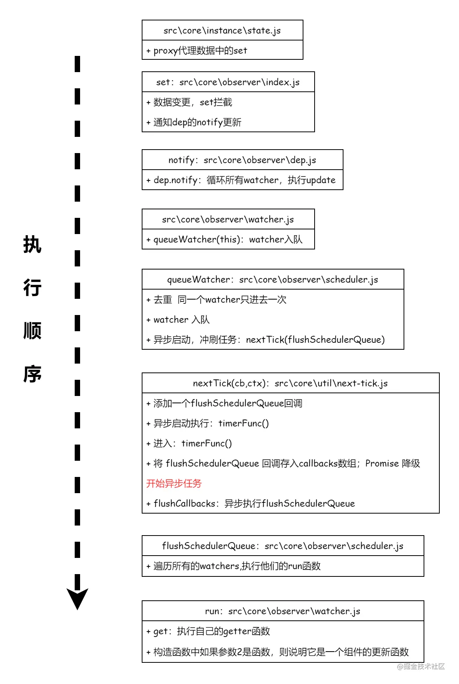

#### 1、为什么用Vue.nextTick()

基于事件循环

主线程的执行过程就是一个`tick`，而所有的异步结果都是通过任务队列来调度。`Event Loop` 分为宏任务和微任务，无论是执行宏任务还是微任务，完成后都会进入到一下`tick`，**并在两个`tick`之间进行UI渲染**。

由于Vue DOM更新是异步执行的，即修改数据时，视图不会立即更新，而是会监听数据变化，并缓存在同一事件循环中，等同一数据循环中的所有数据变化完成之后，再统一进行视图更新。为了确保得到更新后的DOM，所以设置了 `Vue.nextTick()`方法。

#### 2、什么是Vue.nextTick()

是Vue的核心方法之一，官方文档解释如下：

> 在下次DOM更新循环结束之后执行延迟回调。在修改数据之后立即使用这个方法，获取更新后的DOM。

##### MutationObserver

先简单介绍下`MutationObserver`：MO是HTML5中的API，是一个用于监视DOM变动的接口，它可以监听一个DOM对象上发生的子节点删除、属性修改、文本内容修改等。

调用过程是要先给它绑定回调，得到MO实例，这个回调会在MO实例监听到变动时触发。这里MO的回调是放在`microtask`中执行的。




[Vue源码——nextTick实现原理](https://juejin.cn/post/6891309786290192391#heading-6)

[你真的理解$nextTick么](https://juejin.cn/post/6844903843197616136)


# Vue3源码解析：nextTick

#### nextTick

`nextTick`非常简单，创建一个微任务。在当前宏任务结束后，执行fn。

```
function nextTick(fn?: () => void): Promise<void> {
  return fn ? p.then(fn) : p
}
```

`setImmediate` 只兼容 IE10 以上浏览器，其他浏览器均不兼容。其是个宏任务 (macro task)，消耗的资源比较小

