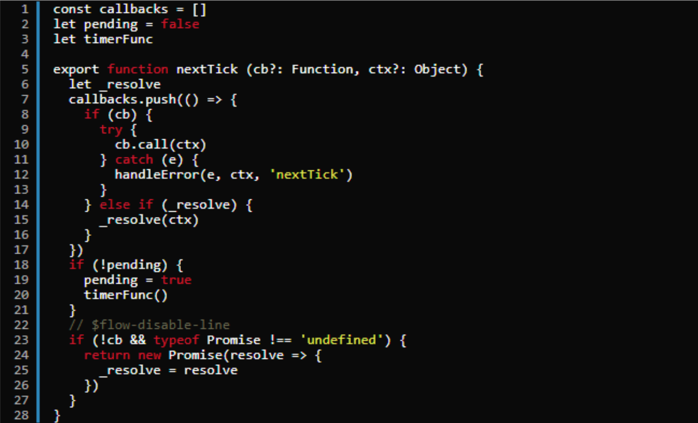

#### 1、为什么用Vue.nextTick()

基于事件循环

主线程的执行过程就是一个`tick`，而所有的异步结果都是通过任务队列来调度。`Event Loop` 分为宏任务和微任务，无论是执行宏任务还是微任务，完成后都会进入到一下`tick`，**并在两个`tick`之间进行UI渲染**。

由于Vue DOM更新是异步执行的，即修改数据时，视图不会立即更新，而是会监听数据变化，并缓存在同一事件循环中，等同一数据循环中的所有数据变化完成之后，再统一进行视图更新。为了确保得到更新后的DOM，所以设置了 `Vue.nextTick()`方法。

#### 2、什么是Vue.nextTick()

是Vue的核心方法之一，官方文档解释如下：

> 在下次DOM更新循环结束之后执行延迟回调。在修改数据之后立即使用这个方法，获取更新后的DOM。

##### MutationObserver

先简单介绍下`MutationObserver`：MO是HTML5中的API，是一个用于监视DOM变动的接口，它可以监听一个DOM对象上发生的子节点删除、属性修改、文本内容修改等。

调用过程是要先给它绑定回调，得到MO实例，这个回调会在MO实例监听到变动时触发。这里MO的回调是放在`microtask`中执行的。


[Vue源码——nextTick实现原理](https://juejin.cn/post/6891309786290192391#heading-6)

[你真的理解$nextTick么](https://juejin.cn/post/6844903843197616136)


# Vue3源码解析：nextTick

#### nextTick

`nextTick`非常简单，创建一个微任务。在当前宏任务结束后，执行fn。

```
function nextTick(fn?: () => void): Promise<void> {
  return fn ? p.then(fn) : p
}
```

`setImmediate` 只兼容 IE10 以上浏览器，其他浏览器均不兼容。其是个宏任务 (macro task)，消耗的资源比较小


它的三个参数的意思：

- callback：我们要执行的操作，可以放在这个函数当中，我们没执行一次`$nextTick`就会把回调函数放到一个异步队列当中；
- pending：标识，用以判断在某个事件循环中是否为第一次加入，第一次加入的时候才触发异步执行的队列挂载
- timerFunc：用来触发执行回调函数，也就是`Promise.then`或`MutationObserver`或`setImmediate` 或`setTimeout`的过程

理解之后，在看整个`$nextTick`里面的执行过程，其实就是把一个个`$nextTick`中的回调函数压入到callback队列当中，然后根据事件的性质等待执行，轮到它执行的时候，就执行一下，然后去掉callback队列中相应的事件。


作者：乐嫣
链接：https://juejin.cn/post/7007328894621581349
来源：掘金
著作权归作者所有。商业转载请联系作者获得授权，非商业转载请注明出处。


Vue 在更新 DOM 时是异步执行的。只要侦听到数据变化，Vue 将开启一个队列，并缓冲在同一事件循环中发生的所有数据变更。如果同一个 watcher 被多次触发，只会被推入到队列中一次。这种在缓冲时去除重复数据对于避免不必要的计算和 DOM 操作是非常重要的。然后，在下一个的事件循环“tick”中，Vue 刷新队列并执行实际 (已去重的) 工作。Vue 在内部对异步队列尝试使用原生的 Promise.then、MutationObserver 和 setImmediate，如果执行环境不支持，则会采用 setTimeout(fn, 0) 代替。



流程就是：

把回调函数放入callbacks等待执行

将执行函数放到微任务或者宏任务中

事件循环到了微任务或者宏任务，执行函数依次执行callbacks中的回调

https://cloud.tencent.com/developer/article/1633546

