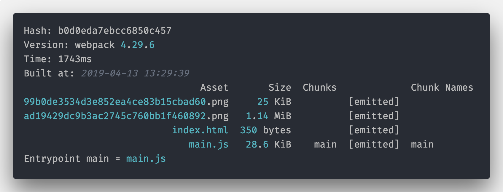

# 使用 Webpack 管理项目中的静态资源

## 图片引入方式

下面三种情况使用图片：

1. HTML 中通过``标签等方式引入；
2. CSS 中通过`src`等方式引入；
3. JavaScript 中使用图片的 URL 或者内容（比如 Canvas 等）。

学过的`resolve.alias`方式创建一个目录的`alias`引用，这种方式不仅仅可以在 JavaScript 中使用，在 HTML 和 CSS 中也可以使用的：

```js
// webpack.confg.js
module.exports = {
    resolve: {
        alias: {
            '@assets': path.resolve('./src/assets')
        }
    }
};

```

### 使用 loader 来加载图片资源

file-loader`和`url-loader的区别

- `file-loader`：能够根据配置项复制使用到的资源（不局限于图片）到构建之后的文件夹，并且能够更改对应的链接；
- `url-loader`：包含 file-loader 的全部功能，并且能够根据配置将符合配置的文件转换成 Base64 方式引入，将小体积的图片 Base64 引入项目可以减少 http 请求，也是一个前端常用的优化方式。

url-loader

安装对应的 loader：`npm install -D url-loader`。

下面我们创建一个项目，目录结构如下：

```
├── package.json            # npm package.json
├── src
│   ├── assets              # 静态资源
│   │   └── img             # 图片资源
│   │       ├── large.png   # 大图图片 超过1M
│   │       ├── small-02.png # 小图图片
│   │       ├── small-03.png
│   │       ├── small-04.png
│   │       ├── small-05.png
│   │       └── small.png  # 小图图片
│   ├── index.css           # css 文件
│   ├── index.html          # html
│   └── index.js            # js
└── webpack.config.js       # webpack 配置
```

首先我们在`index.css`中引入 `small.png`，

```css
.bg-img {
    background: url(./assets/img/small.png) no-repeat;
}
```

然后在`index.js`中引入了`index.css`和`large.png`：

```js
import img from './assets/img/large.png';
import style from './index.css';
console.log(img, style);
```

```html
<!DOCTYPE html>
<html lang="en">
    <head>
        <meta charset="UTF-8" />
        <meta name="viewport" content="width=device-width, initial-scale=1.0" />
        <meta http-equiv="X-UA-Compatible" content="ie=edge" />
        <title>Image</title>
    </head>
    <body>
        
    </body>
</html>
```

这时候我们修改`webpack.config.js`：

```js
// webpack.config.js
const HTMLPlugin = require('html-webpack-plugin');

module.exports = {
    mode: 'development',
    entry: './src/index.js',
    devtool: false,
    module: {
        rules: [
            {
                test: /\.html$/,
                use: ['html-loader']
            },
            {
                test: /\.css$/,
                use: ['style-loader', 'css-loader']
            },
            {
                test: /\.(png|svg|jpg|gif)$/,
                use: {
                    loader: 'url-loader'
                }
            }
        ]
    },
    plugins: [
        new HTMLPlugin({
            template: './src/index.html'
        })
    ]
};
```

执行`webpack`打包出来的文件都比较大,图片被`Base64`处理了，然后直接引入了：

**因为`url-loader`本身优先是将资源`Base64`引入的**。

所以这时候需要使用`url-loader`的`limit`选项来控制**不超过**一定限制的图片才使用`Base64`：

```js
{
    test: /\.(png|svg|jpg|gif)$/,
    use: {
        loader: 'url-loader',
        options: {
            limit: 3*1024 // 3k
        }
    }
}
```

### 配置 CDN 域名

一般静态资源上线的时候都会放到 CDN

```js
module.exports = {
    //..
    output: {
        publicPath: 'http://bd.bxstatic.com/img/'
    }
    //..
};
```

在 HTML 和 CSS 使用`alias`必须要前面添加`~`，即：

```html

.bg-img {
    background: url(~@assets/img/small.png) no-repeat;
}
```

[svg-url-loader](https://www.npmjs.com/package/svg-url-loader) 的工作原理类似于 `url-loader`，除了它利用 [URL encoding](https://developer.mozilla.org/en-US/docs/Glossary/percent-encoding) 而不是 Base64 对文件编码。对于 SVG 图片这是有效的，因为 SVG 文件恰好是纯文本，这种编码规模效应更加明显，使用方法如下：

```js
// webpack.config.js
module.exports = {
    module: {
        rules: [
            {
                test: /\.svg$/,
                loader: 'svg-url-loader',
                options: {
                    // 小于 10kB(10240字节）的内联文件
                    limit: 10 * 1024,
                    // 移除 url 中的引号
                    // (在大多数情况下它们都不是必要的)
                    noquotes: true
                }
            }
        ]
    }
};
```

> Tips：svg-url-loader 拥有改善 IE 浏览器支持的选项，但是在其他浏览器中更糟糕。如果你需要兼容 IE 浏览器，设置 `iesafe: true`选项。

## 图片优化

在 Webpack 中可以借助[img-webpack-loader](https://github.com/tcoopman/image-webpack-loader)来对使用到的图片进行优化。它支持 JPG、PNG、GIF 和 SVG 格式的图片

```bash
# 安装
npm install image-webpack-loader --save-dev
```

[image-webpack-loader](https://github.com/tcoopman/image-webpack-loader)这个 loader 不能将图片嵌入应用，所以它必须和 `url-loader` 以及 `svg-url-loader` 一起使用。为了避免同时将它复制粘贴到两个规则中（一个针对 JPG/PNG/GIF 图片， 另一个针对 SVG ），我们使用 `enforce: 'pre'` 作为单独的规则涵盖在这个 loader：

```js
/ webpack.config.js
module.exports = {
    module: {
        rules: [
            {
                test: /\.(jpe?g|png|gif|svg)$/,
                loader: 'image-webpack-loader',
                // 这会应用该 loader，在其它之前
                enforce: 'pre'
            }
        ]
    }
};
```

通过`enforce: 'pre'`我们提高了 img-webpack-loader 的优先级，保证在`url-loader`和`svg-url-loader`之前就完成了图片的优化。

## CSS Sprite 雪碧图

CSS 使用小图标图片的时候，我们经常做的优化项目是将小图标的图片合并成[雪碧图](https://developer.mozilla.org/zh-CN/docs/Web/Guide/CSS/CSS_Image_Sprites)（CSS Sprite），雪碧图的好处是将页面用到的小图片合并到一张大图中，然后使用`background-position`重新定位，这样节省了 HTTP 的请求数。

在 Webpack 中我们可以借助 PostCSS 来给图片做雪碧图，经过简单的配置之后，生成雪碧图就是全自动的过程了。

首先安装 [postcss-sprites](https://github.com/2createStudio/postcss-sprites)

```bash
npm install postcss-sprites -D
# 如果没有安装 postcss-loader 那么也安装它
npm install postcss-loader -D
```

> Tips：postcss-sprites 安装需要安装[phantomjs](http://phantomjs.org/)可能需要正确上网。

然后修改 PostCSS 的`postcss.config.js`，增加插件的调用：

```js
// postcss.config.js
const postcssSprites = require('postcss-sprites');

module.exports = {
    plugins: [
        postcssSprites({
            // 在这里制定了从哪里加载的图片被主动使用css sprite
            // 可以约定好一个目录名称规范，防止全部图片都被处理
            spritePath: './src/assets/img/'
        })
    ]
};
```

然后修改`webpack.config.js`在`css-loader`之前配置上`postcss-loader`（注意 loader 加载顺序，从后往前）：

```js
//webpack.config.js
// rules

{
    test: /\.css$/,
    use: [
        MiniCssExtractPlugin.loader,
        'css-loader',
        {
            loader: 'postcss-loader'
        }
    ]
}
```

好了，下面我们的 CSS 中使用了`spritePath: './src/assets/img/'`路径的图片就会被处理了，例如下面的文件：

```css
.bg-img02 {
    background: url(./assets/img/small-02.png) no-repeat;
}

.bg-img03 {
    background: url(./assets/img/small-03.png) no-repeat;
}

.bg-img04 {
    background: url(./assets/img/small-04.png) no-repeat;
}

.bg-img05 {
    background: url(./assets/img/small-05.png) no-repeat;
}
```

经过打包之后，输出 log 如下，可见生成了一个新的图片文件`99b0de3534d3e852ea4ce83b15cbad60.png`：



在打开打包之后的 CSS 文件，发现内容被主动替换成了 CSS Sprite 写法，并且设置了正确的`background-position`和`background-size`了：

```css
.bg-img02 {
    background-image: url(99b0de3534d3e852ea4ce83b15cbad60.png);
    background-position: 0px 0px;
    background-size: 320px 320px;
}

.bg-img03 {
    background-image: url(99b0de3534d3e852ea4ce83b15cbad60.png);
    background-position: -160px 0px;
    background-size: 320px 320px;
}

.bg-img04 {
    background-image: url(99b0de3534d3e852ea4ce83b15cbad60.png);
    background-position: 0px -160px;
    background-size: 320px 320px;
}

.bg-img05 {
    background-image: url(99b0de3534d3e852ea4ce83b15cbad60.png);
    background-position: -160px -160px;
    background-size: 320px 320px;
}
```

## 其他资源处理

### 字体、富媒体

对于字体、富媒体等静态资源，可以直接使用`url-loader`或者`file-loader`进行配置即可，不需要额外的操作，具体配置内容如下：

```js
{
    // 文件解析
    test: /\.(eot|woff|ttf|woff2|appcache|mp4|pdf)(\?|$)/,
    loader: 'file-loader',
    query: {
        // 这么多文件，ext不同，所以需要使用[ext]
        name: 'assets/[name].[hash:7].[ext]'
    }
},
```

> Tips：如果不需要 Base64，那么可以直接使用 file-loader，需要的话就是用`url-loader`，还需要注意，如果将正则（test）放在一起，那么需要使用`[ext]`配置输出的文件名。

### 数据

如果我们项目需要加载的类似 JSON、CSV、TSV 和 XML 等数据，那么我们需要单独给它们配置相应的 loader。对 JSON 的支持实际上是内置的，类似于 Node.js，这意味着`import Data from'./data.json'`导入数据默认情况将起作用。要导入 CSV，TSV 和 XML，可以使用[csv-loader](https://www.npmjs.com/package/csv-loader)和[xml-loader](https://www.npmjs.com/package/xml-loader)。

首先是安装它们的 loader：`npm i -D xml-loader csv-loader`，然后增加文件 loader 配置如下：

```js
 {
    test: /\.(csv|tsv)$/,
    use: [
    'csv-loader'
    ]
},
{
    test: /\.xml$/,
    use: [
    'xml-loader'
    ]
}
```

现在，您可以导入这四种类型的数据中的任何一种（JSON，CSV，TSV，XML），并且导入它的 Data 变量将包含已解析的 JSON 以便于使用。