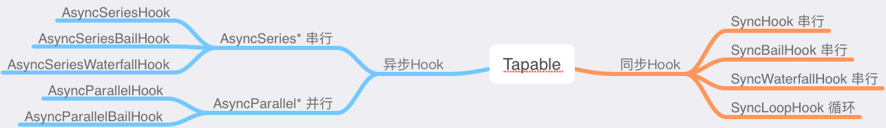
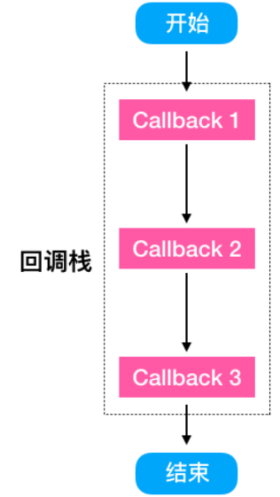
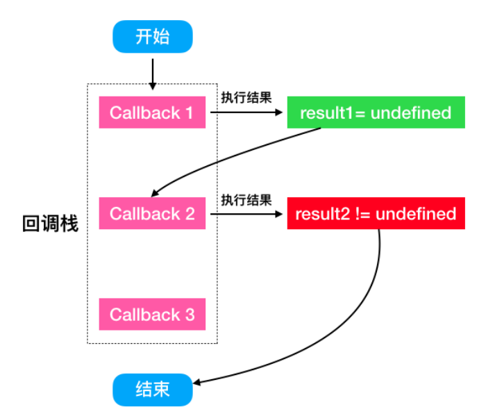
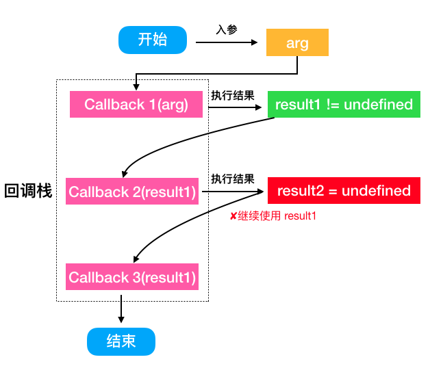
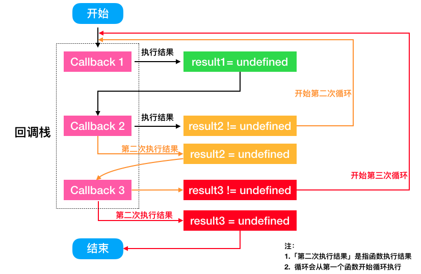

# Tapable —— Webpack 的核心模块

Webpack 工程相当庞大，但 Webpack 本质上是一种事件流机制。通过事件流将各种插件串联起来，最终完成 Webpack 的全流程，而实现事件流机制的核心是今天要讲的[Tapable 模块](https://www.npmjs.com/package/tapable)。Webpack 负责编译的 Compiler 和创建 Bundle 的 Compilation 都是继承自 Tapable。

## 事件监听和发射器

我们都知道 Node.js 特点提到**事件驱动**，这是因为 Node.js 本身利用 JavaScript 的语言特点实现了自定义的事件回调。Node.js 内部一个事件发射器 `EventEmitter`，通过这个类，可以进行事件监听与发射。这个也是 Node.js的核心模块，很多 Node.js 内部模块都是继承自它，或者引用了它。

```js
const EventEmitter = require('events').EventEmitter;
const event = new EventEmitter();
event.on('event_name', arg => {
    console.log('event_name fire', arg);
});
setTimeout(function() {
    event.emit('event_name', 'hello world');
}, 1000);
```

Webpack 核心库 Tapable 的原理和 EventEmitter 类似，但是功能更强大，包括多种类型，通过事件的注册和监听，触发 Webpack 生命周期中的函数方法。在Webpack 中，tapable 都是放到对象的`hooks`上，所以我们叫它们钩子。翻阅 Webpack 的源码时，会发现很多类似下面的代码：

```js
// webpack 4.29.6
// lib/compiler
class Compiler extends Tapable {
    constructor(context) {
        super();
        this.hooks = {
            shouldEmit: new SyncBailHook(['compilation']),
            done: new AsyncSeriesHook(['stats']),
            additionalPass: new AsyncSeriesHook([]),
            beforeRun: new AsyncSeriesHook(['compiler']),
            run: new AsyncSeriesHook(['compiler']),
            emit: new AsyncSeriesHook(['compilation']),
            afterEmit: new AsyncSeriesHook(['compilation']),

            thisCompilation: new SyncHook(['compilation', 'params']),
            compilation: new SyncHook(['compilation', 'params']),
            normalModuleFactory: new SyncHook(['normalModuleFactory']),
            contextModuleFactory: new SyncHook(['contextModulefactory']),

            beforeCompile: new AsyncSeriesHook(['params']),
            compile: new SyncHook(['params']),
            make: new AsyncParallelHook(['compilation']),
            afterCompile: new AsyncSeriesHook(['compilation']),

            watchRun: new AsyncSeriesHook(['compiler']),
            failed: new SyncHook(['error']),
            invalid: new SyncHook(['filename', 'changeTime']),
            watchClose: new SyncHook([]),

            environment: new SyncHook([]),
            afterEnvironment: new SyncHook([]),
            afterPlugins: new SyncHook(['compiler']),
            entryOption: new SyncBailHook(['context', 'entry'])
        };
    }
}
```

这些代码就是一个类或者函数完整生命周期需要**「走过的路」**。

## Tapable 中 Hook 的类型

在[Tapable 的文档](https://github.com/webpack/tapable/blob/master/README.md)中显示了，Tapable 分为以下类型：

```js
// tapable 1.1.1
const {
    SyncHook,
    SyncBailHook,
    SyncWaterfallHook,
    SyncLoopHook,
    AsyncParallelHook,
    AsyncParallelBailHook,
    AsyncSeriesHook,
    AsyncSeriesBailHook,
    AsyncSeriesWaterfallHook
} = require('tapable');
```

Hook 类型可以分为同步（`Sync`）和异步（`Async`），异步又分为并行和串行：



根据使用方式来分，又可以分为`Basic`、`Waterfal`、`Bail`和`Loop`四类，每类 Hook 都有自己的使用要点：

| 类型       | 使用要点                                                     |
| :--------- | :----------------------------------------------------------- |
| `Basic`    | 基础类型，不关心监听函数的返回值，不根据返回值做事情         |
| `Bail`     | 保险式，只要监听函数中有返回值（不为`undefined`），则跳过之后的监听函数 |
| `Waterfal` | 瀑布式，上一步的返回值继续交给下一步处理和使用               |
| `Loop`     | 循环类型，如果该监听函数返回 `true` 则这个监听函数会反复执行，如果返回 `undefined` 则退出循环 |

### `Basic` 类型 Hook

基础类型包括`SyncHook`、`AsyncParallelHook`和`AsyncSeriesHook`，这类 Hook 不关心函数的返回值，会一直执行到底。

`SyncHook`为例来说明下：

```js
const {SyncHook} = require('tapable');
// 所有的构造函数都接收一个可选的参数，这个参数是一个参数名的字符串数组
// 1. 这里array的字符串随便填写，但是array的长度必须与实际要接受参数个数保持一致；
// 2. 如果回调不接受参数，可以传入空数组。
// 后面类型都是这个规则，不再做过多说明
const hook = new SyncHook(['name']);

// 添加监听
hook.tap('1', (arg0, arg1) => {
    // tap 的第一个参数是用来标识`call`传入的参数
    // 因为new的时候只的array长度为1
    // 所以这里只得到了`call`传入的第一个参数，即Webpack
    // arg1 为 undefined
    console.log(arg0, arg1, 1);
    return '1';
});
hook.tap('2', arg0 => {
    console.log(arg0, 2);
});
hook.tap('3', arg0 => {
    console.log(arg0, 3);
});

// 传入参数，触发监听的函数回调
// 这里传入两个参数，但是实际回调函数只得到一个
hook.call('Webpack', 'Tapable');
// 执行结果:
/*
Webpack undefined 1 // 传入的参数需要和new实例的时候保持一致，否则获取不到多传的参数
Webpack 2
Webpack 3
*/
```

通过上面的代码可以得出结论：

\1. 在实例化 SyncHook 传入的数组参数实际是只用了长度，跟实际内容没有关系； 

\2. 执行 call 时，入参个数跟实例化时数组长度相关； 

\3. 回调栈是按照「先入先出」顺序执行的（这里叫回调队列更合适，队列是先入先出）； 

\4. 功能跟 EventEmitter 类似。 

 

#### Bail 类型类**Hook** 

Bail 类型的 Hook 包括： SyncBailHook 、 AsyncSeriesBailHook 、 AsyncParallelBailHook 。 Bail 类型的 Hook 

也是按回调栈顺序一次执行回调，但是如果其中一个回调函数返回结果 result !== undefined 则退出回调栈调。 

代码示例如下：

```javascript
const {SyncBailHook} = require('tapable'); 
const hook = new SyncBailHook(['name']); 
hook.tap('1', name => { console.log(name, 1); }); 
hook.tap('2', name => { console.log(name, 2); return 'stop'; }); 
hook.tap('3', name => { console.log(name, 3); }); 
hook.call('hello'); 
/* output 
hello 1 
hello 2 
*/
```

通过上面的代码可以得出结论： 

\1. BailHook 中的回调是顺序执行的； 

\2. 调用 call 传入的参数会被每个回调函数都获取； 

\3. 当回调函数返回非 undefined 才会停止回调栈的调用。

 

SyncBailHook 类似 Array.find ，找到（或者发生）一件事情就停止执行； AsyncParallelBailHook 类似 Promise. 

race 这里竞速场景，只要有一个回调解决了一个问题，全部都解决了。

#### Waterfall 类型 **Hook** 

`Waterfall`类型 `Hook` 包括 `SyncWaterfallHook`和`AsyncSeriesWaterfallHook`。类似`Array.reduce`效果，如果上一个回调函数的结果 `result !== undefined`，则会被作为下一个回调函数的第一个参数。代码示例如下：

```js
const {SyncWaterfallHook} = require('tapable');
const hook = new SyncWaterfallHook(['arg0', 'arg1']);
hook.tap('1', (arg0, arg1) => {
    console.log(arg0, arg1, 1);
    return 1;
});
hook.tap('2', (arg0, arg1) => {
    console.log(arg0, arg1, 2);
    return 2;
});
hook.tap('3', (arg0, arg1) => {
    // 这里 arg0 = 2
    console.log(arg0, arg1, 3);
    // 等同于 return undefined
});
hook.tap('4', (arg0, arg1) => {
    // 这里 arg0 = 2 还是2
    console.log(arg0, arg1, 4);
});
hook.call('Webpack', 'Tapable');
/* console log output
Webpack Tapable 1
1 'Tapable' 2
2 'Tapable' 3
2 'Tapable' 4 */
```

通过上面的代码可以得出结论：

1. `WaterfallHook` 的回调函数接受的参数来自于上一个函数结果；
2. 调用`call`传入的**第一个参数**会被上一个函数的**非**`undefined`结果给替换；
3. 当回调函数返回**非**`undefined` **不会**停止回调栈的调用。

详细的流程图如下：

 

### `Loop` 类型 Hook

这类 `Hook` 只有一个`SyncLoopHook`（虽然 Tapable 1.1.1版本中存在`AsyncSeriesLoopHook`，但是并没有将它 export 出来），`LoopHook`执行特点是不停地循环执行回调函数，直到所有函数结果 `result === undefined`。为了更加直观地展现 LoopHook 的执行过程，我对示例代码做了一下丰富：

```js
const {SyncLoopHook} = require('tapable');
const hook = new SyncLoopHook(['name']);
let callbackCalledCount1 = 0;
let callbackCalledCount2 = 0;
let callbackCalledCount3 = 0;
let intent = 0;
hook.tap('callback 1', arg => {
    callbackCalledCount1++;
    if (callbackCalledCount1 === 2) {
        callbackCalledCount1 = 0;
        intent -= 4;
        intentLog('</callback-1>');
        return;
    } else {
        intentLog('<callback-1>');
        intent += 4;
        return 'callback-1';
    }
});

hook.tap('callback 2', arg => {
    callbackCalledCount2++;
    if (callbackCalledCount2 === 2) {
        callbackCalledCount2 = 0;
        intent -= 4;
        intentLog('</callback-2>');
        return;
    } else {
        intentLog('<callback-2>');
        intent += 4;
        return 'callback-2';
    }
});

hook.tap('callback 3', arg => {
    callbackCalledCount3++;
    if (callbackCalledCount3 === 2) {
        callbackCalledCount3 = 0;
        intent -= 4;
        intentLog('</callback-3>');
        return;
    } else {
        intentLog('<callback-3>');
        intent += 4;
        return 'callback-3';
    }
});

hook.call('args');

function intentLog(...text) {
    console.log(new Array(intent).join(' '), ...text);
}
/* output
 <callback-1>
 </callback-1>
 <callback-2>
    <callback-1>
    </callback-1>
 </callback-2>
 <callback-3>
    <callback-1>
    </callback-1>
    <callback-2>
        <callback-1>
        </callback-1>
    </callback-2>
 </callback-3>
 */
```

通过上面的代码可以得出结论：

1. `LoopHook` 中的回调返回`undefined`（没有 return 其实就是`undefined`）才会跳出循环；
2. 所说的循环，起点是第一个回调栈的函数。

详细的流程图如下：

 

## Tapable 的原理解析

Tapable 的执行流程可以分为四步：

1. 使用`tap*`对事件进行注册绑定。根据类型不同，提供三种绑定的方式：`tap`、`tapPromise`、`tapAsync`，其中`tapPromise`、`tapAsync`为异步类 Hook 的绑定方法；
2. 使用`call*`对事件进行触发，根据类型不同，也提供了三种触发的方式：`call`、`promise`、`callAsync`；
3. 生成对应类型的代码片段（要执行的代码实际是拼字符串拼出来的）；
4. 生成第三步生成的代码片段。

下面以`SyncHook`源码为例，分析下整个流程。先来看下`lib/SyncHook.js` 主要代码：

```js
class SyncHook extends Hook {
    // 错误处理，防止调用者调用异步钩子
	tapAsync() {
		throw new Error("tapAsync is not supported on a SyncHook");
	}
	tapPromise() {
		throw new Error("tapPromise is not supported on a SyncHook");
	}
    // 实现入口
	compile(options) {
		factory.setup(this, options);
		return factory.create(options);
	}
}
```

首先所有的 Hook 都是继承自`Hook`类，针对同步 Hook 的事件绑定，如`SyncHook`、`SyncBailHook`、`SyncLoopHook`、`SyncWaterfallHook`, 会在子类中覆写基类`Hook`中 `tapAsync` 和 `tapPromise` 方法，这样做可以防止使用者在同步 Hook 中误用异步方法。

## 四个步骤来分析下源码

### 绑定事件

`SyncHook`中绑定事件是下面的代码：

```js
hook.tap('evt1', arg0 => {
    console.log(arg0, 2);
});
hook.tap('evt2', arg0 => {
    console.log(arg0, 3);
});
```

下面我们来看下`tap`的实现，因为`SyncHook`是继承子`Hook`，所以我们找到`lib/Hook.js`中 tap 的实现代码：

```js
tap(options, fn) {
    // 实际调用了_tap
    this._tap("sync", options, fn);
}
_tap(type, options, fn) {
    // 这里主要进行了一些参数的类型判断
    if (typeof options === "string") {
        options = {
            name: options
        };
    } else if (typeof options !== "object" || options === null) {
        throw new Error("Invalid tap options");
    }
    if (typeof options.name !== "string" || options.name === "") {
        throw new Error("Missing name for tap");
    }
    if (typeof options.context !== "undefined") {
        deprecateContext();
    }
    options = Object.assign({ type, fn }, options);
    // 这里是注册了Interceptors(拦截器)
    options = this._runRegisterInterceptors(options);
    // 参数处理完之后，调用了_insert，这是关键代码
    this._insert(options);
}
```

通过查阅`Hook.tap`和`Hook._tap`的代码，发现主要是做一些参数处理的工作，而主要的实现是在`Hook._insert`实现的：

```js
// tapable/lib/Hook.js
_insert(item) {
		this._resetCompilation();
		let before;
		if (typeof item.before === "string") {
			before = new Set([item.before]);
		} else if (Array.isArray(item.before)) {
			before = new Set(item.before);
		}
		let stage = 0;
		if (typeof item.stage === "number") {
			stage = item.stage;
        }
        // 这里根据 stage 对事件进行一个优先级排序
		let i = this.taps.length;
		while (i > 0) {
			i--;
			const x = this.taps[i];
			this.taps[i + 1] = x;
			const xStage = x.stage || 0;
			if (before) {
				if (before.has(x.name)) {
					before.delete(x.name);
					continue;
				}
				if (before.size > 0) {
					continue;
				}
			}
			if (xStage > stage) {
				continue;
			}
			i++;
			break;
        }
        // 这是找到了回调栈
		this.taps[i] = item;
	}
}
```

`_insert`的代码主要目的是将传入的事件推入`this.taps`数组，等同于：

```js
hook.tap('event', callback)
// → 即
this.taps.push({
    type: 'sync',
    name: 'event',
    fn: callback
});
```

在基类`lib/Hook.js`的`constructor`中，可以找到一些变量初始化的代码：

```js
class Hook {
	constructor(args = []) {
        // 这里存入初始化的参数
        this._args = args;
        // 这里就是回调栈用到的数组
        this.taps = [];
        // 拦截器数组
		this.interceptors = [];
		this.call = this._call;
		this.promise = this._promise;
        this.callAsync = this._callAsync;
        // 这个比较重要，后面拼代码会用
		this._x = undefined;
    }
}
```

这样绑定回调函数就完成了，下面看下触发回调的时候发生了什么。

### 事件触发

在事件触发，我们使用同`syncHook`的`call`方法触发一个事件：

```js
hook.call(1, 2);
```

这里的`call`方法，实际是通过`Object.defineProperties`添加到`Hook.prototype`上面的：

```js
// tapable/lib/Hook.js
function createCompileDelegate(name, type) {
	return function lazyCompileHook(...args) {
		this[name] = this._createCall(type);
		return this[name](...args);
	};
}

Object.defineProperties(Hook.prototype, {
	_call: {
		value: createCompileDelegate("call", "sync"),
		configurable: true,
		writable: true
	},
	_promise: {
		value: createCompileDelegate("promise", "promise"),
		configurable: true,
		writable: true
	},
	_callAsync: {
		value: createCompileDelegate("callAsync", "async"),
		configurable: true,
		writable: true
	}
});
```

