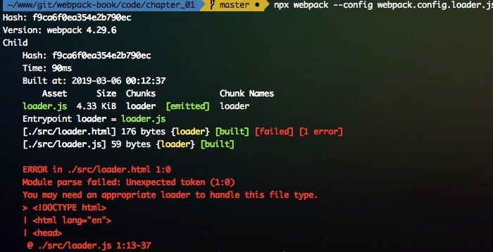

# 基础概念和常见配置项介绍（二）

## resolve

Webpack 进行构建的时候会从入口文件开始（entry）遍历寻找各个模块的依赖，resolve 配置是帮助 Webpack 查找依赖模块的，通过 resolve 的配置，可以帮助 Webpack 快速查找依赖，也可以替换对应的依赖（比如开发环境用 dev 版本的 lib 等）。resolve 的基本配置语法如下：

```js
module.exports = {
    resolve: {
        // resolve的配置
    }
};
```

### resolve.extensions

`resolve.extensions`是帮助 Webpack 解析扩展名的配置，默认值：`['.wasm', '.mjs', '.js', '.json']`，所以我们引入 js 和 json 文件，可以不写它们的扩展名，通常我们可以加上 `.css`、`.less`等，但是要确保同一个目录下面没有重名的 css 或者 js 文件，如果存在的话，还是写全路径吧。

使用 `resolve.extensions` 会 **覆盖默认数组**，这就意味着 webpack 将不再尝试使用默认扩展来解析模块。然而你可以使用 `'...'` 访问默认拓展名

```js
module.exports = {
  //...
  resolve: {
    extensions: ['.ts', '...'],
  },
};
```

### resolve.alias

`resolve.alias` 是最常用的配置，通过设置 alias 可以帮助 webpack 更快查找模块依赖

```js
module.exports = {
    resolve: {
        alias: {
            src: path.resolve(__dirname, 'src'),
            '@lib': path.resolve(__dirname, 'src/lib')
        }
    }
};
```

Tips：

1. alias 的名字可以使用`@` `!` `~`等这些特殊字符，实际使用中 alias 都使用一种，或者不同类型使用一种，这样可以跟正常的模块引入区分开，增加辨识度；
2. 使用`@`注意不要跟 npm 包的[scope](https://docs.npmjs.com/misc/scope)冲突！

> 1. 这时在 vscode 中会导致我们检测不到 utils 中的内容，不能帮我们快速编写代码，可以通过在项目根目录创建 jsconfig.json 来帮助我们定位：

```js
//jsconfig.json
{
    "compilerOptions": {
        "baseUrl": "./src",
        "paths": {
            "@lib/": ["src/lib"]
        }
    }
}
```

alias 还常被用于给生产环境和开发环境配置不同的 lib 库，例如下面写法，在线下开发环境使用具有 debug 功能的 dev 版本 [San](https://baidu.github.io/san/)：

```js
module.exports = {
    resolve: {
        alias: {
            san: process.env.NODE_ENV === 'production' ? 'san/dist/san.min.js' : 'san/dist/san.dev.js'
        }
    }
};
```

alias 还支持在名称末尾添加`$`符号来缩小范围只命中以关键字结尾的导入语句，这样可以做精准匹配：

```js
module.exports = {
    resolve: {
        alias: {
            react$: '/path/to/react.min.js'
        }
    }
};
import react from 'react'; // 精确匹配，所以 react.min.js 被解析和导入
import file from 'react/file.js'; // 非精确匹配，触发普通解析
```

### resolve.mainFields

有一些我们用到的模块会针对不同宿主环境提供几份代码，例如提供 ES5 和 ES6 的两份代码，或者提供浏览器环境和 nodejs 环境两份代码，这时候在`package.json`文件里会做如下配置：

```json
{
    "jsnext:main": "es/index.js", //采用ES6语法的代码入口文件
    "main": "lib/index.js", //采用ES5语法的代码入口文件，node
    "browser": "lib/web.js" //这个是专门给浏览器用的版本
}
```

在 Webpack 中，会根据`resolve.mainFields`的设置去决定使用哪个版本的模块代码，在不同的`target`下对应的`resolve.mainFields`默认值不同，默认`target=web`对应的默认值为：

```js
module.exports = {
    resolve: {
        mainFields: ['browser', 'module', 'main']
    }
};
```

所以在`target=web`打包时，会寻找`browser`版本的模块代码。

`resolve.mainFields`的默认值和当前的`target`配置有关系，对应关系如下：

- 当`target`为`web`或者`webworker`时，值是`["browser", "module", "main"]`
- 当`target`为其它情况时，值是`["module", "main"]`

以`target`等于`web`为例，Webpack 会先采用第三方模块中的`browser`字段去寻找模块的入口文件，如果不存在就采用`module`字段，以此类推。

**下面是不常用的或者比较简单的配置：**

- `resolve.mainFiles`：解析目录时候的默认文件名，默认是`index`，即查找目录下面的`index`+`resolve.extensions`文件；
- `resolve.modules`：查找模块依赖时，默认是`node_modules`；
- `resolve.symlinks`：是否解析符合链接（软连接，[symlink](https://zh.wikipedia.org/zh-cn/符号链接)）；
- `resolve.plugins`：添加解析插件，数组格式；
- `resolve.cachePredicate`：是否缓存，支持 boolean 和 function，function 传入一个带有 path 和 require 的对象，必须返回 boolean 值。

## module

在 webpack 解析模块的同时，不同的模块需要使用不同类型的模块处理器来处理，这部分的设置就在`module`配置中。module 有两个配置：`module.noParse`和`module.rules`，

### module.noParse

`module.noParse`配置项可以让 **Webpack 忽略对部分没采用模块化的文件的递归解析和处理，这样做的好处是能提高构建性能**，接收的类型为正则表达式，或者正则表达式数组或者接收模块路径参数的一个函数：

```js
module.exports = {
    module: {
        // 使用正则表达式
        noParse: /jquery|lodash/

        // 使用函数，从 Webpack 3.0.0 开始支持
        noParse: (content) => {
            // content 代表一个模块的文件路径
            // 返回 true or false
            return /jquery|lodash/.test(content);
        }
    }
}
```

> Tips：这里一定要确定被排除出去的模块代码中不能包含`import`、`require`、`define`等内容，以保证 webpack 的打包包含了所有的模块，不然会导致打包出来的 js 因为缺少模块而报错。

### parser 来控制模块化语法

因为webpack是以模块化的JavaScript文件为入口，所以内置了对模块化JavaScript的解析功能。支持AMD、Commonjs、SystemJs、ES6。

parse属性可以更细粒度的配置哪些模块语法要解析，哪些不解析。简单来说，如果设置`parser.commonjs=false`，那么代码里面使用commonjs的`require`语法引入模块，对应的模块就不会被解析到依赖中，也不会被处理，支持的选项包括：

```js
module: {
    rules: [{
        test: /\.js$/,
        use: ['babel-loader'],
        parser: {
            amd: false, // 禁用 AMD
            commonjs: false, // 禁用 CommonJS
            system: false, // 禁用 SystemJS
            harmony: false, // 禁用 ES6 import/export
            requireInclude: false, // 禁用 require.include
            requireEnsure: false, // 禁用 require.ensure
            requireContext: false, // 禁用 require.context
            browserify: false, // 禁用 browserify
            requireJs: false, // 禁用 requirejs
        }
    }]
}
```

> Tips：parser是语法层面的限制，noParse只能控制哪些文件不进行解析。

### module.rules

`module.rules`是在处理模块时，将符合规则条件的模块，提交给对应的处理器来处理，通常用来配置 loader，其类型是一个数组，数组里每一项都描述了如何去处理部分文件。每一项 rule 大致可以由以下三部分组成：

1. 条件匹配：通过`test`、`include`、`exclude`等配置来命中可以应用规则的模块文件；
2. 应用规则：对匹配条件通过后的模块，使用`use`配置项来应用`loader`，可以应用一个 loader 或者按照**从后往前的顺序**应用一组 loader，当然我们还可以分别给对应 loader 传入不同参数；
3. 重置顺序：一组 loader 的执行顺序默认是**从后到前（或者从右到左）**执行，通过`enforce`选项可以让其中一个 loader 的执行顺序放到最前（pre）或者是最后（post）。

### 条件匹配

条件匹配相关的配置有`test`、`include`、`exclude`、`resource`、`resourceQuery`和`issuer`。

条件匹配的对象包括三类：`resource`，`resourceQuery`和`issuer`。

- resource：请求文件的绝对路径。它已经根据 resolve 规则解析；
- issuer: 被请求资源（requested the resource）的模块文件的绝对路径，即导入时的位置。

举例来说明：从 `app.js` 导入 `'./style.css?inline'`：

- `resource` 是`/path/to/style.css`；
- `resourceQuery` 是`?`之后的`inline`；
- `issuer` 是`/path/to/app.js`。

来看下 rule 对应的配置与匹配的对象关系表：

| rule 配置项     | 匹配的对象          |
| :-------------- | :------------------ |
| `test`          | `resource`类型      |
| `include`       | `resource`类型      |
| `exclude`       | `resource`类型      |
| `resource`      | `resource`类型      |
| `resourceQuery` | `resourceQuery`类型 |
| `issuer`        | `issuer`类型        |

### `Loader` 配置

`loader`是解析处理器

`module.rules`中指定`*.less`文件都是用`less-loader`：

```js
module.exports = {
    module:{
        rules:[
            test: /\.less$/, use:'less-loader'
        ]
    }
}
```

简单来理解上面的配置，`test`项使用 `/\.less$/`正则匹配需要处理的模块文件（即 less 后缀的文件），然后交给`less-loader`来处理，这里的`less-loader`是个 string，最终会被作为`require()`的参数来直接使用。


除了直接在`webpack.config.js`是用 loader 的方式之外，还可以在对应的 JavaScript 文件中是用 loader：

```js
const html = require('html-loader!./loader.html');
console.log(html);
```

上面的代码，实际是将`loader.html`的内容转化成 string 变量，直接给输出了，等同于：

```js
const html = require('./loader.html');
console.log(html);
```

加上下面配置的效果：

```js
module.exports = {
    module: {
        rules: [{test: /\.html$/, use: ['html-loader']}]
    }
};
```

如果没有 html-loader，直接`require`一个 html 文件，会被当初 js 模块来执行，则会报错：


> Tips：`require('html-loader!./loader.html')`中`!`类似 Unix 系统中命令行的管道，这里`!`隔开的命令是**从右到左解析的**，即先加载`loader.html`然后在将加载的文件内容传给`html-loader`处理。

loader 有两种配置方式：

1. 使用 webpack.config.js 的配置方式：

```js
module.exports = {
    module: {
        rules: [{test: /\.html$/, use: ['html-loader']}]
    }
};
```

1. 在 JavaScript 文件内使用内联配置方式：

```js
const html = require('html-loader!./loader.html');
// or
import html from 'html-loader!./loader.html';
```

> Tips：use 中传递字符串（如：`use: ['style-loader']`）是 loader 属性的简写方式（如：`use: [{loader: 'style-loader'}]`）

#### Loader 的参数

给 loader 传参的方式有两种：

1. 通过`options`传入
2. 通过`query`的方式传入：

```js
// inline内联写法，通过 query 传入
const html = require("html-loader?attrs[]=img:src&attrs[]=img:data-src!./file.html");
// config内写法，通过 options 传入
module: {
    rules: [{
        test: /\.html$/,
        use: [{
            loader: 'html-loader',
            options: {
                minimize: true,
                removeComments: false,
                collapseWhitespace: false
            }
        }]
    }]
}
// config内写法，通过 query 传入
module: {
    rules: [{
      test: /\.html$/,
      use: [ {
        loader: 'html-loader?minimize=true&removeComments=false&collapseWhitespace=false',
      }]
    }]
}
```

#### Loader 的解析顺序

Webpack 的 Loader 解析顺序是从右到左（从后到前）的

```js
// query 写法从右到左，使用!隔开
const styles = require('css-loader!less-loader!./src/index.less');
// 数组写法，从后到前
module.exports = {
    module: {
        rules: [
            {
                test: /\.less$/,
                use: [
                    {
                        loader: 'style-loader'
                    },
                    {
                        loader: 'css-loader'
                    },
                    {
                        loader: 'less-loader'
                    }
                ]
            }
        ]
    }
};
```

如果需要调整 Loader 的执行顺序，可以使用`enforce`，`enforce`取值是`pre|post`，`pre`表示把放到最前，`post`是放到最后：

```js
use: [
    {
        loader: 'babel-loader',
        options: {
            cacheDirectory: true
        },
        // enforce:'post' 的含义是把该 loader 的执行顺序放到最后
        // enforce 的值还可以是 pre，代表把 loader 的执行顺序放到最前
        enforce: 'post'
    }
];
```

#### oneOf：只应用第一个匹配的规则

`oneOf`表示对该资源只应用第一个匹配的规则，一般结合`resourceQuery`，具体代码来解释：

```js
module.exports = {
    //...
    module: {
        rules: [
            {
                test: /\.css$/,
                oneOf: [
                    {
                        resourceQuery: /inline/, // foo.css?inline
                        use: 'url-loader'
                    },
                    {
                        resourceQuery: /external/, // foo.css?external
                        use: 'file-loader'
                    }
                ]
            }
        ]
    }
};
```

### `plugin` 插件

plugin`是 Webpack 的重要组成部分，通过`plugin`可以解决`loader`解决不了的问题。Webpack 本身就是有很多插件组成的，所以内置了很多插件，我们可以直接通过`webpack`对象的属性来直接使用，例如：`webpack.optimize.UglifyJsPlugin

```js
module.exports = {
    //....
    plugins: [
        // 压缩js
        new webpack.optimize.UglifyJsPlugin();
    ]
}
```

除了内置的插件，我们也可以通过 NPM 包的方式来使用插件：

```js
// 非默认的插件
const ExtractTextPlugin = require('extract-text-webpack-plugin');
module.exports = {
    //....
    plugins: [
        // 导出css文件到单独的内容
        new ExtractTextPlugin({
            filename: 'style.css'
        })
    ]
};
```

> Tips：`loader`面向的是解决某个或者某类模块的问题，而`plugin`面向的是项目整体，解决的是`loader`解决不了的问题。

- resolve

  ：模块依赖查找相关的配置

  - `resolve.extensions`：可以省略解析扩展名的配置，配置太多反而会导致webpack 解析效率下降；
  - `resolve.alias`：通过设置 alias 可以帮助 webpack 更快查找模块依赖，精简代码书写时相对路径的书写；

- module.rules

  ：loader 相关的配置，每个 rule 重要的内容有：

  - `test`：正则匹配需要处理的模块文件；
  - `use`：loader 数组配置，内部有`loader`和`options`；
  - `include`：包含；
  - `exclude`：排除；

- `plugins`：插件。