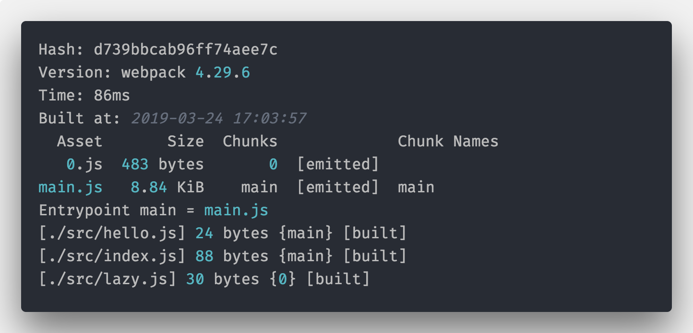
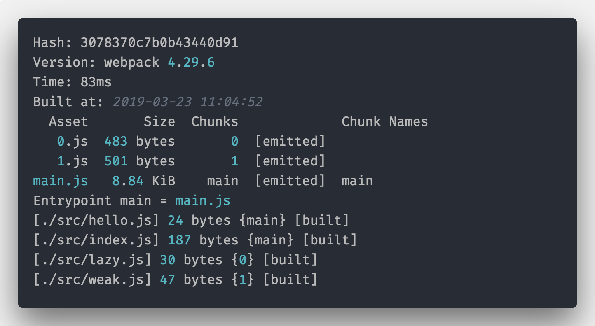
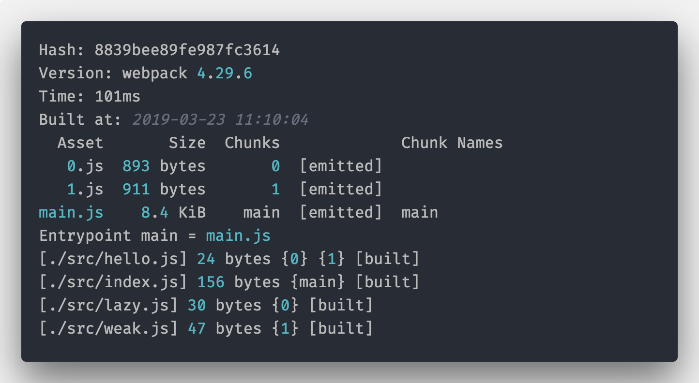

#  Webpack 中的模块化开发

**模块**是指为了完成某功能所需的程序或者子程序，模块是系统中「职责单一」且「可替换」的部分。

所谓的模块化就是指把系统代码分为一系列职责单一且可替换的模块。

模块化开发是指如何开发新的模块和复用已有的模块来实现应用的功能。

> 我们先来认识下三大 JavaScript 主流模块规范：CommonJS、AMD 和 ES6 Module。

## CommonJS

```js
// sayhi.js
var hi = 'hello world';
function sayHi() {
    return hi;
}
module.exports = sayHi;
// index.js
var sayHi = require('./sayhi.js');
console.log(sayHi());
```

上面的代码就是 CommonJS 语法，使用了`require`来导入一个模块，`module.exports`导出模块。在 Node.js 中[实际代码](https://nodejs.org/docs/latest/api/modules.html#modules_the_module_wrapper)会被处理成下面代码而被应用：

```js
(function(exports, require, module, __filename, __dirname) {
    // ...
    // 模块的代码在这里
    // ...
});
```

## AMD

最大特点是浏览器内支持、实现简单、并且支持异步加载

方法：

- `require()`：引入其他模块；
- `define()`：定义新的模块。

基本语法如下：

```js
// sayhi.js
define(function() {
    var hi = 'hello world';
    return function sayHi() {
        return hi;
    };
});
// index.js
require(['./sayhi.js'], function(sayHi) {
    console.log(sayHi());
});
```

## ES6 Module

```js
// sayhi.js
const hi = 'hello world';
export default function sayHi() {
    return hi;
}
// index.js
import sayHi from './sayhi';
console.log(sayHi());
```

## Webpack 中一切皆模块

在 Webpack 编译的过程中，Webpack 会要对整个代码进行**静态分析**，分析出各个模块的类型和它们依赖关系，然后将不同类型的模块提交给对应的加载器（loader）来处理。比如一个用 Less 写的样式，可以先用 less-loader 将它转成一个 CSS 模块，然后再通过 css-loader 把他插入到页面的 `<style>` 标签中执行，甚至还可以通过插件将这部分 CSS 导出为 CSS 文件，使用`link`标签引入到页面中。

## Webpack 对 Module 的增强

在 Webpack 中，我们不仅可以为所欲为的使用 CommonJS 、AMD 和 ES6 Module 三大规范（比如一个文件中混合使用三种规范），还可以使用 Webpack 对 Module 的增强方法和属性。下面介绍下 Webpack 中特有的一些属性和方法。

### `import()`和神奇注释

 Webpack 中，`import`不仅仅是 ES6 Module 的模块导入方式，还是一个类似`require`的函数（其实这是 [ES2015 loader 规范](https://whatwg.github.io/loader/)的实现），我们可以通过`import('path/to/module')`的方式引入一个模块，**`import()`返回的是一个`Promise`对象：**

```js
import('path/to/module').then(mod => {
    console.log(mod);
});
```

下面看看使用`import()`和 import 的打包有什么区别：

```js
// hello.js
export default 'hello';
// layz.js
export default 'lazy module';
// index.js
import hello from './hello';
import('./lazy').then(lazy => {
    console.log(lazy);
});
```

执行下命令：

```js
npx webpack --mode development：
```



通过打包后的 log 和`dist`文件夹内容发现，我们的代码被分割成了两个文件，一个是`main.js`一个是`0.js`，这是因为相对于`import from`的静态分析打包语法，`import()`是动态打包语法，即我们的内容不是第一时间打进`main.js`的，而是通过异步的方式加载进来的。

**代码分割是 webpack 进行代码结构组织，实现动态优化的一个重要功能**

下面我们再来看下`import()`的**神奇注释**特性，上面`index.js`的代码修改成下面这样，增加注释`webpackChunkName: 'lazy-name'`

```js
import hello from './hello';
import(
    /*
     webpackChunkName: 'lazy-name'
     */
    './lazy'
).then(lazy => {
    console.log(lazy);
});
```

则打包后的结果，`0.js`变成了`lazy-name.js`了，这个文件的名字就是在`import()`注释里面指定的`webpackChunkName`，这就是神奇注释（Magic Comments）。

目前支持的注释有：

- `webpackInclude`：如果是 import 的一个目录，则可以指定需要引入的文件特性，例如只加载 json 文件：`/\.json$/`；
- `webpackExclude`：如果是 import 的一个目录，则可以指定需要过滤的文件，例如 `/\.noimport\.json$/`；
- `webpackChunkName`：这是 chunk 文件的名称，例如 `lazy-name`；
- `webpackPrefetch`: 是否预取模块，及其优先级，可选值`true`、或者整数优先级别，0 相当于 true，webpack 4.6+支持；
- `webpackPreload`: 是否预加载模块，及其优先级，可选值`true`、或者整数优先级别，0 相当于 true，webpack 4.6+支持；
- `webpackMode`: 可选值`lazy`/`lazy-once`/`eager`/`weak`。

这里最复杂的是`webpackMode`：

- `lazy`：是默认的模式，为每个 `import()` 导入的模块，生成一个可延迟加载 chunk；
- `lazy-once`：生成一个可以满足所有 `import()` 调用的**单个**可延迟加载 chunk，此 chunk 将在第一次 import() 调用时获取，随后的 import() 调用将使用相同的网络响应；注意，这种模式仅在部分动态语句中有意义，例如 import(`./locales/${language}.json`)，其中可能含有多个被请求的模块路径；
- `eager`：不会生成额外的 chunk，所有模块都被当前 chunk 引入，并且没有额外的网络请求。仍然会返回 Promise，但是是 resolved 状态。和静态导入相对比，在调用 `import()` 完成之前，该模块不会被执行。
- `weak`：尝试加载模块，如果该模块函数已经以其他方式加载（即，另一个 chunk 导入过此模块，或包含模块的脚本被加载）。仍然会返回 Promise，但是只有在客户端上已经有该 chunk 时才成功解析。如果该模块不可用，Promise 将会是 rejected 状态，并且网络请求永远不会执行。当需要的 chunks 始终在（嵌入在页面中的）初始请求中手动提供，而不是在应用程序导航在最初没有提供的模块导入的情况触发，这对于 Server 端渲染（SSR，Server-Side Render）是非常有用的。

通过上面的神奇注释，`import()`不再是简单的 JavaScript 异步加载器，还是任意模块资源的加载器，举例说明：如果我们页面用到的图片都放在`src/assets/img`文件夹下，你们可以通过下面方式将用到的图片打包到一起：

```js
import(/* webpackChunkName: "image", webpackInclude: /\.(png|jpg|gif)/ */ './assets/img');
```

Tips：prefetch 优先级低于 preload，preload 会并行或者加载完主文件之后立即加载；prefetch 则会在主文件之后、空闲时在加载。prefetch 和 preload 可以用于提前加载图片、样式等资源的功能。

### `require.resolve()` 和`require.resolveWeak()`

`require.resolve()` 和 `require.resolveWeak()`都可以获取模块的唯一 ID（moduleId），区别在于`require.resolve()`会把模块真实引入进 bundle，而`require.resolveWeak()`则不会，配合`require.cache`和 `__webpack_modules__`可以用于判断模块是否加载成功或者是否可用。

### `require.context()`

`require.context(directory, includeSubdirs, filter)`可以批量将`directory`内的文件全部引入进文件，并且返回一个具有`resolve`的 context 对象，使用`context.resolve(moduleId)`则返回对应的模块。

- directory：目录 string；
- includeSubdirs：是否包含子目录，可选，默认值是 true；
- filter：过滤正则规则，可选项。

> Tips：注意 `require.context()` 会将所有的文件都引入进 bundle！

### `require.include()`

`require.include(dependency)`顾名思义为引入某个依赖，但是并不执行它，可以用于优化 chunk，例如下面示例代码：

```js
require.include('./hello.js');
require.ensure(['./hello.js', './weak.js'], function(require) {
    /* ... */
});
require.ensure(['./hello.js', './lazy.js'], function(require) {
    /* ... */
});
```



- main 包含了 hello 和 index；
- weak 和 lazy 分别被打包到 1，0 两个文件。

这实际上使用了`require.include()`直接优化了代码分割，如果不用`require.include('./hello.js');`则`hello.js`会分别和`weak`、`lazy`打包，注意下面打包 log 的`[./src/hello.js] 24 bytes {0} {1} [built]` 说明`hello.js`被打包进了 0，1 两个文件。



### `__resourceQuery`

当前模块的资源查询（resource query），即当前模块引入是传入的 query 信息，例如：

```js
// main.js
const component = require('./component-loader?commponent=demo');
// component-loader.js
const querystring = require('querystring');
const query = querystring.parse(__resourceQuery.slice(1)); // 去掉?
console.log(query); // {component: demo}
```

### 其他

- **webpack_public_path**：等同于 `output.publicPath` 配置选项；

- **webpack_require**：原始 `require` 函数。这个表达式不会被解析器解析为依赖。

- webpack_chunk_load

  ：内部`chunk`载入函数，用法

  ```
  __webpack_chunk_load__(chunkId, callback(require))；
  ```

  - chunkId ：需要载入的 chunk id
  - callback(require)： chunk 载入后调用的回调函数。

- **webpack_modules**：所有模块的内部对象，可以通过传入 moduleId 来获取对应的模块；`require.resolve()` 和 `require.resolveWeak()`获取`moduleId`；

- module.hot：用于判断是否在 hotModuleReplace 模式下，一般可以用于 loader 编写中判断在 HMR 模式下增加 reload 逻辑代码等；

- **webpack_hash**：这个变量只有在启用 `HotModuleReplacementPlugin` 或者 `ExtendedAPIPlugin` 时才生效。这个变量提供对编译过程中(compilation)的 hash 信息的获取。

- **non_webpack_require**：生成一个不会被 webpack 解析的 `require` 函数

### Webpack 对 Node.js 模块的 polyfill

Webpack 还对一些常用的 Node.js 模块和属性进行了 mock，例如在 web 的 js 文件中可以直接引入 Node.js 的`querystring`模块，这个模块实际引入的是[node-libs-browser](https://github.com/webpack/node-libs-browser)来对 Node.js 核心库 polyfill，详细在 web 页面中可以用的 Node.js 模块，可以参考[node-libs-browser](https://github.com/webpack/node-libs-browser) Readme 文件的表格。

> polyfill：英文原意为一种用于衣物、床具等的聚酯填充材料，例如装修时候的腻子，作用是抹平坑坑洼洼的墙面；在 JavaScript 中表示一些可以抹平浏览器实现差异的代码，比如某浏览器不支持 Promise，可以引入`es6-promise-polyfill`等库来解决。

## Webpack 对资源的模块化处理

### 样式文件的`@import`和JavaScript 中的`import`

在 Webpack 中的 css （包括其预处理语言，例如 Less、Sass）等，都可以在内部通过`@import`语法直接引入使用：

```css
@import 'vars.less';
body {
    background: @bg-color;
}
```

除了样式文件中的`@import`，在 JavaScript 文件中，还支持直接使用 ES6 Module 的`import`（包括 `require`）直接引入样式文件，例如：

```js
import styles from './style.css';
```

这种语法其实是 [CSS Modules 语法](https://github.com/css-modules/css-modules)

### 使用 loader 把资源作为模块引入

引入对应的 loader

```js
const html = require('html-loader!./loader.html');
console.log(html);
```

除了 html，类似模板文件，还可以直接转换为对应的 render 函数，例如下面代码使用了[ejs-loader](https://www.npmjs.com/package/ejs-loader)：

```js
const render = require('ejs!./file.ejs');
// => 得到 ejs 编译后的 render 函数
render(data); // 传入 data，直接返回的是 html 片段
```
