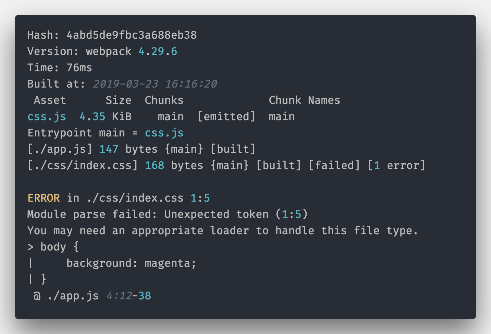
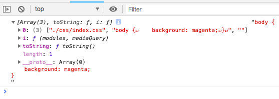
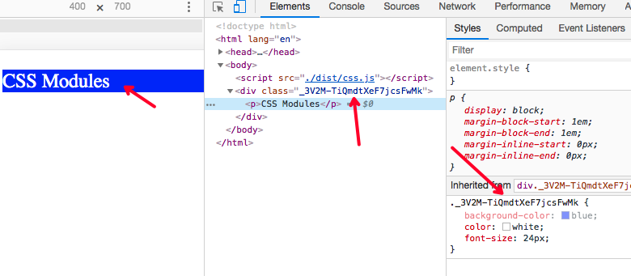

# Webpack 中样式相关的配置

Webpack 中一切皆模块，CSS 也可以在 JavaScript 中被直接引用，但是 CSS 的语法 JavaScript 是不能解析的，所以下面代码会报错：

```js
import css from './css/index.css';
console.log(css);
```



## css-loader

首先添加 css-loader：

```
npm install --save-dev css-loader
# or
npm i -D css-loader
```

然后给`webpack.config.js`添加`rule`：

```js
{
    module: {
        rules: [
            {
                test: /\.css$/,
                use: ['css-loader']
            }
        ];
    }
}
```

这时候修改`app.js` 添加下面代码：

```js
import css from './css/index.css';
console.log(css, css.toString());
```

效果如下：


这时候 CSS 会被转成字符串， JS 就可以直接使用。

除了上面直接在`webpack.config.js`中添加`rule`，还可以在 JavaScript 中直接使用下面的方式引入：

```js
import css from 'css-loader!./css/index.css';
console.log(css);
```

上面代码中`import css from 'css-loader!./css/index.css'`是 webpack loader 的内联写法。

## style-loader

有了 css-loader 可以识别 CSS 语法了，下面就需要 style-loader 出场了。简单来说，style-loader 是将 css-loader 打包好的 CSS 代码以`<style>`标签的形式插入到 HTML 文件中，所以`style-loader`是和`css-loader`成对出现的，并且`style-loader`是在`css-loader`之后。首先安装`style-loader`：

```bash
npm install --save-dev style-loader
# or
npm i -D css-loader
```

## mini-css-extract-plugin

CSS 作为`<style>`标签放到 HTML 内还是不够的，我们还需要将 CSS 以`<link>`的方式通过 URL 的方式引入进来，这时候就需要使用[mini-css-extract-plugin](https://github.com/webpack-contrib/mini-css-extract-plugin)这个插件了，首先安装它：

```
npm install --save-dev mini-css-extract-plugin
```

`mini-css-extract-plugin`这个使用的时候需要分别配置 loader 和 plugin，loader 需要放在`css-loader`之后代替`style-loader`：

```js
const MiniCssExtractPlugin = require('mini-css-extract-plugin');
module.exports = {
    plugins: [
        // 添加 plugin
        new MiniCssExtractPlugin({
            filename: '[name].css',
            chunkFilename: '[id].css'
        })
    ],
    module: {
        rules: [
            {
                test: /\.css$/,
                // 添加 loader
                use: [MiniCssExtractPlugin.loader, 'css-loader']
            }
        ]
    }
};
```

## CSS Modules

1. CSS Modules 主要解决的问题有：
   1. 解决 CSS 类都是全局的，容易造成全局污染（样式冲突）；
   2. JS 和 CSS 共享类名；
   3. 可以方便的编写出更加健壮和扩展方便的 CSS。

下面来看下 CSS Modules 究竟是什么，我们来看下代码表现，首先创建一个`app.css`文件，内容如下：

```css
/* app.css */
.element {
    background-color: blue;
    color: white;
    font-size: 24px;
}
```

我们知道了，在 JS 中可以直接`import`一个 CSS 文件：

```js
// app.js
import styles from './app.css';
```

那么 CSS Modules 中，JS 可以直接使用 CSS 的类名作为对象值，例如下面代码：

```js
// app.js
import styles from './app.css';

let element = `
  <div class="${styles.element}">
    <p>CSS Modules</p>
  </div>
`;
document.write(element);
```

在 css-loader 增加`modules`的选项，说明打开 CSS Modules 支持。

```js
module.exports = {
    //...
    module: {
        rules: [
            {
                test: /\.css$/,
                use: [
                    'style-loader',
                    {
                        loader: 'css-loader',
                        options: {
                            modules: true
                        }
                    }
                ]
            }
        ]
    }
};
```

执行 WebPack 打包，最终效果如下：


## CSS 预处理器

### 使用预处理器 loader

下面以 Less 预处理器为例，介绍 CSS 预处理器的用法。首先安装对应的 loader：[`less-loader`](https://github.com/webpack-contrib/less-loader)：

```shell
npm i -D less-loader
# or
npm install less-loader --save-dev
```

然后修改`webpack.config.js`：

```js
// webpack.config.js
module.exports = {
    //   ...
    module: {
        rules: [
            {
                test: /\.less$/,
                loader: 'less-loader' // 将 Less 编译为 CSS
            }
        ]
    }
};
```

`less-loader`只是将 Less 语法编译成 CSS，后续还需要使用`css-loader`和`style-loader`处理才可以，所以一般来说需要配合使用：

```js
// webpack.config.js
module.exports = {
    //   ...
    module: {
        rules: [
            {
                test: /\.less$/,
                use: [
                    'style-loader',
                    {
                        loader: 'css-loader',
                        options: {
                            modules: true
                        }
                    },
                    'less-loader' // 将 Less 编译为 CSS
                ]
            }
        ]
    }
};
```

> Tips：注意一些预处理语言需要安装对应的解析器，例如 sass-loader，需要同时安装 node-sass：`npm install sass-loader node-sass --save-dev`

## PostCSS：CSS 后处理器

### postcss-loader

使用 PostCSS 需要安装[postcss-loader](https://github.com/postcss/postcss-loader)，然后按照 loader 顺序，在 css-loader 之前（注意 loader 顺序：从右到左，从后到前）加上 postcss-loader：

```js
// webpack.config.js
module.exports = {
    //   ...
    module: {
        resule: [
            {
                test: /\.css$/,
                use: [
                    'style-loader',
                    {
                        loader: 'css-loader',
                        options: {
                            modules: true,
                            importLoader: 1
                        }
                    },
                    'postcss-loader'
                ]
            }
        ]
    }
};
```

如果有 CSS 预处理语言，则配置写法：

```js
// webpack.config.js
module.exports = {
    //   ...
    module: {
        rules: [
            {
                test: /\.less$/,
                use: [
                    'style-loader',
                    {
                        loader: 'css-loader',
                        options: {
                            modules: true,
                            importLoader: 2
                        }
                    },
                    'less-loader',
                    'postcss-loader'
                ]
            }
        ]
    }
};
```

### PostCSS 配置

postCSS 的配置写法有以下三种方式：

1. 通过配置文件`postcss.config.js`，一般放置在项目的根目录下；
2. 通过 loader 的配置项`options`；
3. 直接在 package.json 中添加个`postcss`属性。

#### postcss.config.js

`postcss.config.js`完全是按 Node.js 模块写法来写，使用什么插件就引入什么插件依赖：

```js
// postcss.config.js
const autoprefixer = require('autoprefixer');
module.exports = {
    plugins: [autoprefixer(['IE 10'])]
};
```

#### loader 配置项 options

在`webpack.config.js`中，直接配置了`postcss-loader`之后，然后通过`loader`的`options`可以配置 postcss 的参数。

```js
// 引入postcss 插件
const autoprefixer = require('autoprefixer');
module.exports = {
    module: {
        rules: [
            {
                test: /\.css$/,
                use: [
                    'style-loader',
                    'css-loader',
                    {
                        loader: 'postcss-loader',
                        options: {
                            // 通过 plugins 选项
                            plugins: [autoprefixer(['IE 10'])]
                        }
                    }
                ]
            }
        ]
    }
};
```

#### package.json 中添加个`postcss`属性

最后一种方式是在`package.json`文件中添加`postcss`属性，**这种方式受限于 json 的语法，可扩展性较弱，一般不推荐！**

```json
{
    "postcss": {
        "plugins": {
            "autoprefixer": "IE 10"
        }
    }
}
```

### Autoprefixer

Autoprefixer给 css 补齐各种浏览器私有的前缀

### postcss-preset-env

使用最新的 CSS 语法来写样式，不用关心浏览器兼容性

### PreCSS

写类 Sass 和 cssnext 语法的 CSS

### cssnano

[cssnano](https://cssnano.co/)是一个强大的 PostCss 插件，在 CSS 压缩优化中会经常被用到，它有别于常规的 CSS 压缩工具只是去除空格注释，还支持根据 CSS 语法解析结果**智能**压缩代码，比如合并一些类写法：

```css
/*未经 cssnano 处理之前的 css*/
.a {
    background: red;
    color: yellow;
}
.b {
    font-size: bolder;
    background: red;
}
.c {
    color: yellow;
    text-align: center;
    font-size: bolder;
}
.d {
    display: flex;
    text-align: center;
}
```

经过 cssnano 处理之后的 CSS 文件，会合并压缩一些类，缩短一些常见的值，例如颜色值等：

```css
/*经 cssnano 处理之后的 css*/
.a {
    color: #ff0;
}
.a,
.b {
    background: red;
}
.b,
.c {
    font-size: bolder;
}
.c {
    color: #ff0;
}
.c,
.d {
    text-align: center;
}
.d {
    display: flex;
}
```

## 理解 css-loader 的 importLoaders 参数

这个参数用于配置 **css-loader 作用于 `@import`的资源之前**有多少个 loader。

```js
{
  test: /\.css$/,
  use: [
    'style-loader',
    {
      loader: 'css-loader',
      options: {
        importLoaders: 2 // 0 => 默认，没有 loader; 1 => postcss-loader; 2 => postcss-loader, sass-loader
      }
    },
    'postcss-loader',
    'sass-loader'
  ]
}
```

使用`@import 'body.css'`引入了`body.css`文件之后，`body.css`的 CSS 因为配置了不同的`importLoaders`所以表现不一样：

- 未使用`importLoaders`：被`styles.css`引入的 `body.css`内的`display: flex;`**未添加了前缀**，说明 postcss **没有作用**到`@import`引入的文件中；
- 使用了`importLoaders=1`：被`styles.css`引入的 `body.css`内的`display: flex;`**也被添加了前缀**，说明 postcss **作用到了**被`@import`引入的文件中。

> Tips：除了设置 css-loader 的`importLoaders`，如果使用 PostCSS 则可以使用它的插件：[postcss-import](https://github.com/postcss/postcss-import) 同样可以处理`@import`引入的 CSS 代码：

```js
const autoprefixer = require('autoprefixer');
const postcssImport = require('postcss-import');
module.exports = {
    plugins: [postcssImport(), autoprefixer(['IE 10'])]
};
```