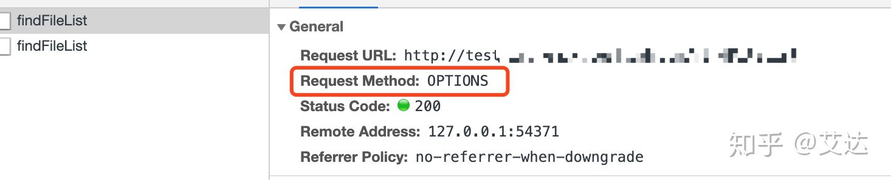

今天的问题是帮同事看的，简单的post请求却得不到返回值，跨域而且看network的时候，request mothod：options，都以为是请求写的不对



后面看代码的时候发现因为单点登录，对axios进行了拦截封装，其中

```text
axios.defaults.withCredentials = true
```

这一条要求在请求头里带上cookie，划重点啊，**如果前端配置了这个withCredentials=true，后段设置Access-Control-Allow-Origin不能为 " \* ",必须是你的源地址啊**

```text
header("Access-Control-Allow-Origin","源地址";
header("Access-Control-Allow-Credentials", "true");
```

