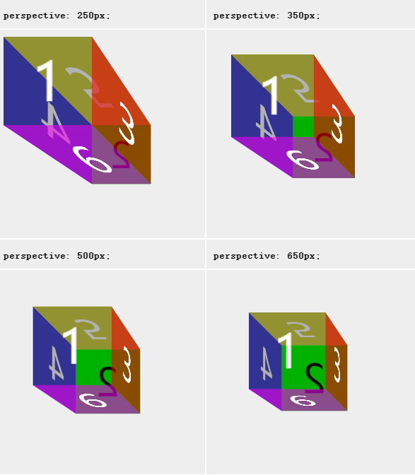

# transform-style

> 属性 **`transform-style `**设置元素的子元素是位于 3D 空间中还是平面中。

如果选择平面，元素的子元素将不会有 3D 的遮挡关系。

由于这个属性不会被继承，因此必须为元素的所有非叶子子元素设置它。

- flat

设置元素的子元素位于该元素的平面中。

- preserve-3d

指示元素的子元素应位于 3D 空间中。

## 

# perspective

> 属性 **`perspective`**指定了观察者与 z=0 平面的距离，使具有三维位置变换的元素产生透视效果。 z>0 的三维元素比正常大，而 z<0 时则比正常小，大小程度由该属性的值决定。

- none

没有应用 perspective 样式时的默认值.

- <length>

[<length>](https://developer.mozilla.org/zh-CN/docs/Web/CSS/length) 指定观察者距离 z=0 平面的距离，为元素及其内容应用透视变换。当值为0或负值时，无透视变换。

## [举例](https://developer.mozilla.org/zh-CN/docs/Web/CSS/perspective#举例)

### [设置视角](https://developer.mozilla.org/zh-CN/docs/Web/CSS/perspective#设置视角)

此示例显示了一个立方体，其 perspective 设置为不同的值。立方体的收缩由 [`perspective`](https://developer.mozilla.org/zh-CN/docs/Web/CSS/perspective) 属性定义。它的值越小，视角越深。

 

# transition

> **`transition`** [CSS](https://developer.mozilla.org/en/CSS) 属性是 [`transition-property`](https://developer.mozilla.org/zh-CN/docs/Web/CSS/transition-property)，[`transition-duration`](https://developer.mozilla.org/zh-CN/docs/Web/CSS/transition-duration)，[`transition-timing-function`](https://developer.mozilla.org/zh-CN/docs/Web/CSS/transition-timing-function) 和 [`transition-delay`](https://developer.mozilla.org/zh-CN/docs/Web/CSS/transition-delay) 的一个[简写属性](https://developer.mozilla.org/en-US/docs/Web/CSS/Shorthand_properties)。

# backface-visibility

> **`backface-visibility`** 指定当元素背面朝向观察者时是否可见。

元素的背面是其正面的镜像。虽然在 2D 中不可见，但是当变换导致元素在 3D 空间中旋转时，背面可以变得可见。 

- visible

背面朝向用户时可见。

- hidden

背面朝向用户时不可见。