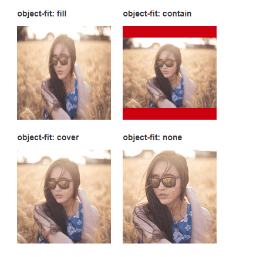

# object-fit

**`object-fit`** [CSS](https://developer.mozilla.org/zh-CN/docs/Web/CSS) 属性指定[可替换元素](https://developer.mozilla.org/zh-CN/docs/Web/CSS/Replaced_element)的内容应该如何适应到其使用的高度和宽度确定的框。

您可以通过使用 [`object-position`](https://developer.mozilla.org/zh-CN/docs/Web/CSS/object-position) 属性来切换被替换元素的内容对象在元素框内的对齐方式。

## [语法](https://developer.mozilla.org/zh-CN/docs/Web/CSS/object-fit#values)

```
fill | contain | cover | none | scale-down
```

## 替换元素

> 其内容不受CSS视觉格式化模型（中文释义参见[这里](http://openwares.net/internet/css_visual_formatting_model.html)）控制的元素
>
> 比如`image`, 嵌入的文档(`iframe`之类)或者`applet`。`img`元素的内容通常会被其`src`属性指定的图像替换掉。替换元素通常有其固有的尺寸：一个固有的宽度，一个固有的高度和一个固有的比率。
>
> CSS渲染模型不考虑替换元素内容的渲染。这些替换元素的展现独立于CSS。`object`, `video`, `textarea`, `input`也是替换元素，`audio`和`canvas`在某些特定情形下为替换元素。
>
> 使用CSS的`content`属性插入的对象是匿名替换元素。

`object-position`和`object-fit`只针对替换元素有作用，也就是`form`表单家族控件系列，老牌劲旅`img`图片，HTML5新贵`video`视频等元素

- **fill**: 中文释义“填充”。默认值。替换内容拉伸填满整个content box, 不保证保持原有的比例。
- **contain**: 中文释义“包含”。保持原有尺寸比例。保证替换内容尺寸一定可以在容器里面放得下。因此，此参数可能会在容器内留下空白。
- **cover**: 中文释义“覆盖”。保持原有尺寸比例。保证替换内容尺寸一定大于容器尺寸，宽度和高度至少有一个和容器一致。因此，此参数可能会让替换内容（如图片）部分区域不可见。
- **none**: 中文释义“无”。保持原有尺寸比例。同时保持替换内容原始尺寸大小。
- **scale-down**: 中文释义“降低”。就好像依次设置了**none**或**contain**, 最终呈现的是尺寸比较小的那个。




图片设置了宽高都是100%, 为何貌似实际效果除了(`fill`)，似乎都无视了这些声明呢？

- img是个替换元素，

- 替换内容`fill`拉伸适应于 `img`替换元素的设定尺寸。

- `object-fit`控制的永远是替换内容的尺寸表现，注意，是替换内容的尺寸表现，不是`img`替换元素。

- 之所以`object-fit:contain`会透明留白，是因为我们没有对壳子`img`设置背景色，假设我们给壳子`img`增加个红色背景，大家就会明白我说的意思了：

  ```
  .box > img { width: 100%; height: 100%; background-color: #cd0000; }
  ```

  效果如下截图，会发现，原来的透明留白现在是红色背景，说明了什么？说明`img`替换元素和`src`替换内容是两个独立体。`img`替换元素受到了CSS `100%`拉伸控制


### object-position理解

控制替换内容位置的。默认值是`50% 50%`，也就是居中效果，所以，无论上一节`object-fit`值为那般，图片都是水平垂直居中的。

替换内容一直定位在容器的右下角：

```
object-position: 100% 100%;
```

例如替换元素相对于右下角20px 10px地方定位：

```
object-position: right 20px bottom 10px;
```

**建议还是使用calc实现相对右下角定位：**

```
object-position: calc(100% - 20px) calc(100% - 10px);
```

