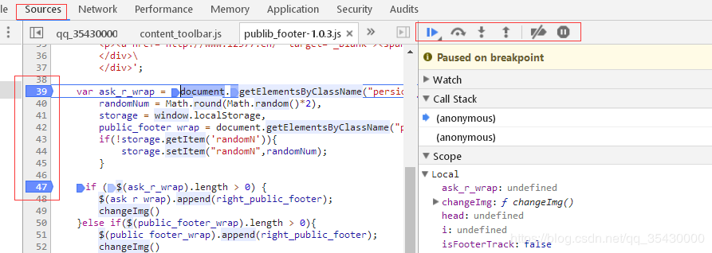

## [debugger工具的使用以及调试](https://www.cnblogs.com/xiaoqi2018/p/10832069.html)

①打开debugger调试

无论是web网页（F12）还是微信开发者工具里面，调试都是在source面板

②在需要打断点的地方打上标签，如图 39 、47

③F5刷新，重新执行，进入断点。如果没有进入断点，说明这个断点不是运行时触发或者需要点击等其他事件触发。

二、调试工具说明

①进入下个断点

，快捷键F8，如果有多个断点，点击时可以直接进入下个断点，忽略断点内部所有逻辑。

②忽略代码内部实现，进入下个方法

，快捷键 F10，不关注方法内部逻辑，点击直接跳到当前断点的下个方法

③单步调试，逐行执行

，快捷键F11，按照代码顺序，从上到下，一行一行执行

④跳出当前函数内部，执行下一步

，快捷键shift+F11