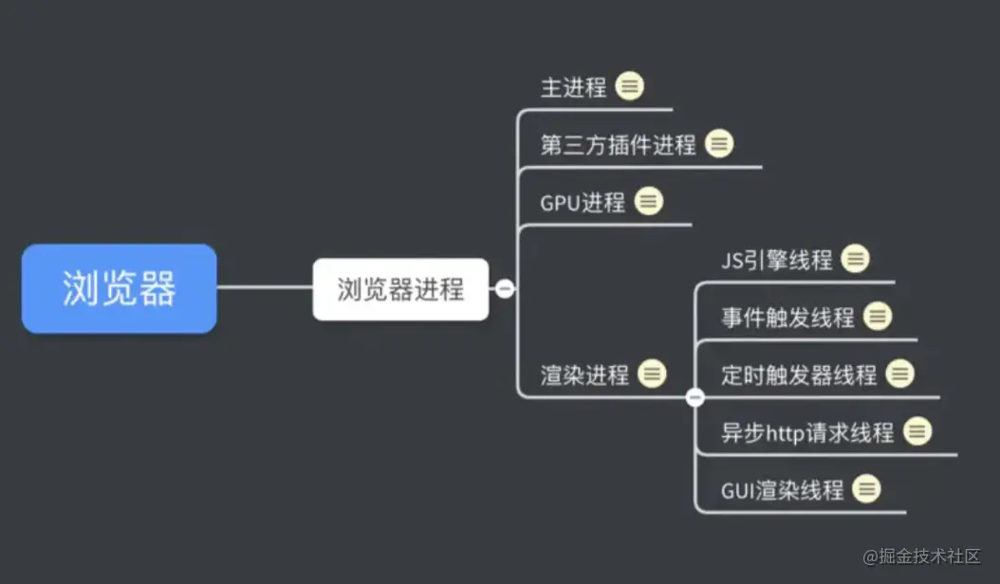
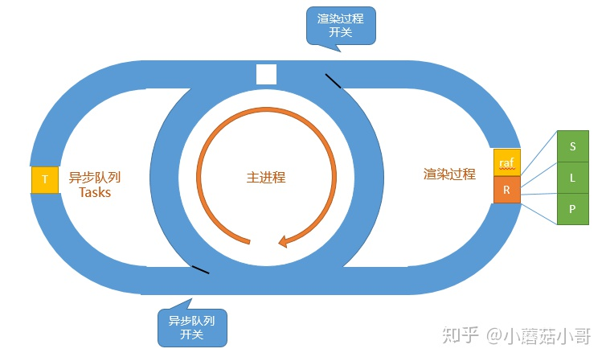

# js 的同步任务和异步任务

js代码可以分为两种任务：

- 同步任务（synchronous）—— 在主线程上排队执行的任务，只有前一个任务执行完毕，才能执行后一个任务；

- 异步任务（asynchronous）—— 不进入主线程、而进入"任务队列"（task queue）的任务，只有"任务队列"通知主线程，某个异步任务可以执行了，该任务才会进入主线程执行。

  异步任务又分为宏任务与微任务：

  - 宏任务（macrotask ）

  | 事件/函数               | 浏览器环境 | Node.js环境 |
  | ----------------------- | ---------- | ----------- |
  | `I/O`                   | ✅          | ✅           |
  | `setTimeout`            | ✅          | ✅           |
  | `setInterval`           | ✅          | ✅           |
  | `setImmediate`          | ❌          | ✅           |
  | `requestAnimationFrame` | ✅          | ❌           |

  - 微任务（microtask ）

  | 事件/函数                    | 浏览器环境 | Node.js环境 |
  | ---------------------------- | ---------- | ----------- |
  | `process.nextTick`           | ❌          | ✅           |
  | `MutationObserver`           | ✅          | ❌           |
  | `Promise.then catch finally` | ✅          | ✅           |

事件循环(event-loop)是什么？

总方针是先同步再异步，异步中先微任务，在宏任务。

macro-task(宏任务)：setTimeout，setInterval

micro-task(微任务)：Promise.then/catch，process.nextTick

# [深入浏览器的事件循环 (GDD@2018)](https://zhuanlan.zhihu.com/p/45111890)

## 渲染过程

页面并不是时时刻刻被渲染的，浏览器会有固定的节奏去渲染页面，称为 render steps。它内部分为 3 个小步骤，分别是

- Structure - 构建 DOM 树的结构
- Layout - 确认每个 DOM 的大致位置（排版）
- Paint - 绘制每个 DOM 具体的内容（绘制）

## requestAnimationFrame

是一个特别的异步任务，只是注册的方法不加入异步队列，而是加入渲染这一边的队列中，它在渲染的三个步骤之前被执行。通常用来处理渲染相关的工作。



`setTimeout` 和 `requestAnimationFrame` 的差别。

 `setTimeout` 在每次运行结束时都把自己添加到异步队列。等渲染过程的时候（不是每次执行异步队列都会进到渲染循环）异步队列已经运行过很多次了，所以渲染部分会一下会更新很多像素，而不是 1 像素。`requestAnimationFrame` 只在渲染过程之前运行，因此严格遵守“执行一次渲染一次”，所以一次只移动 1 像素，是我们预期的方式。

如果在低端环境兼容，常规也会写作 `setTimeout(callback, 1000 / 60)` 来大致模拟 60 fps 的情况，但本质上 `setTimeout` 并不适合用来处理渲染相关的工作。因此和渲染动画相关的，多用 `requestAnimationFrame`，不会有掉帧的问题（即某一帧没有渲染，下一帧把两次的结果一起渲染了）

## 同步代码的合并

开头说过，一段同步代码修改同一个元素的属性，浏览器会直接优化到最后一个。例如

```js
box.style.display = 'none'
box.style.display = 'block'
box.style.display = 'none'
```

浏览器会直接隐藏元素，相当于只运行了最后一句。这是一种优化策略。

但有时候也会给我们造成困扰。例如如下代码：

```js
box.style.transform = 'translateX(1000px)'
box.style.tranition = 'transform 1s ease'
box.style.transform = 'translateX(500px)'
```

我们的本意是从让 box 元素的位置从 0 **一下子** 移动到 1000，然后 **动画移动** 到 500。

但实际情况是从 0 **动画移动** 到 500。这也是由于浏览器的合并优化造成的。第一句设置位置到 1000 的代码被忽略了。

解决方法有 2 个：

\1. 我们刚才提过的 `requestAnimationFrame`。思路是让设置 box 的初始位置（第一句代码）在同步代码执行；让设置 box 的动画效果（第二句代码）和设置 box 的重点位置（第三句代码）放到下一帧执行。

但要注意，`requestAnimationFrame` 是在渲染过程 **之前** 执行的，因此直接写成

```js
box.style.transform = 'translateX(1000px)'
requestAnimationFrame(() => {
  box.style.tranition = 'transform 1s ease'
  box.style.transform = 'translateX(500px)'
})
```

是无效的，因为这样这三句代码依然是在同一帧中出现。那如何让后两句代码放到下一帧呢？这时候我们想到一句话：没有什么问题是一个 `requestAnimationFrame` 解决不了的，如果有，那就用两个：

```js
box.style.transform = 'translateX(1000px)'
requestAnimationFrame(() => {
  requestAnimationFrame(() => {
    box.style.tranition = 'transform 1s ease'
    box.style.transform = 'translateX(500px)'
  })
})
```

在渲染过程之前，再一次注册 `requestAnimationFrame`，这就能够让后两句代码放到下一帧去执行了，问题解决。（当然代码丑了点）

\2. 你之所以没有在平时的代码中看到这样奇葩的嵌套用法，是因为还有更简单的实现方式，并且同样能够解决问题。这个问题的根源在于浏览器的合并优化，那么打断它的优化，就能解决问题。

```js
box.style.transform = 'translateX(1000px)'
box.offsetWidth // 只要获取一下和排版相关的计算样式即可
box.style.tranition = 'transform 1s ease'
box.style.transform = 'translateX(500px)'
```

## Microtasks

- Tasks (in `setTimeout`)
- Animation callbacks (in `requestAnimationFrame`)
- Microtasks (in `Promise.then`)

执行特点:

- Tasks 只执行一个。执行完了就进入主进程，主进程可能决定进入其他两个异步队列，也可能自己执行到空了再回来。

补充：对于“只执行一个”的理解，可以考虑设置 2 个相同时间的 `timeout`，两个并不会一起执行，而依然是分批的。

- Animation callbacks 执行队列里的全部任务，但如果任务本身又新增 Animation callback 就不会当场执行了，因为那是下一个循环

补充：同 Tasks，可以考虑连续调用两句 `requestAnimationFrame`，它们会在同一次事件循环内执行，有别于 Tasks

- Microtasks 直接执行到空队列才继续。因此如果任务本身又新增 Microtasks，也会一直执行下去。

## 一段神奇的代码

*这是本次讲座的高光部分*

考虑如下的代码：

```js
button.addEventListener('click', () => {
  Promise.resolve().then(() => console.log('microtask 1'))
  console.log('listener 1')
})

button.addEventListener('click', () => {
  Promise.resolve().then(() => console.log('microtask 2'))
  console.log('listener 2')
})
```

在浏览器上运行后点击按钮，会按顺序打印

```text
listener 1
microtask 1
listener 2
microtask 2
```

但如果在上面代码的最后加上 `button.click()` 打印顺序会 **有所区别**：（你也可以自己试试看）

```text
listener 1
listener 2
microtask 1
microtask 2
```

主要是 `listener 2` 和 `microtask 1` 次序的问题，原因如下：

- 用户直接点击的时候，浏览器先后触发 2 个 listener。第一个 listener 触发完成 (`listener 1`) 之后，队列空了，就先打印了 microtask 1。然后再执行下一个 listener。**重点在于浏览器并不实现知道有几个 listener，因此它发现一个执行一个，执行完了再看后面还有没有。**
- 而使用 `button.click()` 时，浏览器的内部实现是把 2 个 listener 都同步执行。因此 `listener 1` 之后，执行队列还没空，还要继续执行 "listener 2" 之后才行。所以 listener 2 会早于 microtask 1。**重点在于浏览器的内部实现，`click` 方法会先采集有哪些 listener，再依次触发。**

这个差别最大的应用在于自动化测试脚本。在这里可以看出，使用自动化脚本测试和真正的用户操作还是有细微的差别。如果代码中有类似的情况，要格外注意了。


在浏览器环境中，常见的创建宏任务(macro task)的方法有：

- setTimeout、setInterval
- 网络请求、I/O
- 页面交互：DOM事件回调、鼠标、键盘、滚动事件
- 页面渲染

常见的创建微任务(micro task)的方法有：

- Promise.then
- MutationObserve(DOM监听)
- process.nextTick


