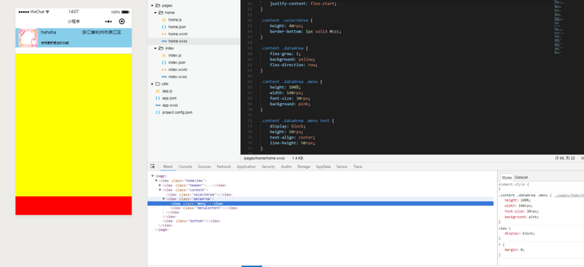

黄色区域为dataArea我在内部设置menu的高度为100%，不生效？？



```html
<!DOCTYPE html>
<html lang="en">
<head>
    <meta charset="UTF-8">
    <title>Document</title>
    <style>
        *{
            margin:0;
            border:0;
            padding: 0;
        }
        html,body{
            height: 100%;
        }
        .content {
            height: 100%;
            display: flex;
            flex-direction: column;
            justify-content: flex-start;
        }

        .content .selectArea {
            height: 40px;
            border-bottom: 1px solid #ccc;
            background: red;
        }

        .content .dataArea {
            flex-grow: 1;
            background: yellow;
            flex-direction: row;
        }

        .content .dataArea .menu {
            height: 20px;
            width: 140px;
            font-size: 30px;
            background: pink;
        }

        .content .dataArea .menu text {
            display: block;
            height: 50px;
            text-align: center;
            line-height: 50px;
        }

        .content .dataArea .menuContent {
            flex-grow: 1;
            height: 100%;
            background: pink;
        }
    </style>
</head>
<body>
    <div class='content'>
        <div class='selectArea'>

        </div>
        <div class='dataArea'>
            <div class='menu'>
                <!-- <text wx:for="{{menu}}" wx:for-item='menuName' wx:key>{{menuName}}</text> -->
            </div>
            <div class='menuContent'>

            </div>
        </div>

    </div>
</body>
</html>
```

## 解决办法

方法一

```css
.dataArea {
    postition: realative;
}
.menu {
    postition: absolute;
}
```

方法二

```css
.content .dataArea {

flex-grow: 1;
background: yellow;
flex-direction: row;
height: 100%;
}
```

