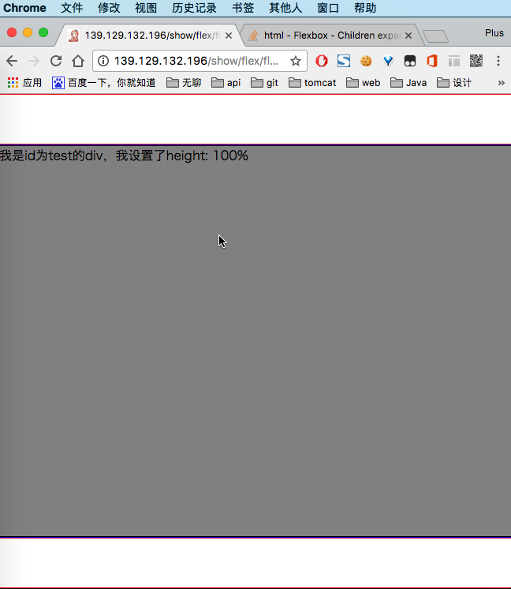
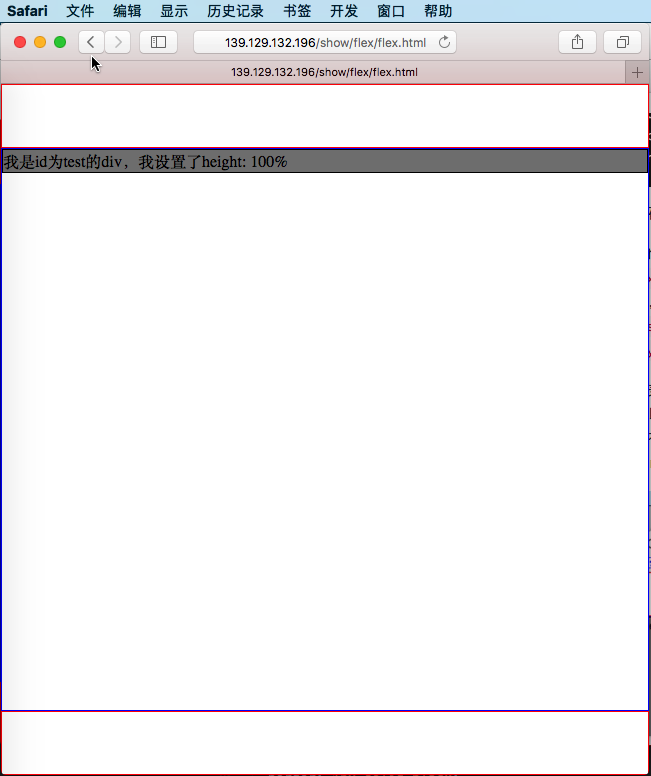

```html
<!doctype html>
<html>
<head>
<meta charset="utf-8">
<meta name="viewport" content="width=device-width, minimum-scale=1.0,maximum-scale=1.0,user-scalable=no, initial-scale=1">
<style>
* {
  box-sizing: border-box;
}
body {
  margin: 0;
}
#main {
  height: 100vh;
  display: flex;
  flex-direction: column;
}
main {
  flex: 1;
  border: 1px solid blue;
}
header, footer {
  flex: 0 0 auto;
  height: 64px;
  border: 1px solid red;
}
#test {
  height: 100%;
  background-color: gray;
  border: 1px solid black;
}
</style>
</head>
<body>
<div id="main">
  <header></header>
  <main>
    <div id="test">
      我是id为test的div，我设置了height: 100%
    </div>
  </main>
  <footer></footer>
</div>
</body>
</html>

```

`#app`的高度为`100vh`，内部的`header`, `main`, `footer`使用`flex`布局，从上到下依次排列，`header`和`footer`的高度不弹性变化，为`64px`，`main`占据屏幕剩下的所有高度。其中`main`中的`#test`的高度为`100% main`元素的高度，并且背景颜色为`gray`。

但是其兼容性却出了问题。在chrome和safari中的表现不一致。
大家可以[点击我](http://139.129.132.196/show/flex/flex.html)，查看在safari中和chrome中的不同表现。
如果没有设备…也可以看图来查看一下这之间的差异。
这是chrome



这是safari



#### 解决方案

> 方案一：

给`main`设置`display: flex; flex-direction: column;`
给`#test`设置`flex: 1;`
新增代码大致如下:

```css
  main {
      display: flex;
      flex-direction: column;
  }
  #test {
      flex: 1
  }
```

> 方案二：

曲线救国。我们给`main`设置`position: relative`，然后给`#test`设置`position: absolute; left: 0; right: 0; top: 0; bottom: 0;`
这时，`main`和`#test`的`css`代码为：

```css
main {
  flex: 1;
  position: relative;
  border: 1px solid blue;
}
#test {
  position: absolute;
  top: 0;
  left: 0;
  right: 0;
  bottom: 0;
  background-color: gray;
  border: 1px solid black;
}
```

