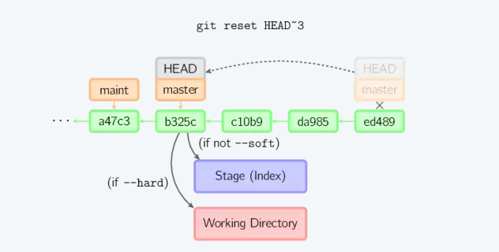
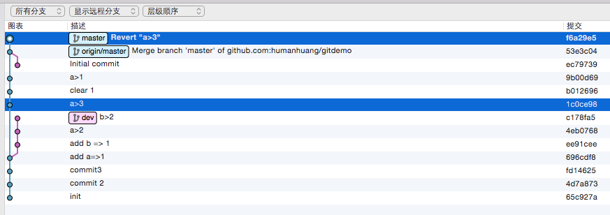

# [git如何正确回滚代码](https://www.cnblogs.com/human/p/5128482.html)

> git如何正确回滚代码

# 方法一，删除远程分支再提交

### ①首先两步保证当前工作区是干净的，并且和远程分支代码一致

```
$ git co currentBranch
$ git pull origin currentBranch
$ git co ./
```

### ②备份当前分支（如有必要）

```
$ git branch currentBranchBackUp
```

### ③恢复到指定的commit hash

```
$ git reset --hard resetVersionHash //将当前branch的HEAD指针指向commit hash
```



### ④删除当前分支的远程分支

```
$ git push origin :currentBranch 
$ //或者这么写git push origin --delete currentBranch
```

### ⑤把当前分支提交到远程

```
$ git push origin currentBranch
```

# 方法二，强制push远程分支

### ①首先两步保证当前工作区是干净的，并且和远程分支代码一致

### ②备份当前分支（如有必要）

### ③恢复到指定的commit hash

```
$ git reset --hard resetVersionHash
```

### ④把当前分支强制提交到远程

```
$ git push -f origin currentBranch
```

# 方法三，从回滚位置生成新的commit hash

### ①首先两步保证当前工作区是干净的，并且和远程分支代码一致

### ②备份当前分支（如有必要）

### ③使用git revert恢复到指定的commit hash，当前分支恢复到a>3版本（见下图）

### a）此方法会产生一条多余的commit hash&log，其实1c0ce98和01592eb内容上是一致的

### b）git revert是以要回滚的commit hash(1c0ce98)为基础，新生成一个commit hash(01592eb)

```
$ git revert resetVersionHash
```



### ④提交远程分支

```
$ git push origin currentBranch
```

# 方法四，从回滚位置生成新的分支merge

### ①首先两步保证当前工作区是干净的，并且和远程分支代码一致

### ②备份当前分支（如有必要）

### ③把当前工作区的HEAD指针指向回滚的commit hash(注意不是branch的HEAD指针)

### Notice:这个时候工作区HEAD没有指向分支，称为匿名分支detached HEAD

### 这个时候提交commit后无法保存状态，git中的任何提交必须是在当前工作区HEAD所在分支的HEAD上进行push hash入栈，所以HEAD必须是属于某个分支的HEAD位置，提交才生效。

```
$ git co resetVersionHash
```


### ④以该commit hash创建一个新的分支

```
$ git co -b newRevertedHash
```

### ⑤切换到当前分支，合并newRevertedHash。

```
$ git co currentBranch
$ git merge newRevertedHash
```

### ⑥进行代码diff，完成代码回滚，push到远程currentBranch

### Notice: 也可以直接hotfix，从要回滚的地方直接重新打包一个新tag包，发版本hotFixVersion即可。