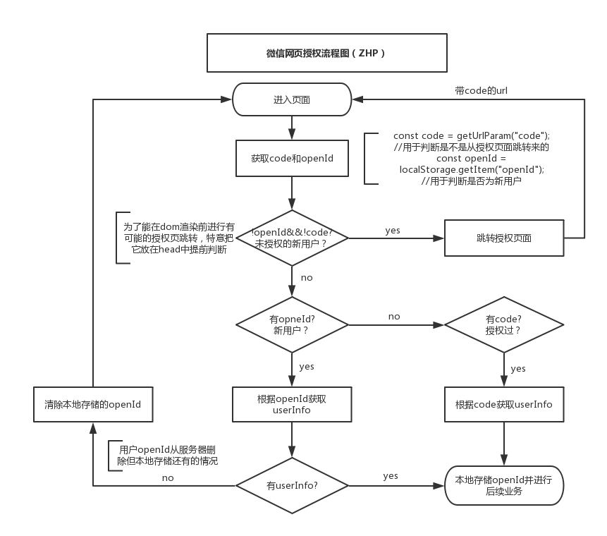

## 1、微信网页受权

网页受权流程分为四步，这里只说前端须要作的，其中的第一步：跳转受权页面获取code。 这里分享下个人受权逻辑（下图），它有两个优势：php

1. 受权跳转在dom渲染以前，体验会好一些；
2. 本地存储了openId，先后端均不用频繁的与微信服务器交互。



## 2、微信jssdk受权

若是你页面中有用到分享、上传图片、微信支付等功能，那么须要先进行js-sdk受权。我这边封装成了2个方法：initConfig和setShare，方便在路由/页面切换的时候重复调用。css

```
//main.js
import wxsdk from './config/wxsdk.js' //该模块提供initConfig和setShare方法，具体代码太长见github
Vue.prototype.wxsdk = wxsdk;//挂载到全局

//使用
 created() {
   this.wxsdk.initConfig(location.href.split("#")[0], () => {
     this.wxsdk.setShare(this.user.openId);
    });
 }
```

