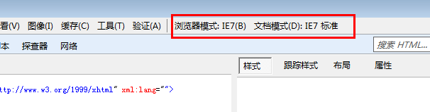

有一回改个老项目，用了 `transform`，在 ie11 上测试，没有用，而且在它的工具栏里样式表里根本看不到我写的代码，这个时候我就好奇了，这是 ie11 啊，怎么会不支持 `transform` 呢？然后我瞄了一下开发者工具，大概是这样的：



然后我就好奇了，为什么会是 ie7 模式呢？我明明装的是 ie11 浏览器啊，然后脑袋一闪，好像明白了什么，看了看 `html` ，果然没有:

```
<meta http-equiv="X-UA-Compatible" content="ie=edge">
```

加上之后，再刷新，网页就正常了。

在这件事之前，我知道这个东西，但是因为是用的模板，一直没有遇到过这个问题，而且通常来说，我会以为，我既然是在 ie11 里打开的，默认你也没有理由用 ie11- 的文档模式去渲染啊，结果就错了。后来看到 SO 上高票答主大概是这么解释 ie 的行为的：

*ie 会用它认为最好的方式去渲染页面，如果没有上面那行代码的话*

此外，ie11 已经开始废弃上面那个了，如果不兼容 ie 的话，其实上面的代码也可以不用写了，不过目前为止 html 模板和 vue 的模板都还是默认支持的。而上面的那行代码实际意思呢，就是：

*Edge：始终以最新的文档模式来渲染页面。忽略文档类型声明。对于 IE8，始终保持以 IE8 标准模式渲染页面。对于 IE9，则以 IE9 标准模式渲染页面。*

当然 ie 还可以等于其他值，不过其他值大多都是老版本，目前而言，都没有必要去纠结了，譬如：

- "IE=edge"
- "IE=11"
- "IE=EmulateIE11"
- "IE=10"
- "IE=EmulateIE10"
- "IE=9"
- "IE=EmulateIE9
- ...