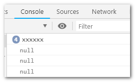

## 场景

浏览器端需要存储一个用户的标识和`cookie`一样需要过期时间，但是用的是`localStorage`存储。而`localStorage`一经存储除非手动删除是不会过期的。那就需要自己实现过期机制。网上找了几种简单的方法。

## 方案一：ES5扩展Storage

思路很简单，存储的值加一个时间戳，下次取值时验证时间戳。
**注意：** `localStorage`只能存储字符，存入时将对象转为`json`字符串,读取时也要解析

```js
Storage.prototype.setExpire = (key, value, expire) => {
	let obj = {
	data: value,
	time: Date.now(),
	expire: expire
	};
	//localStorage 设置的值不能为对象,转为json字符串
	localStorage.setItem(key, JSON.stringify(obj));
}

Storage.prototype.getExpire = key => {
    let val = localStorage.getItem(key);
    if (!val) {
        return val;
    }
    val = JSON.parse(val);
    if (Date.now() - val.time > val.expire) {
        localStorage.removeItem(key);
        return null;
    }
    return val.data;
}
```

测试一下：

```js
localStorage.setExpire('userId','zhangsan',5000);
window.setInterval(()=>{
    console.log(localStorage.getExpire("userId"));
},1000)
```

前5秒还是有值的，之后即为`null`



## 方案二：ES6扩展Storage

大体思路和方案一是一样的只不过是用了ES6的最新语法实现。

```js
class Storage {

    constructor(props) {
        this.props = props || {}
        this.source = this.props.source || window.localStorage
        this.initRun();
    }
    initRun(){
        /*
        * set 存储方法
        * @ param {String}     key 键
        * @ param {String}     value 值，存储的值可能是数组/对象，不能直接存储，需要转换 JSON.stringify
        * @ param {String}     expired 过期时间，以分钟为单位
        */
        const reg = new RegExp("__expires__");
        let data = this.source;
        let list = Object.keys(data);
        if(list.length > 0){
            list.map((key,v)=>{
                if( !reg.test(key )){
                    let now = Date.now();
                    let expires = data[`${key}__expires__`]||Date.now+1;
                    if (now >= expires ) {
                        this.remove(key);
                    };
                };
                return key;
            });
        };
    }

	set(key, value, expired) {
	    /*
	    * set 存储方法
	    * @ param {String}     key 键
	    * @ param {String}     value 值，
	    * @ param {String}     expired 过期时间，以毫秒为单位，非必须
	    */
	    let source = this.source;
	    source[key] = JSON.stringify(value);
	    if (expired){
	        source[`${key}__expires__`] = Date.now() + expired
	    };
	    return value;
	}

    get(key) {
        /*
        * get 获取方法
        * @ param {String}     key 键
        * @ param {String}     expired 存储时为非必须字段，所以有可能取不到，默认为 Date.now+1
        */
        const source = this.source,
        expired = source[`${key}__expires__`]||Date.now+1;
        const now = Date.now();
    
        if ( now >= expired ) {
            this.remove(key);
            return;
        }
        const value = source[key] ? JSON.parse(source[key]) : source[key];
        return value;
	}

	remove(key) {
	    const data = this.source,
	        value = data[key];
	    delete data[key];
	    delete data[`${key}__expires__`];
	    return value;
	}

}
```

其中`set()`,`get()`,`remove()`方法可以理解用来存、取、删, `initRun()`做什么用呢？过期的值只有取时才能知道是不是过期，不取一直存着。`initRun()`和`constructor`只是在初始化时实现清理，也不是一定即时。另外写一个定时器去清理貌似也不值当，所以觉得做到这样已经够用了。

使用如下代码进行测试一下,效果和方案一相同

```js
var ls=new Storage();
ls.set('userId','zhangsan',5000);
window.setInterval(()=>{
    console.log(ls.get("userId"));
},1000)
```

## 参考

- [localStorage 设置过期时间](https://blog.csdn.net/qq_20343517/article/details/83656450)
- [如何给localStorage设置一个过期时间？](https://segmentfault.com/a/1190000016892019)