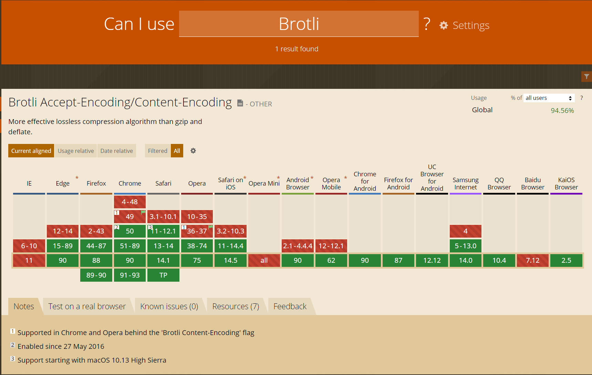
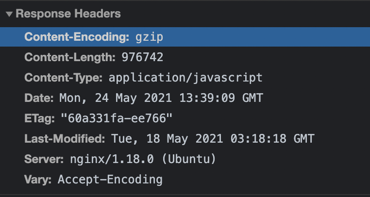
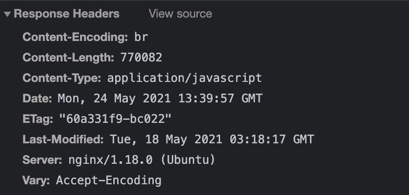

# [Brotli 运用实践总结](https://blog.csdn.net/qq_35844177/article/details/117248683)

## 介绍

`Brotli` 是 `Google` 推出的开源压缩算法，通过变种的 `LZ77` 算法、`Huffman` 编码以及二阶文本建模等方式进行数据压缩，与其他压缩算法相比，它有着更高的压缩效率，性能也比我们目前常见的 `Gzip` 高17-25%，可以帮我们更高效的压缩网页中的各类文件大小及脚本，从而提高加载速度，提升网页浏览体验。需要说明的是 `Brotli` 压缩只在 `https` 下生效，因为 在 `http` 请求中 `request header` 里的 `Accept-Encoding: gzip, deflate` 是没有 `br` 的。

`Brotli` 如此高的压缩比率，得益于其使用一个预定义的字典，该字典包含超过 13000 个来自文本和 `HTML` 文档的大型语料库的常用字符串，预定义的算法可以提升较小文件的压缩密度，而压缩与解压缩速度则大致不变。

`Brotli` 凭借它优异的压缩性能迅速占领了市场，从下图可以看到，除了 `IE` 和 `Opera Mini` 之外，几乎所有的主流浏览器都已支持 `Brotli` 算法，因此处于资源占用的考虑，比如说流量，建议启用：



## 服务器端配置

本示例中使用的相关资源如下

- 操作系统：`Ubuntu 20.04`
- Nginx 版本：`nginx/1.18.0`

### 安装配置 git

在安装之前请先确定当前服务器是否安装 `git`，安装配置好 `git`，请直接进入下一步骤。
安装 `git`：

```shell
sudo apt-get install git
1
```

### 下载 Brotli

`google/ngx_brotli` 从 16年12月的版本起，开始内置`google/brotli`，所以我们不需要额外编译 `bagder/libbrotli` 库，让安装变得简单起来。
我们将 `google/ngx_brotli` 下载并解压到 `/usr/local/src/ngx_brotli` 目录

```shell
cd /usr/local/src
sudo git clone https://github.com/google/ngx_brotli.git || sudo git clone https://github.com.cnpmjs.org/google/ngx_brotli.git
12
```

然后再下载 `google/brotli` 并解压到 `/usr/local/src/ngx_brotli/deps/brotli`

```shell
cd /usr/local/src/ngx_brotli/deps && rm -rf brotli
git clone https://github.com/google/brotli.git || sudo git clone https://github.com.cnpmjs.org/google/brotli.git
cd /usr/local/src/ngx_brotli && git submodule update --init
123
```

### 下载解压 Nginx 源码包

请下载与当前 `Nginx` 版本相同的 `Nginx` 源码包。`Nginx` 官方下载地址：http://nginx.org/en/download.html。

可通过命令，获取当前 `Nginx` 版本：

```shell
nginx -v
1
```

输出：

```shell
nginx version: nginx/1.18.0 (Ubuntu)
1
```

下载并解压 `Nginx` 源码包：

```shell
cd /usr/local/src
sudo wget http://nginx.org/download/nginx-1.18.0.tar.gz
sudo tar -xvf nginx-1.18.0.tar.gz
123
```

### 编译动态模块

```shell
cd nginx-1.18.0
sudo ./configure --with-compat --add-dynamic-module=/usr/local/src/ngx_brotli
sudo make modules
123
```

> 参数语法：–add-dynamic-module=[模块源码所在目录的绝对路径]

等运行完成后，查看编译好的模块：

```shell
ls objs/*.so
1
```

输出：

```shell
objs/ngx_http_brotli_filter_module.so  objs/ngx_http_brotli_static_module.so
1
```

将编译好的模块文件复制到 `Nginx` 动态模块加载目录：

```shell
sudo cp objs/{ngx_http_brotli_filter_module.so,ngx_http_brotli_static_module.so} /etc/nginx/modules
1
```

### 注册 Brotli 模块

修改 `Nginx` 配置文件 `nginx.conf`：

```shell
cd /etc/nginx
sudo vim nginx.conf
12
```

可以在头部添加：

```shell
# Brotli 模块
load_module /etc/nginx/modules/ngx_http_brotli_filter_module.so;
load_module /etc/nginx/modules/ngx_http_brotli_static_module.so;
123
```

### 启动 Brotli 压缩

`Brotli` 和 `gzip` 是可以并存的，因此无需关闭 `gzip` 。

```shell
sudo vim nginx.conf
1
http{
	...
	##
	# Gzip Settings
	##

	gzip on;
    gzip_static on;
    gzip_disable "MSIE [1-6]\.";
    gzip_min_length 1k;
    gzip_vary on;
    gzip_comp_level 3;
    gzip_types text/plain text/css text/javascript application/javascript text/xml application/xml application/xml+rss application/json image/jpeg image/gif image/png;

	##
	# Brotli Settings
	##

	brotli on;
    brotli_static on;
	brotli_comp_level 6;
	brotli_buffers 16 8k;
	brotli_min_length 20;
	brotli_types text/plain text/css text/javascript application/javascript text/xml application/xml application/xml+rss application/json image/jpeg image/gif image/png;
	...
}
1234567891011121314151617181920212223242526
```

验证 `Nginx` 配置是否正确并重启 `Nginx`：

```shell
sudo nginx -t
sudo systemctl reload nginx
12
```

### 清理临时文件

要养成好习惯，每次编译完后都要把应用包解压出来的文件或目录进行删除。

```shell
rm -rf /usr/local/src/{nginx-1.18.0/,ngx_brotli/}
1
```

## 前端配置

### vue-cli 中配置

修改 `vue.confi.js` 文件：

```javascript
const CompressionWebpackPlugin = require('compression-webpack-plugin') // 压缩插件
 
configureWebpack: config => {
    const plugins = [
      ......
      // gzip 压缩
      new CompressionWebpackPlugin({
        filename: '[path][base].gz',
        algorithm: 'gzip',
        test: new RegExp(
          '\\.(' +
          ['js', 'css'].join('|') +
          ')$'
        ),
        threshold: 10240,
        minRatio: 0.8
      }),
      // brotli 压缩
      new CompressionWebpackPlugin({
        filename: '[path][base].br',
        algorithm: 'brotliCompress',
        test: /\.(js|css|html|svg)$/,
        threshold: 10240,
        minRatio: 0.8
      })
    ]
    if (process.env.NODE_ENV === 'production') {
      config.plugins = [...config.plugins, ...plugins]
    }
  },
```

### vite 中配置

修改 `vite.config.ts` 文件

```javascript
import viteCompression from 'vite-plugin-compression' // 压缩插件

  // 插件
  plugins: [
    ...
    // gzip 压缩 
    viteCompression({
      verbose: true,
      disable: false,
      threshold: 10240,
      algorithm: 'gzip',
      ext: '.gz'
    }),
    // brotli 压缩  
    viteCompression({
      verbose: true,
      disable: false,
      threshold: 10240,
      algorithm: 'brotliCompress',
      ext: '.br'
    })
  ],
```

## 验证压缩是否生效

### curl 验证

```shell
curl -H 'Accept-Encoding: br' -I http://localhost
1
HTTP/1.1 200 OK
Server: nginx/1.18.0 (Ubuntu)
Date: Mon, 24 May 2021 14:38:29 GMT
Content-Type: text/html
Last-Modified: Tue, 21 Apr 2020 14:09:01 GMT
Connection: keep-alive
Vary: Accept-Encoding
ETag: W/"5e9efe7d-264"
Content-Encoding: br
```

### 浏览器端验证

未开启：



已开启



## 参考文献

1. [Nginx启用Brotli压缩](https://blog.csdn.net/qq_35416183/article/details/88917034)
2. [Nginx 为站点启用 Brotli 压缩算法](https://blog.csdn.net/qq_34556414/article/details/109112165)
3. [gzip，zopfli及brotli压缩对比，vue配置及服务端实现](https://blog.csdn.net/qq_33290980/article/details/108362453)
4. [Nginx开启Google Brotli压缩](https://cloud.tencent.com/developer/article/1549869)
5. [How to install Brotli Module for Nginx on Ubuntu 20.04](https://www.atlantic.net/dedicated-server-hosting/how-to-install-brotli-module-for-nginx-on-ubuntu-20-04/)
6. [compression-webpack-plugin](https://github.com/webpack-contrib/compression-webpack-plugin)
7. [vite-plugin-compression](https://github.com/anncwb/vite-plugin-compression)

# [Nginx 开启 Brotli 压缩算法](https://www.cnblogs.com/-wenli/p/13594882.html)

