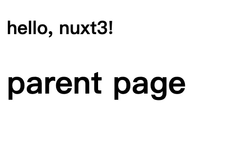
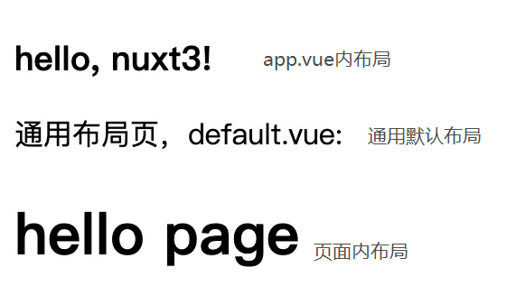
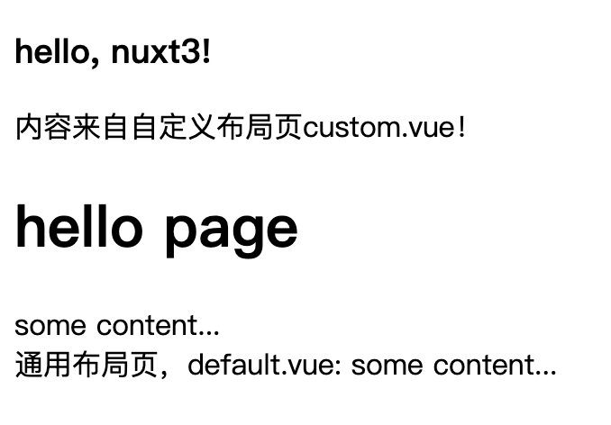

## 安装

```bash
npx nuxi init nuxt3-app
```

## 约定路由

> 是否引入vue-router，nuxt3的行为是：如果只有app.vue不创建pages目录，将不会引入vue-router，则打包体积更小，反之则引入路由库

### 页面路径

nuxt3会自动整合vue-router，并且映射`pages/`目录到应用的routes配置中。

```js
[
  {
    path: '/',
    component: '~/pages/index.vue',
    name: 'index',
  },
  {
    path: '/detail',
    component: '~/pages/detail.vue',
    name: 'detail',
  }
]
```

### 动态路由

> 如果我们在文件名或者文件夹名称里面包含了`方括号`，它们将被转换为`动态路由`参数。

比如下面这样的文件结构：

```
-| pages/
---| users-[group]/
-----| [id].vue
```

上面案例我们可以在组件`[id].vue`中访问`group`、`id`这两个参数:

```
<template>
  {{ $route.params.group }}
  {{ $route.params.id }}
</template>
```

通过 `/users-admins/123` 导航即可:

```
<NuxtLink to="/users-admins/123">管理员123</NuxtLink>
```


NuxtLink

NuxtChild


#### 嵌套路由

目录和文件同名，就制造了嵌套路由。

比如下面目录结构：

```
-| pages/
---| parent/
------| child.vue
---| parent.vue
```

child.vue

```
<template>
  <div>
    <h1>child page</h1>
  </div>
</template>
```

父组件中使用NuxtChild组件显示嵌套子组件内容，parent.vue：

```
<template>
  <div>
    <h1>parent page</h1>
    <!-- 子组件出口 -->
    <NuxtChild></NuxtChild>
  </div>
</template>
```

试一下，index.vue

```
<NuxtLink to="/parent/child">Parent</NuxtLink>
```

产生的路由会像下面这样：

```
{
 path: '/parent',
 children: [
  {
   path: 'child'
  }
 ]
}
```

那如果只使用`/parent`会怎么样？发现内容没有了，显然需要一个`{path: '/parent/'}`子路由



解决方法也很简单，在`parent/`目录下加一个`index.vue`即可。

### 原理

动态路由的原理可以简单在`.nuxt`目录中一探究竟

### 默认布局

那些放在`layouts/`目录下的SFC会被自动加载进来，如果我们创建的SFC名为`default.vue`，将会被用于项目所有页面中作为布局模板。

layouts/default.vue：

```
<template>
  <div>
    通用布局页，default.vue:
    <slot />
  </div>
</template>
```

效果如下：可见还是嵌套在app.vue中



### 自定义布局文件

如果我们的布局文件名不叫default，而是别的，比如`custom.vue`，想要使用它们，就必须在某个页面中设置页面属性`layout`。

custom.vue：

```
<template>
  <div>
    内容来自自定义布局页custom.vue！
    <slot />
  </div>
</template>
```

可以在helloworld.vue中试试custom这个布局，helloworld.vue：

```
<script>
export default {
  layout: "custom"
}
</script>
```

> 试了一下，嵌套路由中是没有效果的，这可能是有意为之的

#### 使用NuxtLayout

可以使用NuxtLayout组件结合slots获得完全控制力，同时需要设置组件选项`layout: false`。

helloworld.vue

```
<template>
	<NuxtLayout name="custom">
    <template #header>
		 <h1>hello page</h1>
    </template>
    some content...
	</NuxtLayout>
</template>
<script>
export default {
  layout: false,
};
</script>
```

修改一下custom.vue

```
<template>
  <div>
    内容来自自定义布局页custom.vue！
    <slot name="header"/>
    <slot />
  </div>
</template>
```

我们甚至能组合多个布局页：

```
<template>
  <div>
    <NuxtLayout name="custom">
      <template #header>
        <h1>hello page</h1>
      </template>
      some content...
    </NuxtLayout>

    <NuxtLayout name="default">
      some content...
    </NuxtLayout>
  </div>
</template>
```

效果如下：



#### 配合<script setup>一起使用

由于需要设置layout选项，所以在这个script标签旁边同时使用<script setup>标签，它们都能生效。

```
<script>
export default {
  layout: "custom",
};
</script>

<script setup>
// your setup script
</script>
```

### 下次预告

我估计大家应该挺烦每次使用组件时的各种导入和注册操作，这点nuxt中早就解决了，用就完了！下篇文章我们将演示其中的细节，欢迎大家关注！