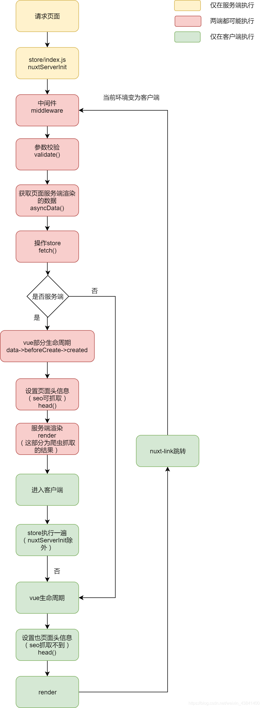

## nuxt生命周期

 

登录状态的处理及通用方案
当你登录状态要做持久化处理时你就需要借助cookie来实现，当项目采取的是cookie来处理你可以使用 cookie-universal-nuxt 插件来处理，当然如果是采用token,不管是放在请求头中还是请求体中，我在下面给出一个傻瓜式的解决方案
所需要使用的 **cookie-universal-nuxt**

````js
// nuxt.config.js添加axios二次封装
plugins: [
    "~/plugins/axios"
 ],
 modules: [
    '@nuxtjs/axios',
    'cookie-universal-nuxt',
 ]

//plugs/axios.js
export default function ({ $axios, redirect, store,app,route ,error }, inject) {
  let axios = $axios; 
  axios.defaults.headers = {
  //设置token,cookie-universal-nuxt将对象绑定在app对象上了
    Authorization:store.state.token ||  app.$cookies.get('token') || ''
  }
  
  axios.baseUrl = '/api'
 // 基本配置

  // 请求回调
  axios.onRequest(config => {
    return config
  })

  // 返回回调
  axios.onResponse(async res => {
    return await res
  })

  // 错误回调
  axios.onError(err => {
    if(process.client){
      //处理浏览器端接口异常
      switch(err.response.status){
        case 500:break;
        case 404:break;
        default:break;
      }
      
    }else{
		//处理服务器端接口异常
      switch(err.response.status){
        case 404:
        //layout/error.vue
        //加载error页面
        //return error({statusCode:404});
        break;
      }
    }
    
  })
}

//store/index.js
const state = () => ({ 
  token: ''
});

const mutations = {
  setToken(state, token) {
    state.token = token
  }
};

const actions = {
  async nuxtServerInit({
    commit
  }, {
    req,
    app,
    store
  }) {
    let token = app.$cookies.get('token') || '';
    commit('setToken', token);
	//还可以获取一些通用信息，比如个人信息，通用配置什么的

  }
};
export default {
  state,
  actions,
  mutations
};
````

