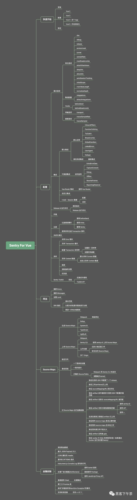

# [Sentry For Vue 完整接入详解(2021 Sentry v21.8.x)前方高能预警！三万字，慎入！](https://www.cnblogs.com/hacker-linner/p/15237007.html)

## 系列

- [1 分钟快速使用 Docker 上手最新版 Sentry-CLI - 创建版本](https://mp.weixin.qq.com/s/7pTJbwkUltqMndg3IIHBfQ)
- [快速使用 Docker 上手 Sentry-CLI - 30 秒上手 Source Maps](https://mp.weixin.qq.com/s/zUbsfMTtajGrhJm6hfaHJw)
- [Sentry For React 完整接入详解](https://mp.weixin.qq.com/s/FFpg1t0-3K8casLMNla15g)



## 快速开始

> `Sentry` 的 `SDK` 支持自动报告错误和异常。

### 安装

`Sentry` 通过在应用程序 `runtime` 使用 `SDK` 捕获数据。

```sh
# 使用 npm
npm install --save @sentry/vue @sentry/tracing
# 使用 yarn
yarn add @sentry/vue @sentry/tracing
```

### 配置

配置应该在应用程序的生命周期中尽早进行。

要在您的 `Vue` 应用程序中初始化 `Sentry`，请将其添加到您的 `app.js` 中：

#### Vue2

```js
import Vue from "vue";
import Router from "vue-router";
import * as Sentry from "@sentry/vue";
import { Integrations } from "@sentry/tracing";

Vue.use(Router);

const router = new Router({
  // ...
});

Sentry.init({
  Vue,
  dsn: "https://examplePublicKey@o0.ingest.sentry.io/0",
  integrations: [
    new Integrations.BrowserTracing({
      routingInstrumentation: Sentry.vueRouterInstrumentation(router),
      tracingOrigins: ["localhost", "my-site-url.com", /^\//],
    }),
  ],
  // Set tracesSampleRate to 1.0 to capture 100%
  // of transactions for performance monitoring.
  // We recommend adjusting this value in production
  tracesSampleRate: 1.0,
});

// ...

new Vue({
  router,
  render: h => h(App),
}).$mount("#app");
```

#### Vue3

```js
import { createApp } from "vue";
import { createRouter } from "vue-router";
import * as Sentry from "@sentry/vue";
import { Integrations } from "@sentry/tracing";

const app = createApp({
  // ...
});
const router = createRouter({
  // ...
});

Sentry.init({
  app,
  dsn: "https://examplePublicKey@o0.ingest.sentry.io/0",
  integrations: [
    new Integrations.BrowserTracing({
      routingInstrumentation: Sentry.vueRouterInstrumentation(router),
      tracingOrigins: ["localhost", "my-site-url.com", /^\//],
    }),
  ],
  // Set tracesSampleRate to 1.0 to capture 100%
  // of transactions for performance monitoring.
  // We recommend adjusting this value in production
  tracesSampleRate: 1.0,
});

app.use(router);
app.mount("#app");
```

此外，`Vue 3` 允许您使用具有相同 `Sentry SDK` 实例的多个应用程序，以及在 `SDK` 已经初始化后动态添加更多应用程序。

#### Vue 3 - 多个 App

```js
const appOne = Vue.createApp(App);
const appTwo = Vue.createApp(App);
const appThree = Vue.createApp(App);

Sentry.init({
  app: [appOne, appTwo, appThree],
});
```

#### Vue 3 - 手动初始化

```js
import * as Sentry from "@sentry/vue";

// ...
const app = createApp(App);

Sentry.init({
  app,
  // ...
});

const miscApp = createApp(MiscApp);
miscApp.mixin(Sentry.createTracingMixins({ trackComponents: true }));
Sentry.attachErrorHandler(miscApp, { logErrors: true });
```

`SDK` 接受一些不同的配置选项，可让您更改其行为：

- `attachProps`（默认为 `true`）- 包括所有 `Vue` 组件的带有事件的属性(`props`)。
- `logErrors` (默认为 `false`) - 决定 `SDK` 是否也应该调用 `Vue` 的原始 `logError` 函数。
- `trackComponents`（默认为 `false`）- 决定是否通过 `hooking` 到其生命周期方法来跟踪组件。可以设置为布尔值(`boolean`)，以启用/禁用对所有组件的跟踪，或设置为特定组件名称的数组（区分大小写）。
- `timeout`（默认为 `2000`）- 以毫秒为单位的时间，指示等待被跟踪的根活动标记为完成(`finished`)并发送给 `Sentry` 的时间。
- `hooks`（默认为[`'activate', 'mount', 'update'`]）- 在组件生命周期 `'activate' | 'create' | 'destroy' | 'mount' | 'unmount' | 'update'` 期间要跟踪的 `hooks` 列表。

> 如果启用 `SDK`，`Vue` 将不会在内部调用其 `logError`。因此，`Vue` 渲染器中发生的错误将不会显示在开发人员控制台中。要保留此功能，请传递 `logErrors:true` 选项。

### 验证

此代码段包含一个故意错误，因此您可以在设置后立即测试一切是否正常：

向页面添加一个引发错误的按钮：

```js
// ...
<button @click="throwError">Throw error</button>
// ...

export default {
  // ...
  methods: {
    throwError() {
      throw new Error('Sentry Error');
    }
  }
};
```

## 配置

### 基本选项

`SDK` 可以使用多种选项进行配置。这些选项在 `SDK` 中基本上是标准化的，但在更好地适应平台特性方面存在一些差异。选项是在 `SDK` 首次初始化时设置的。

选项作为对象传递给 `init()` 函数：

```js
Sentry.init({
  dsn: "https://examplePublicKey@o0.ingest.sentry.io/0",
  maxBreadcrumbs: 50,
  debug: true,
});
```

#### 常见选项

跨 `SDK` 的常用选项列表。这些在所有 `SDK` 中的工作方式或多或少都相同，但为了更好地支持平台，将存在一些细微差别。 可以从环境变量（`SENTRY_DSN`、`SENTRY_ENVIRONMENT`、`SENTRY_RELEASE`）中读取的选项会自动读取。

##### dsn

*`DSN`* 告诉 `SDK` 将事件发送到哪里。如果没有提供这个值，`SDK` 将尝试从 `SENTRY_DSN` 环境变量中读取它。如果这个变量也不存在，`SDK` 就不会发送任何事件。

在没有进程环境（如浏览器）的运行时中，`fallback` 不会应用。

*更多：https://docs.sentry.io/product/sentry-basics/dsn-explainer/#dsn-utilization*

##### debug

打开或关闭调试模式。如果启用了调试，如果发送事件时出现问题，`SDK` 将尝试打印出有用的调试信息。默认值总是 `false`。一般不建议在生产环境中打开它，尽管打开 `debug` 模式不会引起任何安全问题。

##### release

设置 release。某些 `SDK` 会尝试自动配置 `release`，但是最好手动设置 `release`，以确保该 `release` 与您的 `deploy integrations` 或 `source map uploads` 同步。`Release` 名称是字符串，但是 `Sentry` 会检测到某些格式，并且它们的呈现方式可能有所不同。

*更多：https://docs.sentry.io/product/releases/*

默认情况下，`SDK` 会尝试从环境变量 `SENTRY_RELEASE` 中读取该值（在浏览器 `SDK` 中，将从 `window.SENTRY_RELEASE` 中读取该值，如果可用）。

##### environment

设置环境。此字符串为自由形式，默认情况下不设置。一个 `release` 可以与多个环境相关联，以便在 UI 中将它们分开（可以考虑`staging` 与 `prod` 或类似的方式）。

默认情况下，`SDK` 将尝试从 `SENTRY_ENVIRONMENT` 环境变量中读取该值（浏览器 `SDK` 除外）。

##### tunnel

设置将用于传输捕获事件的 `URL`，而不是使用 `DSN`。这可用于解决广告拦截器(`ad-blockers`)或对发送到 `Sentry` 的事件进行更精细的控制。此选项需要实现自定义服务器端点。

*更多：https://docs.sentry.io/platforms/javascript/troubleshooting/#dealing-with-ad-blockers*

##### sampleRate

配置错误事件的采样率，范围为 `0.0` 到 `1.0`。默认值为 `1.0`，表示发送了 `100％` 的错误事件。如果设置为 `0.1`，则仅发送 `10％` 的错误事件。事件是随机选择的。

##### maxBreadcrumbs

这个变量控制应该捕获的面包屑总数。默认值为 `100`。

##### attachStacktrace

当启用时，堆栈跟踪将自动附加到所有记录的消息。堆栈跟踪总是附加到异常；然而，当设置此选项时，堆栈跟踪也会与消息一起发送。例如，该选项意味着堆栈跟踪显示在所有日志消息的旁边。

该选项默认为 `off`。

`Sentry` 中的分组对于有和没有堆栈跟踪的事件是不同的。因此，当您为某些事件启用或禁用此 `flag` 时，您将获得新组。

##### denyUrls

与不应该发送到 `Sentry` 的错误 `URL` 相匹配的字符串或正则表达式模式列表。默认情况下，将发送所有错误。这是一个 “contains(包含)” 匹配整个文件 URL。因此，如果你添加 `foo.com`，它也会匹配 `https://bar.com/myfile/foo.com`。默认情况下，将发送所有错误。

##### allowUrls

匹配错误 `URL` 的字符串列表或正则表达式模式的遗留别名，这些错误 `URL` 应该专门发送给 `Sentry`。默认情况下，将发送所有错误。这是一个 “contains(包含)” 匹配整个文件 URL。因此，如果您将 `foo.com` 添加到它，它也将匹配 `https://bar.com/myfile/foo.com`。默认情况下，所有错误将被发送。

##### autoSessionTracking

设置为 `true` 时，`SDK` 将向 `Sentry` 发送 `session` 事件。这在所有浏览器 `SDK` 中都受支持，每个页面加载和页面导航都向 `Sentry` 发出一个 `session`。在移动 `SDK` 中，当应用进入后台超过 `30` 秒时，会话结束。

##### initialScope

要设置为初始作用域的数据。初始作用域可以定义为对象或回调函数，如下所示。

对象：

```js
Sentry.init({
  dsn: "https://examplePublicKey@o0.ingest.sentry.io/0",
  debug: true,
  initialScope: {
    tags: {"my-tag": "my value"},
    user: {id: 42, email: "john.doe@example.com"},
  }
});
```

回调函数：

```js
Sentry.init({
  dsn: "https://examplePublicKey@o0.ingest.sentry.io/0",
  debug: true,
  initialScope: scope => {
    scope.setTags({ a: 'b' });
    return scope;
  },
});
```

##### maxValueLength

单个值在被截断之前可以具有的最大字符数（默认为 `250`）。

##### normalizeDepth

`Sentry SDK` 将任何上下文数据标准化到给定的深度。 任何包含结构比这更深的数据的 `key` 都将使用其类型（`[Object]` 或 `[Array]`）进行修剪和标记，而不会进一步遍历树。默认情况下，步行执行 `3` 级深度。

