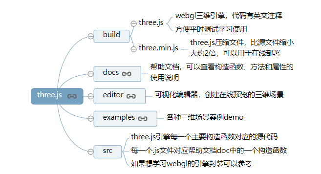
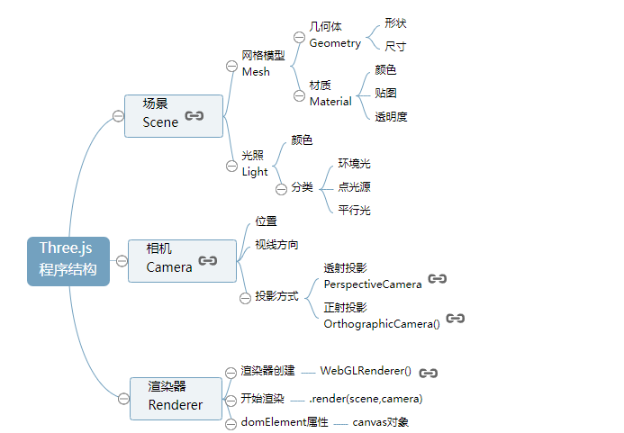

# Threejs第一个3D场景

github链接查看所有目录：https://github.com/mrdoob/three.js



#### 几何体Geometry

```js
//创建一个立方体几何对象Geometry
var geometry = new THREE.BoxGeometry(100, 100, 100);
```

```js
//创建一个球体几何对象
var geometry = new THREE.SphereGeometry(60, 40, 40);
```

### 材质Material

通过构造函数[THREE.MeshLambertMaterial()](http://www.yanhuangxueyuan.com/threejs/docs/index.html#api/zh/materials/MeshLambertMaterial)创建了一个可以用于立方体的材质对象， 构造函数的参数是一个对象，对象包含了颜色、透明度等属性

### 光源Light

通过构造函数[THREE.PointLight()](http://www.yanhuangxueyuan.com/threejs/docs/index.html#api/zh/lights/PointLight)创建了一个点光源对象，参数`0xffffff`定义的是光照强度， 你可以尝试把参数更改为为`0x444444`，刷新浏览器你会看到立方体的表面颜色变暗，这很好理解，实际生活中灯光强度变低了，周围的景物自然暗淡

### 相机Camera

过构造函数[THREE.OrthographicCamera()](http://www.yanhuangxueyuan.com/threejs/docs/index.html#api/zh/cameras/OrthographicCamera)创建了一个正射投影相机对象

### 整个程序的结构

 

### 对象、方法和属性


# 旋转动画、requestAnimationFrame周期性渲染

### 周期性渲染

在1.1节中讲解过，每执行一次渲染器对象[WebGLRenderer](http://www.yanhuangxueyuan.com/threejs/docs/index.html#api/zh/renderers/WebGLRenderer)的渲染方法`.render()`，浏览器就会渲染出一帧图像并显示在Web页面上，这就是说你按照一定的周期不停地调用渲染方法`.render()`就可以不停地生成新的图像覆盖原来的图像。这也就是说只要一边旋转立方体，一边执行渲染方法`.render()`重新渲染，就可以实现立方体的旋转效果。

为了实现周期性渲染可以通过浏览器全局对象`window`对象的一个方法`setInterval()`,可以通过window对象调用该方法`window.setInterval()`，也可以直接以函数形式调用`setInterval()`。

`setInterval()`是一个周期性函数，就像一个定时器，每隔多少毫秒ms执行一次某个函数。

```js
// 渲染函数
function render() {
    renderer.render(scene,camera);//执行渲染操作
    mesh.rotateY(0.01);//每次绕y轴旋转0.01弧度
}
//间隔20ms周期性调用函数fun,20ms也就是刷新频率是50FPS(1s/20ms)，每秒渲染50次
setInterval("render()",20);
```

### 渲染频率

一般调用渲染方法`.render()`进行渲染的渲染频率控制在每秒30~60次，人的视觉效果都很正常，也可以兼顾渲染性能。

### 函数`requestAnimationFrame()`

> 为了更好的利用浏览器渲染，可以使用函数`requestAnimationFrame()`代替`setInterval()`函数

`requestAnimationFrame()`参数是将要被调用函数的函数名，`requestAnimationFrame()`调用一个函数不是立即调用而是向浏览器发起一个执行某函数的请求， 什么时候会执行由浏览器决定，一般默认保持60FPS的频率，大约每16.7ms调用一次`requestAnimationFrame()`方法指定的函数，60FPS是理想的情况下，如果渲染的场景比较复杂或者说硬件性能有限可能会低于这个频率。可以查看文章[《requestAnimationFrame()》](http://www.yanhuangxueyuan.com/HTML5/time.html)了解更多`requestAnimationFrame()`函数的知识。

```js
function render() {
        renderer.render(scene,camera);//执行渲染操作
        mesh.rotateY(0.01);//每次绕y轴旋转0.01弧度
        requestAnimationFrame(render);//请求再次执行渲染函数render
    }
render();
```

### 均匀旋转

在实际执行程序的时候，可能`requestAnimationFrame(render)`请求的函数并不一定能按照理想的60FPS频率执行，两次执行渲染函数的时间间隔也不一定相同，如果执行旋转命令的`rotateY`的时间间隔不同，旋转运动就不均匀，为了解决这个问题需要记录两次执行绘制函数的时间间隔。

```js
let T0 = new Date();//上次时间
function render() {
        let T1 = new Date();//本次时间
        let t = T1-T0;//时间差
        T0 = T1;//把本次时间赋值给上次时间
        requestAnimationFrame(render);
        renderer.render(scene,camera);//执行渲染操作
        mesh.rotateY(0.001*t);//旋转角速度0.001弧度每毫秒
    }
render();
```

# 鼠标操作三维场景

## OrbitControls.js

### 代码实现

`OrbitControls.js`控件支持鼠标左中右键操作和键盘方向键操作，具体代码如下，使用下面的代码替换1.1节中`renderer.render(scene,camera);`即可。

```js
function render() {
  renderer.render(scene,camera);//执行渲染操作
}
render();
var controls = new THREE.OrbitControls(camera,renderer.domElement);//创建控件对象
controls.addEventListener('change', render);//监听鼠标、键盘事件
```

### 场景操作

- 缩放：滚动—鼠标中键
- 旋转：拖动—鼠标左键
- 平移：拖动—鼠标右键

### `requestAnimationFrame()`使用情况

如果threejs代码中通过`requestAnimationFrame()`实现渲染器渲染方法`render()`的周期性调用，当通过OrbitControls操作改变相机状态的时候，没必要在通过`controls.addEventListener('change', render)`监听鼠标事件调用渲染函数，因为`requestAnimationFrame()`就会不停的调用渲染函数。

```js
function render() {
  renderer.render(scene,camera);//执行渲染操作
  // mesh.rotateY(0.01);//每次绕y轴旋转0.01弧度
  requestAnimationFrame(render);//请求再次执行渲染函数render
}
render();
var controls = new THREE.OrbitControls(camera,renderer.domElement);//创建控件对象
// 已经通过requestAnimationFrame(render);周期性执行render函数，没必要再通过监听鼠标事件执行render函数
// controls.addEventListener('change', render)
```

> 注意开发中不要同时使用`requestAnimationFrame()`或`controls.addEventListener('change', render)`调用同一个函数，这样会冲突。

# 3D场景中插入新的几何体

### SphereGeometry构造函数

```javascript
SphereGeometry(radius, widthSegments, heightSegments)
```

第一个参数`radius`约束的是球的大小，参数`widthSegments`、`heightSegments`约束的是球面的精度

| 参数           | 含义                     |
| :------------- | :----------------------- |
| radius         | 球体半径                 |
| widthSegments  | 控制球面精度，水平细分数 |
| heightSegments | 控制球面精度，水平细分数 |

## 绘制球体网格模型

```js
var box=new THREE.SphereGeometry(60,40,40);//创建一个球体几何对象
```

### 更多几何体

```js
//长方体 参数：长，宽，高
var geometry = new THREE.BoxGeometry(100, 100, 100);
// 球体 参数：半径60  经纬度细分数40,40
var geometry = new THREE.SphereGeometry(60, 40, 40);
// 圆柱  参数：圆柱面顶部、底部直径50,50   高度100  圆周分段数
var geometry = new THREE.CylinderGeometry( 50, 50, 100, 25 );
// 正八面体
var geometry = new THREE.OctahedronGeometry(50);
// 正十二面体
var geometry = new THREE.DodecahedronGeometry(50);
// 正二十面体
var geometry = new THREE.IcosahedronGeometry(50);
```

### 同时绘制多个几何体

需要创建一个几何体对象作和一个材质对象，然后把两个参数作为网格模型构造函数`Mesh()`的参数创建一个网格模型，然后再使用场景对象`scene`的方法`.add()`把网格模型`mesh`加入场景中。

threejs的几何体默认位于场景世界坐标的原点(0,0,0),所以绘制多个几何体的时候，主要它们的位置设置。

下面代码同时绘制了立方体、球体和圆柱三个几何体对应的网格模型。

```js
// 立方体网格模型
var geometry1 = new THREE.BoxGeometry(100, 100, 100);
var material1 = new THREE.MeshLambertMaterial({
  color: 0x0000ff
}); //材质对象Material
var mesh1 = new THREE.Mesh(geometry1, material1); //网格模型对象Mesh
scene.add(mesh1); //网格模型添加到场景中

// 球体网格模型
var geometry2 = new THREE.SphereGeometry(60, 40, 40);
var material2 = new THREE.MeshLambertMaterial({
  color: 0xff00ff
});
var mesh2 = new THREE.Mesh(geometry2, material2); //网格模型对象Mesh
mesh2.translateY(120); //球体网格模型沿Y轴正方向平移120
scene.add(mesh2);

// 圆柱网格模型
var geometry3 = new THREE.CylinderGeometry(50, 50, 100, 25);
var material3 = new THREE.MeshLambertMaterial({
  color: 0xffff00
});
var mesh3 = new THREE.Mesh(geometry3, material3); //网格模型对象Mesh
// mesh3.translateX(120); //球体网格模型沿Y轴正方向平移120
mesh3.position.set(120,0,0);//设置mesh3模型对象的xyz坐标为120,0,0
scene.add(mesh3); //
```

### 辅助三维坐标系`AxisHelper`

为了方便调试预览threejs提供了一个辅助三维坐标系`AxisHelper`，可以直接调用`THREE.AxisHelper`创建一个三维坐标系，然后通过`.add()`方法插入到场景中即可。

```javascript
// 辅助坐标系  参数250表示坐标系大小，可以根据场景大小去设置
var axisHelper = new THREE.AxisHelper(250);
scene.add(axisHelper);
```

# 材质效果

### 半透明效果

更改场景中的球体材质对象构造函数[THREE.MeshLambertMaterial()](http://www.yanhuangxueyuan.com/threejs/docs/index.html#api/zh/materials/MeshLambertMaterial)的参数，添加`opacity`和`transparent`属性，`opacity`的值是`0~1`之间，`transparent`表示是否开启透明度效果， 默认是`false`表示透明度设置不起作用，值设置为`true`，网格模型就会呈现透明的效果

```js
var sphereMaterial=new THREE.MeshLambertMaterial({
    color:0xff0000,
    opacity:0.7,
    transparent:true
});//材质对象

//或

material.opacity = 0.5 ;
material.transparent = true ;
```

### 材质常见属性

| 材质属性    | 简介                                       |
| :---------- | :----------------------------------------- |
| color       | 材质颜色，比如蓝色0x0000ff                 |
| wireframe   | 将几何图形渲染为线框。 默认值为false       |
| opacity     | 透明度设置，0表示完全透明，1表示完全不透明 |
| transparent | 是否开启透明，默认false                    |

### 添加高光效果

```js
var sphereMaterial=new THREE.MeshPhongMaterial({
    color:0x0000ff,
    specular:0x4488ee,
    shininess:12
});//材质对象
```

对于three.js而言漫反射、镜面反射分别对应两个构造函数[MeshLambertMaterial()](http://www.yanhuangxueyuan.com/threejs/docs/index.html#api/zh/materials/MeshLambertMaterial)、[MeshPhongMaterial()](http://www.yanhuangxueyuan.com/threejs/docs/index.html#api/zh/materials/MeshPhongMaterial),通过three.js引擎你可以很容易实现这些光照模型

前面案例都是通过构造函数`MeshLambertMaterial()`实现**漫反射**进行渲染，**高光效果**要通过构造函数`MeshPhongMaterial()`模拟镜面反射实现

属性`specular`表示球体网格模型的高光颜色

属性`shininess`可以理解为光照强度的系数

### 材质类型

| 材质类型                                                     | 功能                                                         |
| :----------------------------------------------------------- | :----------------------------------------------------------- |
| [MeshBasicMaterial](http://www.yanhuangxueyuan.com/threejs/docs/index.html#api/zh/materials/MeshBasicMaterial) | 基础网格材质，不受光照影响的材质                             |
| [MeshLambertMaterial](http://www.yanhuangxueyuan.com/threejs/docs/index.html#api/zh/materials/MeshLambertMaterial) | Lambert网格材质，与光照有反应，漫反射                        |
| [MeshPhongMaterial](http://www.yanhuangxueyuan.com/threejs/docs/index.html#api/zh/materials/MeshPhongMaterial) | 高光Phong材质,与光照有反应                                   |
| [MeshStandardMaterial](http://www.yanhuangxueyuan.com/threejs/docs/index.html#api/zh/materials/MeshStandardMaterial) | PBR物理材质，相比较高光Phong材质可以更好的模拟金属、玻璃等效果 |

# threejs光源

### 常见光源类型

| 光源                                                         | 简介               |
| :----------------------------------------------------------- | :----------------- |
| [AmbientLight](http://www.yanhuangxueyuan.com/threejs/docs/index.html#api/zh/lights/AmbientLight) | 环境光             |
| [PointLight](http://www.yanhuangxueyuan.com/threejs/docs/index.html#api/zh/lights/PointLight) | 点光源             |
| [DirectionalLight](http://www.yanhuangxueyuan.com/threejs/docs/index.html#api/zh/lights/DirectionalLight) | 平行光，比如太阳光 |
| [SpotLight](http://www.yanhuangxueyuan.com/threejs/docs/index.html#api/zh/lights/SpotLight) | 聚光源             |

环境光创建

```javascript
//环境光    环境光颜色与网格模型的颜色进行RGB进行乘法运算
var ambient = new THREE.AmbientLight(0x444444);
scene.add(ambient);
```

点光源创建

```javascript
//点光源
var point = new THREE.PointLight(0xffffff);
point.position.set(400, 200, 300); //点光源位置
// 通过add方法插入场景中，不插入的话，渲染的时候不会获取光源的信息进行光照计算
scene.add(point); //点光源添加到场景中
```

光源通过`add`方法插入场景中，不插入的话，渲染的时候不会获取光源的信息进行光照计算

### 立体效果

仅仅使用环境光的情况下，你会发现整个立方体没有任何棱角感，这是因为环境光只是设置整个空间的明暗效果。如果需要立方体渲染要想有立体效果，需要使用具有方向性的点光源、平行光源等。

### 光源光照强度

通过光源构造函数的参数可以设置光源的颜色，一般设置明暗程度不同的白光RGB三个分量值是一样的。如果把`THREE.AmbientLight(0x444444);`的光照参数`0x444444`改为`0xffffff`,你会发现场景中的立方体渲染效果更明亮。

### 光源位置

```javascript
//点光源
var point = new THREE.PointLight(0xffffff);
point.position.set(400, 200, 300); //点光源位置
scene.add(point); //点光源添加到场景中
```

你可以把点光源的位置设置为`(0,0,0)`，然后不使用其它任何光源，这时候你会发现场景中立方体渲染效果是黑色。其实原因很简单，立方体是有大小占，用一定空间的，如果光源位于立方体里面，而不是外部，自然无法照射到立方体外表面。

如果只设置一个点光源的情况下，你通过鼠标旋转操作整个三维场景，你会发现立方体点光源无法照射的地方相对其他位置会比较暗，你可以通过下面的代码在新的位置插入一个新的光源对象。点光源设置的位置是(-400, -200, -300)，相当于把立方体夹在两个点光源之间。

```javascript
// 点光源2  位置和point关于原点对称
var point2 = new THREE.PointLight(0xffffff);
point2.position.set(-400, -200, -300); //点光源位置
scene.add(point2); //点光源添加到场景中
```

