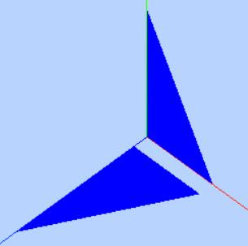
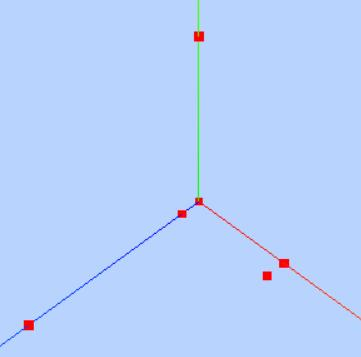
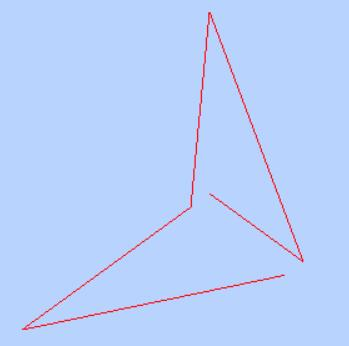
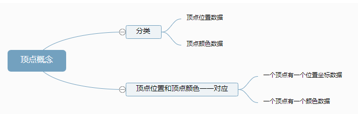
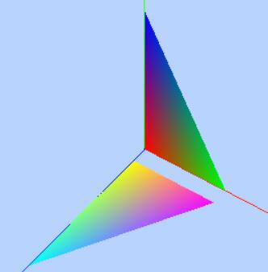
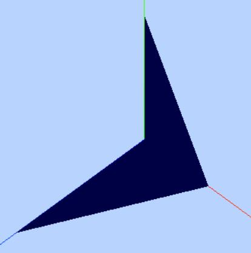
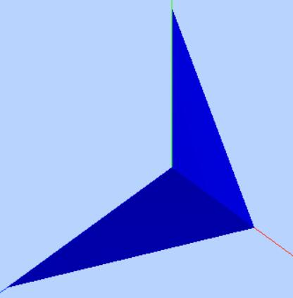

# 顶点法向量数据和前面两节课讲解到的顶点位置数据、顶点颜色数据一样都是一一对应的。Threejs几何体顶点概念

# 顶点位置数据解析渲染

### JavaScript类型化数组

> 类型数组上调用  [`Array.isArray()`](https://developer.mozilla.org/zh-CN/docs/Web/JavaScript/Reference/Global_Objects/Array/isArray) 会返回`false`

### [ArrayBuffer](https://developer.mozilla.org/zh-CN/docs/Web/JavaScript/Typed_arrays#arraybuffer)

 [`ArrayBuffer`](https://developer.mozilla.org/zh-CN/docs/Web/JavaScript/Reference/Global_Objects/ArrayBuffer) 是一种数据类型，用来表示一个通用的、固定长度的二进制数据缓冲区。

### 自定义几何体

下面代码通过Threejs引擎的[BufferGeometry](http://www.yanhuangxueyuan.com/threejs/docs/index.html#api/zh/core/BufferGeometry)和[BufferAttribute](http://www.yanhuangxueyuan.com/threejs/docs/index.html#api/zh/core/BufferAttribute)两个API自定义了一个具有六个顶点数据的几何体。



```javascript
var geometry = new THREE.BufferGeometry(); //创建一个Buffer类型几何体对象
//类型数组创建顶点数据
var vertices = new Float32Array([
  0, 0, 0, //顶点1坐标
  50, 0, 0, //顶点2坐标
  0, 100, 0, //顶点3坐标
  0, 0, 10, //顶点4坐标
  0, 0, 100, //顶点5坐标
  50, 0, 10, //顶点6坐标
]);
// 创建属性缓冲区对象
var attribue = new THREE.BufferAttribute(vertices, 3); //3个为一组，表示一个顶点的xyz坐标
// 设置几何体attributes属性的位置属性
geometry.attributes.position = attribue;
```

```js
// 三角面(网格)渲染模式
var material = new THREE.MeshBasicMaterial({
  color: 0x0000ff, //三角面颜色
  side: THREE.DoubleSide //两面可见
}); //材质对象
var mesh = new THREE.Mesh(geometry, material); //网格模型对象Mesh
```

### 点模型`Points`

对于网格模型`Mesh`而言，几何体geometry三个顶点为一组渲染出来一个三角形，对于点模型`Points`而言，几何体的每个顶点对应位置都会渲染出来一个方形的点区域，该区域可以设置大小。

```javascript
// 点渲染模式
var material = new THREE.PointsMaterial({
  color: 0xff0000,
  size: 10.0 //点对象像素尺寸
}); //材质对象
var points = new THREE.Points(geometry, material); //点模型对象
scene.add(points); //点对象添加到场景中
```



### 线模型`Line`

上面两个案例适用点模型和网格模型去渲染几何体的顶点数据，下面代码是把几何体作为线模型`Line`参数，你会发现渲染效果是从第一个点开始到最后一个点，依次连成线。

```javascript
// 线条渲染模式
var material=new THREE.LineBasicMaterial({
    color:0xff0000 //线条颜色
});//材质对象
var line=new THREE.Line(geometry,material);//线条模型对象
scene.add(line);//线条对象添加到场景中
```



### 几何体本质

立方体几何体`BoxGeometry`本质上就是一系列的顶点构成，只是Threejs的API`BoxGeometry`把顶点的生成细节封装了，用户可以直接使用。

```javascript
var geometry = new THREE.BoxGeometry(100, 100, 100); //创建一个立方体几何对象Geometry
var material = new THREE.MeshLambertMaterial({
  color: 0x0000ff
}); //材质对象Material
var mesh = new THREE.Mesh(geometry, material); //网格模型对象Mesh
```


# 顶点颜色数据插值计算



### 每个顶点设置一种颜

```js
var geometry = new THREE.BufferGeometry(); //声明一个缓冲几何体对象

//类型数组创建顶点位置position数据
var vertices = new Float32Array([
  0, 0, 0, //顶点1坐标
  50, 0, 0, //顶点2坐标
  0, 100, 0, //顶点3坐标

  0, 0, 10, //顶点4坐标
  0, 0, 100, //顶点5坐标
  50, 0, 10, //顶点6坐标
]);
// 创建属性缓冲区对象
var attribue = new THREE.BufferAttribute(vertices, 3); //3个为一组，作为一个顶点的xyz坐标
// 设置几何体attributes属性的位置position属性
geometry.attributes.position = attribue;
//类型数组创建顶点颜色color数据
var colors = new Float32Array([
  1, 0, 0, //顶点1颜色
  0, 1, 0, //顶点2颜色
  0, 0, 1, //顶点3颜色

  1, 1, 0, //顶点4颜色
  0, 1, 1, //顶点5颜色
  1, 0, 1, //顶点6颜色
]);
// 设置几何体attributes属性的颜色color属性
geometry.attributes.color = new THREE.BufferAttribute(colors, 3); //3个为一组,表示一个顶点的颜色数据RGB
//材质对象
var material = new THREE.PointsMaterial({
  // 使用顶点颜色数据渲染模型，不需要再定义color属性
  // color: 0xff0000,
  vertexColors: THREE.VertexColors, //以顶点颜色为准
  size: 10.0 //点对象像素尺寸
});
// 点渲染模式  点模型对象Points
var points = new THREE.Points(geometry, material); //点模型对象
scene.add(points); //点对象添加到场景
```

### 材质属性`.vertexColors`

```js
var material = new THREE.PointsMaterial({
  // 使用顶点颜色数据渲染模型，不需要再定义color属性
  // color: 0xff0000,
  vertexColors: THREE.VertexColors, //以顶点颜色为准
  size: 10.0 //点对象像素尺寸
});
```

属性`.vertexColors`的默认值是`THREE.NoColors`，这也就是说模型的颜色渲染效果取决于材质属性`.color`，如果把材质属性`.vertexColors`的值设置为`THREE.VertexColors`,threejs渲染模型的时候就会使用几何体的顶点颜色数据`geometry.attributes.color`。

### 属性缓冲区对象`BufferAttribute`

> Threejs提供的接口[BufferAttribute](http://www.yanhuangxueyuan.com/threejs/docs/index.html#api/zh/core/BufferAttribute)目的是为了创建各种各样顶点数据，比如顶点颜色数据，顶点位置数据，然后作为几何体`BufferGeometry`的顶点位置坐标属性`BufferGeometry.attributes.position`、顶点颜色属性`BufferGeometry.attributes.color`的值。

`BufferGeometry`更多属性和方法可以查看文档[BufferGeometry](http://www.yanhuangxueyuan.com/threejs/docs/index.html#api/zh/core/BufferGeometry)。

### *颜色插值

如果你把几何体作为网格模型`Mesh`或者线模型`Line`构造函数的参数，你会发现渲染出渐变的彩色效果。



之所以出现渐变是因为Threejs通过底层WebGL进行渲染的时候会对顶点的颜色数据进行插值计算。颜色插值计算简单点说，比如一条直线的端点1设置为红色，端点2设置为蓝色，整条直线就会呈现出从点1到红色点2的蓝色颜色渐变，对于网格模型Mesh而言，就是三角形的三个顶点分别设置一个颜色，三角形内部的区域像素会根据三个顶点的颜色进行插值计算。

# 顶点法向量数据光照计算

在Threejs中表示物体的网格模型Mesh的曲面是由一个一个三角形构成，所以为了表示物体表面各个位置的法线方向，可以给几何体的每个顶点定义一个方向向量。

### 不设置顶点法向量数据

下面代码仅仅定义了几何体[BufferGeometry](http://www.yanhuangxueyuan.com/threejs/docs/index.html#api/zh/core/BufferGeometry)的顶点位置数据，没有定义顶点法向量数据。没有法向量数据，点光源、平行光等带有方向性的光源不会起作用，三角形平面整个渲染效果相对暗淡，而且两个三角形分界位置没有棱角感。

 

```js
var geometry = new THREE.BufferGeometry(); //声明一个空几何体对象
//类型数组创建顶点位置position数据
var vertices = new Float32Array([
  0, 0, 0, //顶点1坐标
  50, 0, 0, //顶点2坐标
  0, 100, 0, //顶点3坐标

  0, 0, 0, //顶点4坐标
  0, 0, 100, //顶点5坐标
  50, 0, 0, //顶点6坐标

]);
// 创建属性缓冲区对象
var attribue = new THREE.BufferAttribute(vertices, 3); //3个为一组
// 设置几何体attributes属性的位置position属性
geometry.attributes.position = attribue
```

### 定义几何体顶点法向量数据

在上面顶点位置数据基础上定义顶点法向量数据，这时候除了环境光以外，点光源也会参与光照计算，三角形整个表面比较明亮，同时两个三角形表面法线不同，即使光线方向相同，明暗自然不同，在分界位置有棱角感。

 

 

```js
var normals = new Float32Array([
  0, 0, 1, //顶点1法向量
  0, 0, 1, //顶点2法向量
  0, 0, 1, //顶点3法向量

  0, 1, 0, //顶点4法向量
  0, 1, 0, //顶点5法向量
  0, 1, 0, //顶点6法向量
]);
// 设置几何体attributes属性的位置normal属性
geometry.attributes.normal = new THREE.BufferAttribute(normals, 3); //3个为一组,表示一个顶点的法向量数据
```

顶点法向量数据和前面两节课讲解到的顶点位置数据、顶点颜色数据一样都是一一对应的。

### API使用总结

```javascript
// 访问几何体顶点位置数据
BufferGeometry.attributes.position
// 访问几何体顶点颜色数据
BufferGeometry.attributes.color
// 访问几何体顶点法向量数据
BufferGeometry.attributes.normal
```

几何体[BufferGeometry](http://www.yanhuangxueyuan.com/threejs/docs/index.html#api/zh/core/BufferGeometry)的顶点法向量数据和几何体位置、颜色等顶点数据一样使用[BufferAttribute](http://www.yanhuangxueyuan.com/threejs/docs/index.html#api/zh/core/BufferAttribute)表示。

```javascript
// 设置几何体attributes属性的位置normal属性
geometry.attributes.normal = new THREE.BufferAttribute(normals, 3); //3个为一组,表示一个顶点的
```

# 顶点索引复用顶点数据

通过几何体[BufferGeometry](http://www.yanhuangxueyuan.com/threejs/docs/index.html#api/zh/core/BufferGeometry)的顶点索引属性`BufferGeometry.index`可以设置几何体顶点索引数据

对于矩形网格模型而言，两个三角形有两个顶点位置是重合的。也就是说可以重复的位置可以定义一次，然后通过通过顶点数组的索引值获取这些顶点位置数据。

### 不使用顶点索引

下面通过几何体六个顶点定义了两个三角形，几何体的顶点位置数据、顶点法向量数据都是6个。

```javascript
var geometry = new THREE.BufferGeometry(); //声明一个空几何体对象
//类型数组创建顶点位置position数据
var vertices = new Float32Array([
  0, 0, 0, //顶点1坐标
  80, 0, 0, //顶点2坐标
  80, 80, 0, //顶点3坐标

  0, 0, 0, //顶点4坐标   和顶点1位置相同
  80, 80, 0, //顶点5坐标  和顶点3位置相同
  0, 80, 0, //顶点6坐标
]);
// 创建属性缓冲区对象
var attribue = new THREE.BufferAttribute(vertices, 3); //3个为一组
// 设置几何体attributes属性的位置position属性
geometry.attributes.position = attribue
var normals = new Float32Array([
  0, 0, 1, //顶点1法向量
  0, 0, 1, //顶点2法向量
  0, 0, 1, //顶点3法向量

  0, 0, 1, //顶点4法向量
  0, 0, 1, //顶点5法向量
  0, 0, 1, //顶点6法向量
]);
// 设置几何体attributes属性的位置normal属性
geometry.attributes.normal = new THREE.BufferAttribute(normals, 3); //3个为一组,表示一个顶点的xyz坐标
```

### 顶点索引`.index`


# 设置`Geometry`顶点位置、顶点颜色数据

> 几何体`Geometry`和缓冲类型几何体`BufferGeometry`表达的含义相同，只是对象的结构不同，Threejs渲染的时候会先把`Geometry`转化为`BufferGeometry`再解析几何体顶点数据进行渲染。

### [Vector3](http://www.yanhuangxueyuan.com/threejs/docs/index.html#api/zh/math/Vector3)定义顶点位置坐标数据

`Vector3`是threejs的三维向量对象,可以通过`Vector3`对象表示一个顶点的xyz坐标，顶点的法线向量。

几何体`Geometry`的顶点位置属性`geometry.vertices`和缓冲类型几何体`BufferGeometry`顶点位置属性`BufferGeometry.attributes.position`是对应的。

```javascript
var geometry = new THREE.Geometry(); //声明一个几何体对象Geometry
var p1 = new THREE.Vector3(50, 0, 0); //顶点1坐标
var p2 = new THREE.Vector3(0, 70, 0); //顶点2坐标
var p3 = new THREE.Vector3(80, 70, 0); //顶点3坐标
//顶点坐标添加到geometry对象
geometry.vertices.push(p1, p2, p3);
```

### [Color](http://www.yanhuangxueyuan.com/threejs/docs/index.html#api/zh/math/Color)定义顶点颜色数据

