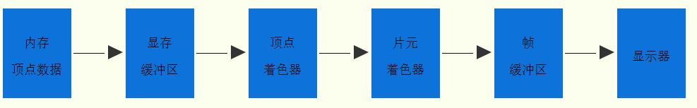

# WebGL绘制一个矩形

### `attribute`关键字

>`attribute vec4 apos;`声明的变量`apos`表示矩形所有顶点的位置坐标

目的是为了javascript可以调用相关的WebGL API把顶点相关数据从javascript传递给顶点着色器`attribute`声明的变量。

```js
//attribute声明vec4类型变量apos
attribute vec4 apos;
```

```js
//类型数组构造函数Float32Array创建顶点数组
var data=new Float32Array([0.5,0.5,-0.5,0.5,-0.5,-0.5,0.5,-0.5]);
```

javascript会调用相关的WebGL API通过下面的代码把类型数组`data`中包含的顶点位置坐标数据传递给顶点着色器中`attribute`关键字声明的变量`apos`。

```js
//获取顶点着色器的位置变量apos，即aposLocation指向apos变量。
var aposLocation = gl.getAttribLocation(program,'apos');
...
...
//创建缓冲区对象
var buffer=gl.createBuffer();
//绑定缓冲区对象,激活buffer
gl.bindBuffer(gl.ARRAY_BUFFER,buffer);
//顶点数组data数据传入缓冲区
gl.bufferData(gl.ARRAY_BUFFER,data,gl.STATIC_DRAW);
//缓冲区中的数据按照一定的规律传递给位置变量apos
gl.vertexAttribPointer(aposLocation,2,gl.FLOAT,false,0,0);
//允许数据传递
gl.enableVertexAttribArray(aposLocation);
```

### 代码执行流程简述

- 初始化着色器函数`initShader()`，执行该函数后，会返回一个程序program对象，同时顶点着色器的位置变量apos会 与program建立联系，你可以把apos理解为对象program的属性。

```js
//初始化着色器
var program = initShader(gl,vertexShaderSource,fragShaderSource);
```

- 通过`getAttribLocation()`方法使当前定义的变量aposLocation指向apos变量，方法的第一个参数是对象program，第二个参数是顶点着色器位置变量apos，并使用引号标识。

```js
//获取顶点着色器的位置变量apos，即aposLocation指向apos变量。
var aposLocation = gl.getAttribLocation(program,'apos');
```

- `new Float32Array([0.5,...`定义的是矩形四个顶点的顶点坐标，仅定义了x和y轴坐标，8个元素存入数组，z轴坐标未定义，z轴方向垂直屏幕，如果图形没有旋转平面显示不受z影响，关于WebGL的坐标系问题可以先不关心。 当浏览器运行这句代码时，会在内存上开辟一个区域，初始化语句重定义的矩形顶点数据。

```js
//类型数组构造函数Float32Array创建顶点数组
var data=new Float32Array([0.5,0.5,-0.5,0.5,-0.5,-0.5,0.5,-0.5]);
```

### drawArrays整体执行顺序




### 硬件相关

- 着色器语言编写的程序称为着色器程序(`shader program`),在GPU顶点着色器单元上执行的是顶点着色器程序， 在GPU片元着色器单元上执行的是片元着色器程序。

顶点着色器

```javascript
//attribute声明vec4类型变量apos
attribute vec4 apos;
void main() {
  //顶点坐标apos赋值给内置变量gl_Position
  //逐顶点处理数据
  gl_Position = apos;
}
```

片元着色器

```javascript
void main() {
  // 逐片元处理数据，所有片元(像素)设置为红色
  gl_FragColor = vec4(1.0,0.0,0.0,1.0);
}
```

- 可编程顶点处理器(`Programmable Vertex Processor`)又称为顶点着色器，用来执行顶点着色器程序
- 可编程片元处理器(`Programmable Fragment Processor`)又称为片元着色器，用来执行片元着色器程序
- GPU中有各种专门的寄存器，比如用来接收顶点坐标数据的寄存器是输入寄存器，从数据类型的角度看属于浮点寄存器，用来临时存储浮点数； 存储输出到显示器像素的帧缓存是输出寄存器，从处理速度的角度看是数据缓冲寄存器，GPU处理数据的速度要比显示器扫描帧缓存中像素数据的速度要快得多
- 显示器像素是显示器可以通过RGB值控制的最小单位，一幅图像是由大量像素点累积显示。着色器中的颜色定义会反映在显示器中
- 显示器的分辨率就是显示器长度方向像素点的个数X显示器宽度方向像素点的个数
- 屏幕相邻的两个像素单元的距离就是点距，点距越小显示效果越好，一般现在显示器0.2mm~0.4mm之间