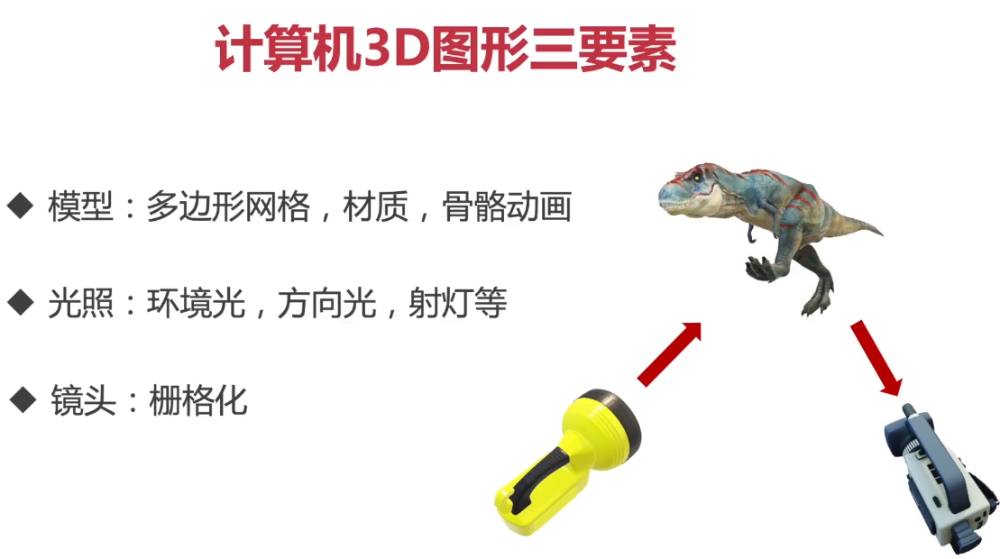

 

**模型要有画布承接**

> <canvas></canvas>

> 模型，光照，渲染器，镜头，场景

```js
class App {
	constructor(canvas,model,animations){//画布对象 ，模型，动画
		this.scene = App.createScene()
        	.add(model)//添加模型
        	.add(App.createAmbientLight)//添加背景灯光
        	.add(App.createDrectionalLight)//添加平行灯光
        //镜头
        this.camera = App.createCamera()
        //渲染器
       this.renderer = App.createRenderer(canvas) 
        //绘制函数
        this.update()
	}
    //场景
    static createScene(){
        let scene = new THREE.Scene();
        scene.background = new THREE.Color(0x336495);//场景背景颜色
        return scene;
    }
    
    static createAmbientLight(){
        return new THREE.AmbientLight(0xffffff,1)
    }
    
    static createDrectionalLight(){
        //光的颜色，强度，位置
        let light = new THREE.DirectionalLight(0xffffff,2)
        light.position.set(0,400,350)
        return light
    }
    
    static createCamera(){
        //镜头的大小，长宽比，角度
        //镜头长宽比要和窗口的长宽比成比例 
        let camera = new THREE.PerspectiveCamera(
        	50,
            window.innerWidth/window.innerHerght,
            0.1,
            1000
        )
        camera.position.z = 10;
        camera.position.x = 0;
        camera.position.y = -3;
        return camera
    }
    
    static createRenderer(canvas){//渲染目标canvas对象
        //参数  像素比例，颜色映射
        let renderer = new THREE.WebGLRenderer({canvas})
        renderer.setPixelRatio(window.devicePixelRatio)
        renderer.toneMapping = THREE.ReinhardToneMapping
        renderer.toneMappingExposure = 2.0
        return renderer
    }
    
    update(){
        this.resize()//浏览器改变时，需要画布重置
        //把场景渲染到画布上去
        this.renderer.render(this.scene,this.camera)
        //每次窗口刷新，都要重新update
        window.requestAnimationFrame(() => { this.update() });
    }
    
    resize(){
        let canvasSize = this.renderer.getSize(new THREE.Vector2());//画布大小
        let windowSize = new THREE.Vector2(window.innerWidth, window.innerHeight);
        if (!canvasSize.equals(windowSize)) {//如果不相等,重置画布大小，重置镜头比例
            this.renderer.setSize(windowSize.x, windowSize.y, false);
            this.camera.aspect = windowSize.x / windowSize.y;
            this.camera.updateProjectionMatrix();
        }
    }
}
```

### 加载模型

```js
//用loader加载模型
let loader = new THREE.GLTFLoader();
loader.load('models/multi.glb',
    function (gltf) {
        let model = gltf.scene;
        model.scale.set(10, 10, 10);//模型大小调整
        model.position.y = -6;//模型位置调整

        let canvas = document.querySelector('#app-canvas');//画布对象
        app = new App(canvas, model, gltf.animations);

        app.mixer.play('CatWalk');
        document.querySelector(".switch-button").addEventListener("click", () => {
            const clips = [
                'CatWalk',
                'Samba',
                'Belly',
            ]
            let clipIndex = clips.indexOf(app.mixer.clip);
            clipIndex = (clipIndex + 1) % clips.length;
            app.mixer.play(clips[clipIndex]);
        });
    },
    undefined,
    function (error) {
        console.error(error);
    }
);
```

### 动画

```js
class AnimationMixer {
  constructor(model, animations) {//模型，动画
    this.clock = new THREE.Clock()//时钟
    this.mixer = new THREE.AnimationMixer(model)
    this.animations = animations
  }

  play(clip) {//动画名称clip
    let animation = this.animations.find((a) => a.name === clip)
    if (animation) {
      this.mixer.stopAllAction()//终止所有动画
      this.mixer.clipAction(animation).play()//播放当前动画
      this.clip = clip//记录当前动画
    }
  }

  update() {
    let delta = this.clock.getDelta()//距离上一次时间差了多少时间 
    this.mixer.update(delta)//然后做动作 
  }
}
```

## 相机

正投影相机[OrthographicCamera](http://www.yanhuangxueyuan.com/threejs/docs/index.html#api/zh/cameras/OrthographicCamera)和透视投影相机[PerspectiveCamera](http://www.yanhuangxueyuan.com/threejs/docs/index.html#api/zh/cameras/PerspectiveCamera)。

#### 透视投影相机

构造函数`PerspectiveCamera`格式

> PerspectiveCamera( fov, aspect, near, far )

| 参数   | 含义                                                         | 默认值                               |
| :----- | :----------------------------------------------------------- | :----------------------------------- |
| fov    | fov表示视场，所谓视场就是能够看到的角度范围，人的眼睛大约能够看到180度的视场，视角大小设置要根据具体应用，一般游戏会设置60~90度 | 45                                   |
| aspect | aspect表示渲染窗口的长宽比，如果一个网页上只有一个全屏的canvas画布且画布上只有一个窗口，那么aspect的值就是网页窗口客户区的宽高比 | window.innerWidth/window.innerHeight |
| near   | near属性表示的是从距离相机多远的位置开始渲染，一般情况会设置一个很小的值。 | 0.1                                  |
| far    | far属性表示的是距离相机多远的位置截止渲染，如果设置的值偏小，会有部分场景看不到 | 1000                                 |

```js
/**
 * 透视投影相机设置
 */
var width = window.innerWidth; //窗口宽度
var height = window.innerHeight; //窗口高度
/**透视投影相机对象*/
var camera = new THREE.PerspectiveCamera(60, width / height, 1, 1000);
camera.position.set(200, 300, 200); //设置相机位置
camera.lookAt(scene.position); //设置相机方向(指向的场景对象)
```


.lookAt()`方法用来指定相机拍摄对象的坐标位置，`.lookAt()`方法的参数是表示位置坐标的三维向量对象[Vector3](http://www.yanhuangxueyuan.com/threejs/docs/index.html#api/zh/math/Vector3)，所以`.lookAt()`方法的参数可以通过代码`new THREE.Vector3(x,y,z)`设置。实际开发的时候，你希望相机对准哪个对象，就返回那个对象的位置属性`.posiiotn

## 渲染器

```js
 /**
     * 创建渲染器对象
     */
    var renderer = new THREE.WebGLRenderer();
    renderer.setSize(width, height);//设置渲染区域尺寸
    renderer.setClearColor(0xb9d3ff, 1); //设置背景颜色
    document.body.appendChild(renderer.domElement); //body元素中插入canvas对象
    //执行渲染操作   指定场景、相机作为参数
    renderer.render(scene, camera);
```

antialias - 是否执行抗锯齿。默认为**false**

alpha - canvas是否包含alpha (透明度)。默认为 **false**

### .setClearColor ( color : Color, alpha : Float ) : null

设置颜色及其透明度

## 光源

### 常见光源类型

| 光源                                                         | 简介               |
| :----------------------------------------------------------- | :----------------- |
| [AmbientLight](http://www.yanhuangxueyuan.com/threejs/docs/index.html#api/zh/lights/AmbientLight) | 环境光             |
| [PointLight](http://www.yanhuangxueyuan.com/threejs/docs/index.html#api/zh/lights/PointLight) | 点光源             |
| [DirectionalLight](http://www.yanhuangxueyuan.com/threejs/docs/index.html#api/zh/lights/DirectionalLight) | 平行光，比如太阳光 |
| [SpotLight](http://www.yanhuangxueyuan.com/threejs/docs/index.html#api/zh/lights/SpotLight) | 聚光源             |

环境光创建

```javascript
//环境光    环境光颜色与网格模型的颜色进行RGB进行乘法运算
var ambient = new THREE.AmbientLight(0x444444);
scene.add(ambient);
```

点光源创建

```javascript
//点光源
var point = new THREE.PointLight(0xffffff);
point.position.set(400, 200, 300); //点光源位置
// 通过add方法插入场景中，不插入的话，渲染的时候不会获取光源的信息进行光照计算
scene.add(point); //点光源添加到场景中
```

光源通过`add`方法插入场景中，不插入的话，渲染的时候不会获取光源的信息进行光照计算

### 立体效果

仅仅使用环境光的情况下，你会发现整个立方体没有任何棱角感，这是因为**环境光只是设置整个空间的明暗效果**。如果需要立方体渲染要想有立体效果，需要使用具有方向性的点光源、平行光源等。

### 光源光照强度

通过光源构造函数的参数可以设置光源的颜色，一般设置明暗程度不同的白光RGB三个分量值是一样的。如果把`THREE.AmbientLight(0x444444);`的光照参数`0x444444`改为`0xffffff`,你会发现场景中的立方体渲染效果更明亮。

### 光源位置

```javascript
//点光源
var point = new THREE.PointLight(0xffffff);
point.position.set(400, 200, 300); //点光源位置
scene.add(point); //点光源添加到场景中
```

你可以把点光源的位置设置为`(0,0,0)`，然后不使用其它任何光源，这时候你会发现场景中立方体渲染效果是黑色。其实原因很简单，立方体是有大小占，用一定空间的，如果光源位于立方体里面，而不是外部，自然无法照射到立方体外表面。

```javascript
point.position.set(0, 0, 0);
```

如果只设置一个点光源的情况下，你通过鼠标旋转操作整个三维场景，你会发现立方体点光源无法照射的地方相对其他位置会比较暗，你可以通过下面的代码在新的位置插入一个新的光源对象。点光源设置的位置是(-400, -200, -300)，相当于把立方体夹在两个点光源之间。

```javascript
// 点光源2  位置和point关于原点对称
var point2 = new THREE.PointLight(0xffffff);
point2.position.set(-400, -200, -300); //点光源位置
scene.add(point2); //点光源添加到场景中
```

## 几何体

### SphereGeometry构造函数

```javascript
SphereGeometry(radius, widthSegments, heightSegments)
```

第一个参数`radius`约束的是球的大小，参数`widthSegments`、`heightSegments`约束的是球面的精度，球体你可以理解为正多面体，就像圆一样是正多边形，当分割的边足够多的时候，正多边形就会无限接近于圆，球体同样的的道理

| 参数           | 含义                     |
| :------------- | :----------------------- |
| radius         | 球体半径                 |
| widthSegments  | 控制球面精度，水平细分数 |
| heightSegments | 控制球面精度，水平细分数 |

```js
//长方体 参数：长，宽，高
var geometry = new THREE.BoxGeometry(100, 100, 100);
// 球体 参数：半径60  经纬度细分数40,40
var geometry = new THREE.SphereGeometry(60, 40, 40);
// 圆柱  参数：圆柱面顶部、底部直径50,50   高度100  圆周分段数
var geometry = new THREE.CylinderGeometry( 50, 50, 100, 25 );
// 正八面体
var geometry = new THREE.OctahedronGeometry(50);
// 正十二面体
var geometry = new THREE.DodecahedronGeometry(50);
// 正二十面体
var geometry = new THREE.IcosahedronGeometry(50);
```

### 同时绘制多个几何体

模仿立方体的代码就可以，需要创建一个几何体对象作和一个材质对象，然后把两个参数作为网格模型构造函数`Mesh()`的参数创建一个网格模型，然后再使用场景对象`scene`的方法`.add()`把网格模型`mesh`加入场景中。

threejs的几何体默认位于场景世界坐标的原点(0,0,0),所以绘制多个几何体的时候，主要它们的位置设置。

```js
// 立方体网格模型
var geometry1 = new THREE.BoxGeometry(100, 100, 100);
var material1 = new THREE.MeshLambertMaterial({
  color: 0x0000ff
}); //材质对象Material
var mesh1 = new THREE.Mesh(geometry1, material1); //网格模型对象Mesh
scene.add(mesh1); //网格模型添加到场景中

// 球体网格模型
var geometry2 = new THREE.SphereGeometry(60, 40, 40);
var material2 = new THREE.MeshLambertMaterial({
  color: 0xff00ff
});
var mesh2 = new THREE.Mesh(geometry2, material2); //网格模型对象Mesh
mesh2.translateY(120); //球体网格模型沿Y轴正方向平移120
scene.add(mesh2);

// 圆柱网格模型
var geometry3 = new THREE.CylinderGeometry(50, 50, 100, 25);
var material3 = new THREE.MeshLambertMaterial({
  color: 0xffff00
});
var mesh3 = new THREE.Mesh(geometry3, material3); //网格模型对象Mesh
// mesh3.translateX(120); //球体网格模型沿Y轴正方向平移120
mesh3.position.set(120,0,0);//设置mesh3模型对象的xyz坐标为120,0,0
scene.add(mesh3); //
```

## 材质效果

| 材质类型                                                     | 功能                                                         |
| :----------------------------------------------------------- | :----------------------------------------------------------- |
| [MeshBasicMaterial](http://www.yanhuangxueyuan.com/threejs/docs/index.html#api/zh/materials/MeshBasicMaterial) | 基础网格材质，不受光照影响的材质                             |
| [MeshLambertMaterial](http://www.yanhuangxueyuan.com/threejs/docs/index.html#api/zh/materials/MeshLambertMaterial) | Lambert网格材质，与光照有反应，漫反射                        |
| [MeshPhongMaterial](http://www.yanhuangxueyuan.com/threejs/docs/index.html#api/zh/materials/MeshPhongMaterial) | 高光Phong材质,与光照有反应                                   |
| [MeshStandardMaterial](http://www.yanhuangxueyuan.com/threejs/docs/index.html#api/zh/materials/MeshStandardMaterial) | PBR物理材质，相比较高光Phong材质可以更好的模拟金属、玻璃等效果 |

## 纹理贴图

通过纹理贴图加载器[TextureLoader](http://www.yanhuangxueyuan.com/threejs/docs/index.html#api/zh/loaders/TextureLoader)的`load()`方法加载一张图片可以返回一个纹理对象[Texture](http://www.yanhuangxueyuan.com/threejs/docs/index.html#api/zh/textures/Texture)，纹理对象`Texture`可以作为模型材质颜色贴图`.map`属性的值。

材质的颜色贴图属性`.map`设置后，模型会从纹理贴图上采集像素值，这时候一般来说不需要再设置材质颜色`.color`。`.map`贴图之所以称之为颜色贴图就是因为网格模型会获得颜色贴图的颜色值RGB。

```js
// 纹理贴图映射到一个矩形平面上
var geometry = new THREE.PlaneGeometry(204, 102); //矩形平面
// TextureLoader创建一个纹理加载器对象，可以加载图片作为几何体纹理
var TextureLoader = new THREE.TextureLoader();
// 执行load方法，加载纹理贴图成功后，返回一个纹理对象Texture
TextureLoader.load('Earth.png', function(texture) {
  var material = new THREE.MeshLambertMaterial({
    // color: 0x0000ff,
    // 设置颜色纹理贴图：Texture对象作为材质map属性的属性值
    map: texture,//设置颜色贴图属性值
  }); //材质对象Material
  var mesh = new THREE.Mesh(geometry, material); //网格模型对象Mesh
  scene.add(mesh); //网格模型添加到场景中

  //纹理贴图加载成功后，调用渲染函数执行渲染操作
  // render();
})
```

## 鼠标操作三维场景

使用鼠标操作三维场景，可以借助three.js众多控件之一`OrbitControls.js`

### 代码实现

`OrbitControls.js`控件支持鼠标左中右键操作和键盘方向键操作

```js
function render() {
  renderer.render(scene,camera);//执行渲染操作
}
render();
var controls = new THREE.OrbitControls(camera,renderer.domElement);//创建控件对象
controls.addEventListener('change', render);//监听鼠标、键盘事件
```

### .enableZoom : Boolean

启用或禁用摄像机的缩放。
