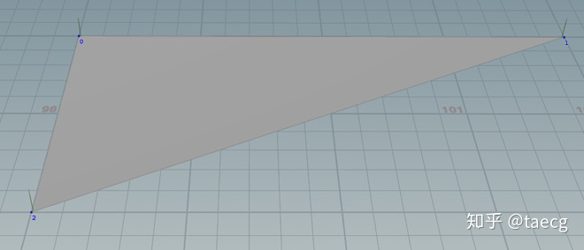
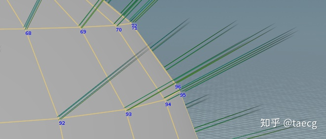
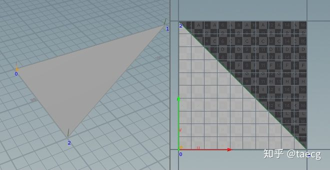
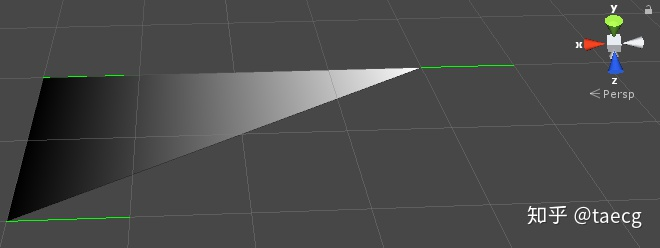

## 顶点属性

做渲染的都知道，我们在写Shader时必然会用到顶点的一些属性，这其中包括：

- 顶点位置坐标
- 顶点UV1/UV2
- 顶点颜色
- 顶点法线
- 顶点切线
- 顶点副切线
- 等等...

> 其中顶点位置坐标在Shader中是必不可少的属性，其余的根据自己需要来决定是否使用。

## 法线

模型由三个顶点组成，这是最基本的一个三角面，顶点上的蓝色数字表示顶点的序号。
重点看下，在 每个顶点所处位置都有一个向上的绿线，而那个就是顶点的法线。

> 定义：**三维平面的法线是垂直于该平面的三维向量。曲面在某点P处的法线为垂直于该点切平面的向量。**

如果面不是一个平面，则法线呈现的效果如下：

可以看出每个点的法线都是由垂直于该点所在面的法线来决定的。

所以说呢，**法线首先是一个向量！**

**而由于我们讨论的是三维空间，所以此法线必然是一个三维向量！**

## 切线

切线是垂直于法线的一条向量，由于垂直于法线的向量有无数条，所以切线最终规定为由UV坐标来决定朝向。

DCC中三角面片的UV分布如下：

导入到Unity后的切线朝向(绿色的线),为了便于观察，现在的颜色输出改为UV中的U值:

> U和V分别是图片在显示器水*、垂直方向上的坐标，取值一般都是0~1，也 就是（水*方向的第U个像素/图片宽度，垂直方向的第V个像素/图片高度）。

[关于顶点的法线、切线、副切线](https://zhuanlan.zhihu.com/p/103546030)

