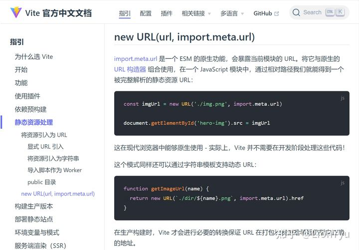

最近在做一个轮播图组件，当我想动态绑定src引入图片的时候，我使用了require对资源进行引用。

```js
<CarouselItem v-for="(item,index) of carouselData" :key="index">
    
</CarouselItem>
```

结果出现了如下的错误


初步判断这是因为 require 是属于 Webpack 的方法，而我使用的是 Vite，所以我们需要去寻找 Vite 静态资源处理的方法，方法如下。



所以，我们只需要将代码改写以下形式即可。 

template

```text
<CarouselItem v-for="(item,index) of carouselData" :key="index">
    
</CarouselItem>
```

script

```js
setup() {
    const getImageUrl = (name) => {
        return new URL(`../../lib/Carousel/assets/${name}`, import.meta.url).href
    }
  return {
        carouselData,
    getImageUrl
  }
}
```