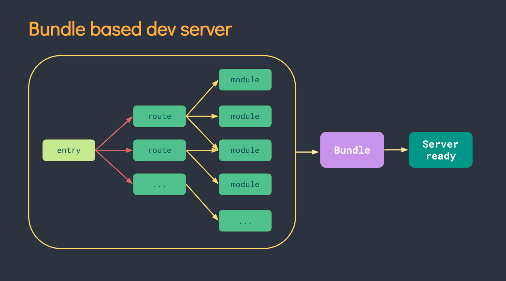
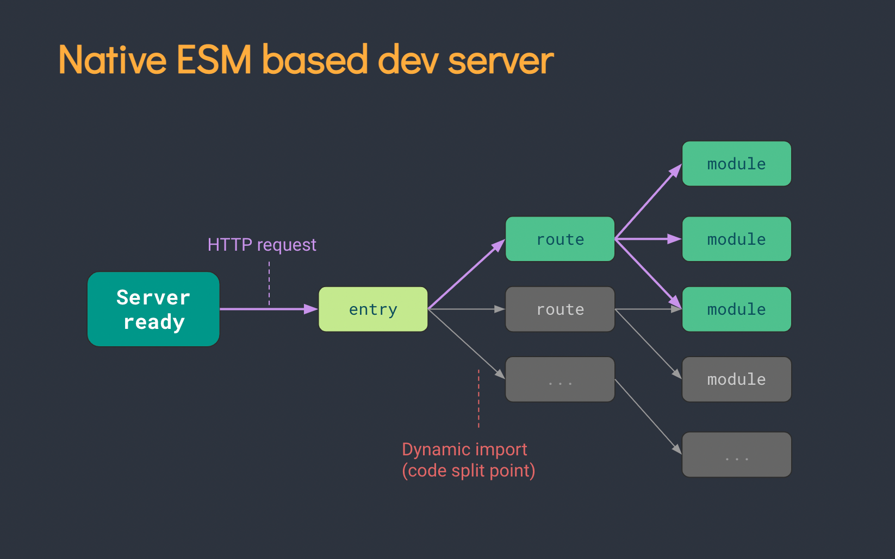

[浅谈 Vite 2.0 原理，依赖预编译，插件机制是如何兼容 Rollup 的？](https://learnku.com/vuejs/t/54664)

## Vite 原理

在过去的 Webpack、Rollup 等构建工具,在本地开发调试的时候，也都会提前把你的模块先打包成浏览器可读取的 js bundle，虽然有诸如路由懒加载等优化手段，但懒加载并不代表懒构建，Webpack 还是需要把你的异步路由用到的模块提前构建好。

当你的项目越来越大的时候，启动也难免变的越来越慢，甚至可能达到分钟级别。而 HMR 热更新也会达到好几秒的耗时。

Vite 则别出心裁的利用了浏览器的原生 ES Module 支持，直接在 html 文件里写诸如这样的代码：

```html
// index.html
<div id="app"></div>
<script type="module">
  import { createApp } from 'vue'
  import Main from './Main.vue'

  createApp(Main).mount('#app')
</script>
```

Vite 会在本地帮你启动一个服务器，当浏览器读取到这个 html 文件之后，会在执行到 import 的时候才去向服务端发送 Main.vue 模块的请求，Vite 此时在利用内部的一系列黑魔法，包括 Vue 的 template 解析，代码的编译等等，解析成浏览器可以执行的 js 文件返回到浏览器端。

这就保证了只有在真正使用到这个模块的时候，浏览器才会请求并且解析这个模块，最大程度的做到了按需加载。

用 Vite 官网上的图来解释，传统的 bundle 模式是这样的：



而基于 ESM 的构建模式则是这样的：



灰色部分是暂时没有用到的路由，甚至完全不会参与构建过程，随着项目里的路由越来越多，构建速度也不会变慢。

## 依赖预编译

依赖预编译，其实是 Vite 2.0 在为用户启动开发服务器之前，先用 esbuild 把检测到的依赖预先构建了一遍。

也许你会疑惑，不是一直说好的 no-bundle 吗，怎么还是走启动时编译这条路线了？尤老师这么做当然是有理由的，我们先以导入 lodash-es 这个包为例。

当你用 import { debounce } from 'lodash' 导入一个命名函数的时候，可能你理想中的场景就是浏览器去下载只包含这个函数的文件。但其实没那么理想，debounce 函数的模块内部又依赖了很多其他函数，形成了一个依赖图。

当浏览器请求 debounce 的模块时，又会发现内部有 2 个 import，再这样延伸下去，这个函数内部竟然带来了 600 次请求，耗时会在 1s 左右。


这当然是不可接受的，于是尤老师想了个折中的办法，正好利用 Esbuild 接近无敌的构建速度，让你在没有感知的情况下在启动的时候预先帮你把 debounce 所用到的所有内部模块全部打包成一个传统的 js bundle。

Esbuild 使用 Go 编写，并且比以 JavaScript 编写的打包器预构建依赖快 10-100 倍。

在 `httpServer.listen` 启动开发服务器之前，会先把这个函数劫持改写，放入依赖预构建的前置步骤，[Vite 启动服务器相关代码](https://github.com/vitejs/vite/blob/main/packages/vite/src/node/server/index.ts)。

```js
// server/index.ts
const listen = httpServer.listen.bind(httpServer)
httpServer.listen = (async (port: number, ...args: any[]) => {
  try {
    await container.buildStart({})
    // 这里会进行依赖的预构建
    await runOptimize()
  } catch (e) {
    httpServer.emit('error', e)
    return
  }
  return listen(port, ...args)
}) as any
```

