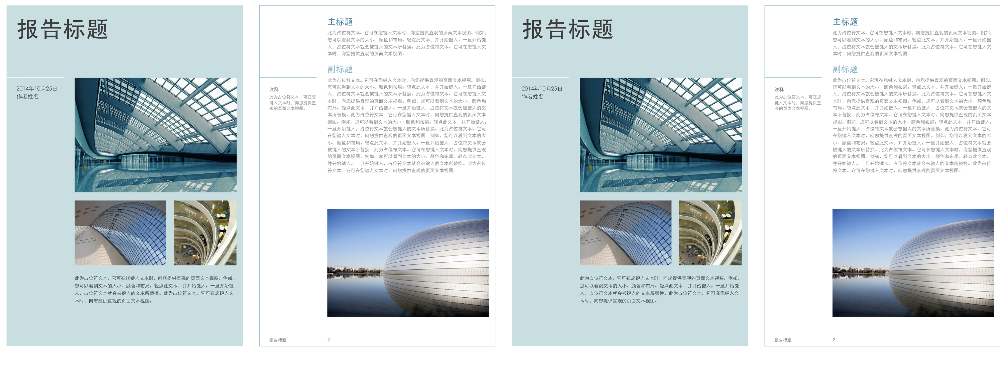

# Vue pdf 多文件全部页面显示 使用笔记

## 参考链接

https://[github](https://so.csdn.net/so/search?q=github&spm=1001.2101.3001.7020).com/FranckFreiburger/vue-pdf#createloadingtasksrc

## 单个文件

安装

```
npm install --save vue-pdf
1
```

单个pdf文件显示全部，我是直接复制的参考链接

```js
<template>
	<div>
		<pdf
			v-for="i in numPages"
			:key="i"
			:src="src"
			:page="i"
			style="display: inline-block; width: 25%"
		></pdf>
	</div>
</template>

<script>

import pdf from 'vue-pdf'

var loadingTask = pdf.createLoadingTask('https://cdn.mozilla.net/pdfjs/tracemonkey.pdf');

export default {
	components: {
		pdf
	},
	data() {
		return {
			src: loadingTask,
			numPages: undefined,
		}
	},
	mounted() {

		this.src.promise.then(pdf => {

			this.numPages = pdf.numPages;
		});
	}
}

</script>
1234567891011121314151617181920212223242526272829303132333435363738
```

## 多个pdf文件 全部显示

#### 效果预览



```
有几个点要注意
```

- 一 本地pdf文件的话，pdf文件必须放置在 public （vue-cli 4+） 或者 static （vue-cli < 3） 文件夹下, 如果放置src/assets下， 会读取报错，下面demo pdf文件放置在public下
  
- 二 使用线上的pdf文件时，需要后台配合处理跨域，否则读取不了pdf文件。
- 三 得使用async/await语法糖取出promise对象里面的pdf总页数。

```js
<template>
    <div class="about">
        <template v-for="item in handelPdfList">
            <pdf
                    v-for="i in item.numPages"
                    :key="i"
                    :src="item.src"
                    :page="i"
                    style="display: inline-block; width: 25%"
            ></pdf>
        </template>
    </div>
</template>
<script>
    import pdf from 'vue-pdf'


    export default {
        name: "about",
        components: {
            pdf
        },
        data() {
            return {
                // src: loadingTask,
                numPages: undefined,
                pdfList: [
                    {
                        src: '/test.pdf'
                    },
                    {
                        src: '/test.pdf'
                    }
                ],
                handelPdfList: []
            }
        },
        mounted() {
            this.handelPdf()
        },
        methods: {
            async handelPdf() {
                for (let info of this.pdfList) {
                    // 测试使用本地的pdf文件 (必须放到public(vue-cli 4+)或者static文件里面)
                    // info.src = '/test.pdf'
                    // 测试使用 自己搭建 已跨域的pdf文件
                    // info.src = 'http://127.0.0.1:8010/assets/test.pdf'
                    info['numPages'] = await pdf.createLoadingTask(info.src).promise.then(pdf => {
                        return pdf.numPages
                    })
                }
                // 数据处理完毕后  再复制
                this.handelPdfList = this.pdfList
            }
        }
    }
</script>
```


### 参考链接

[【Vue】vue中使用pdf，看这篇就够了~](https://blog.csdn.net/weixin_42678675/article/details/109736497)

[vue-pdf报错，之前用的好好的，多刷几次页面，打包到线上，就说pdf跨域，然后还有提示错误](https://blog.csdn.net/qq_39738977/article/details/105690619)

