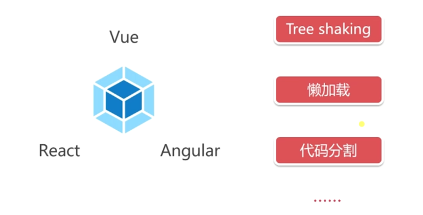
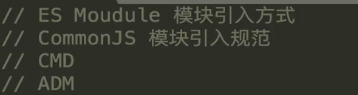
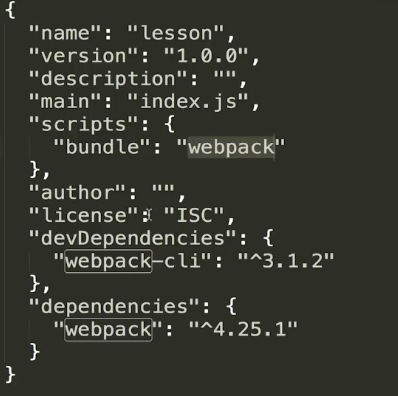
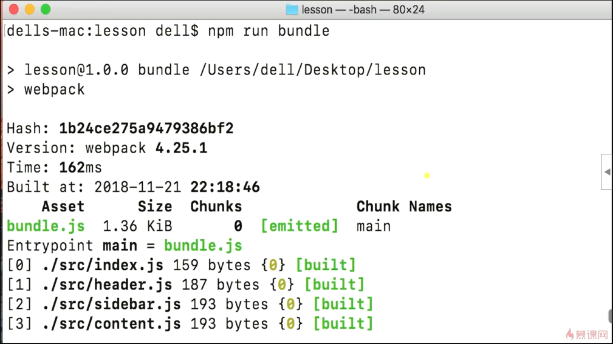
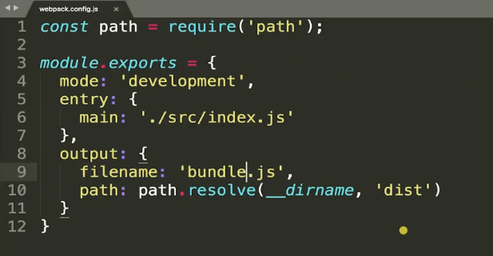

 

### 安装webpack

```
npm install webpack webpacl-cli --save-dev
```

#### 运行

```
npx webpack index.js
```

如果是哟个ES Moudule模块引入文件，那么也必须用ES Moudule来导出文件。

加载script标签会有http请求

### Bundler：模块打包工具

 

### package.json关键字

```
private:true,//是否是私有项目，是否发布到公共环境中。 
```

npm info 包名称//查看包的信息，版本号等

### webpack配置文件

webpack.config.js

他是遵循commonJS的语法

```
entry:'',//入口文件
output:{//打包文件配置
	filename:'',//打包文件重命名为
	path:'',//打包文件位置，绝对路径  __dirname这个关键字代表配置文件所在的目录
},
```

 

源代码放在src文件夹下


### npm scripts

 

这个命令优先从工程目录中寻找资源执行，

webpack-cli可以让你在命令行中正确执行webpack命令



### model

production和development，production会压缩文件

 

## webpack是什么

